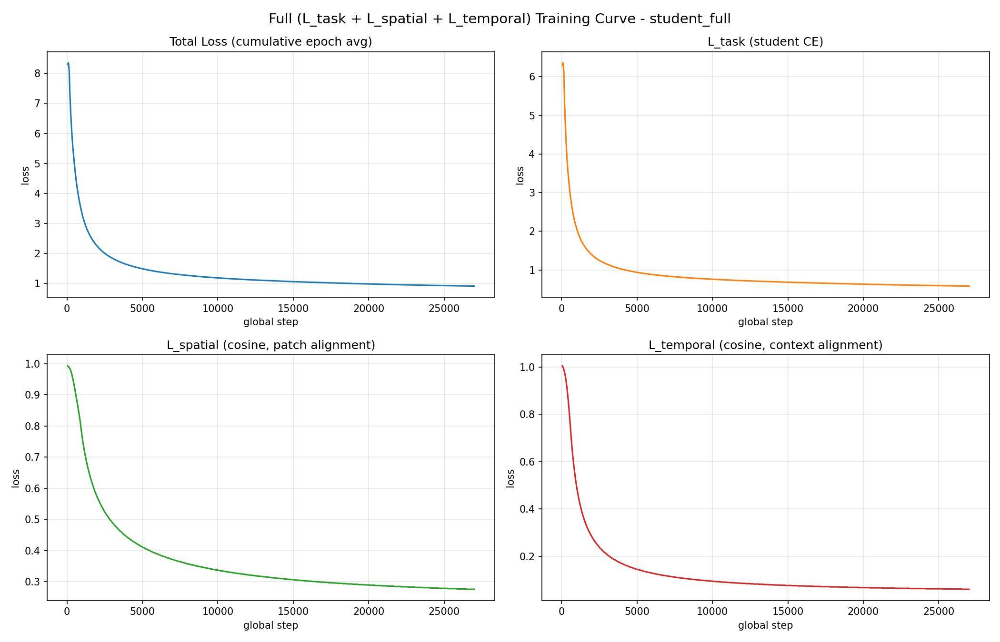
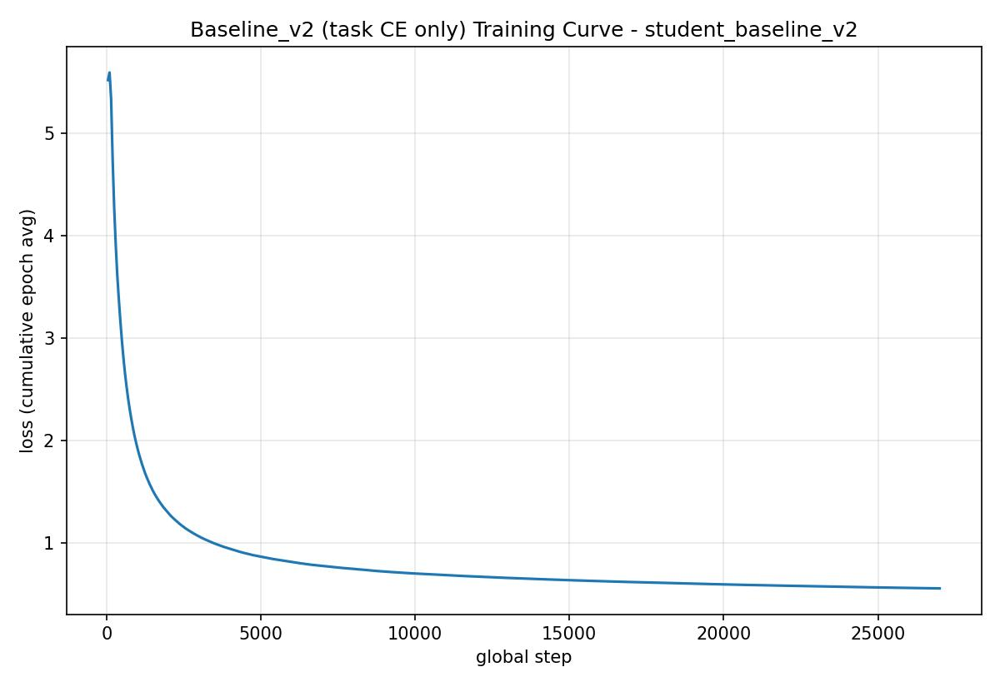
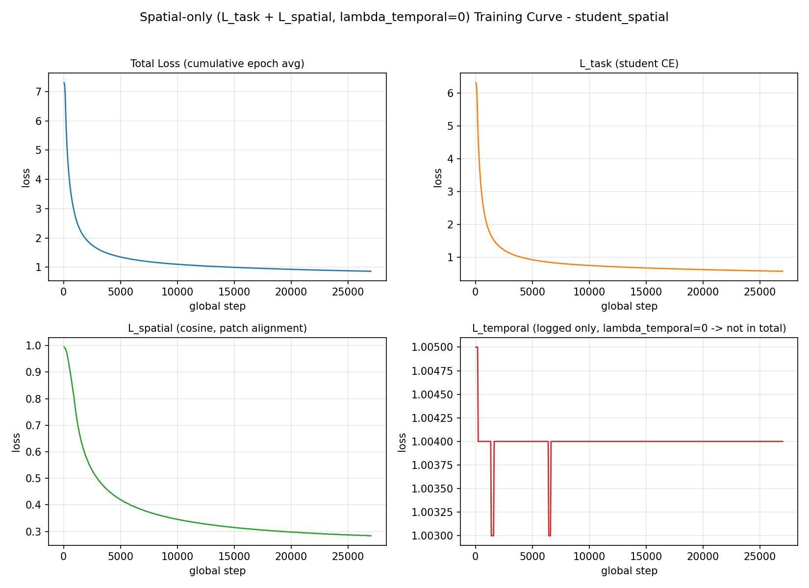
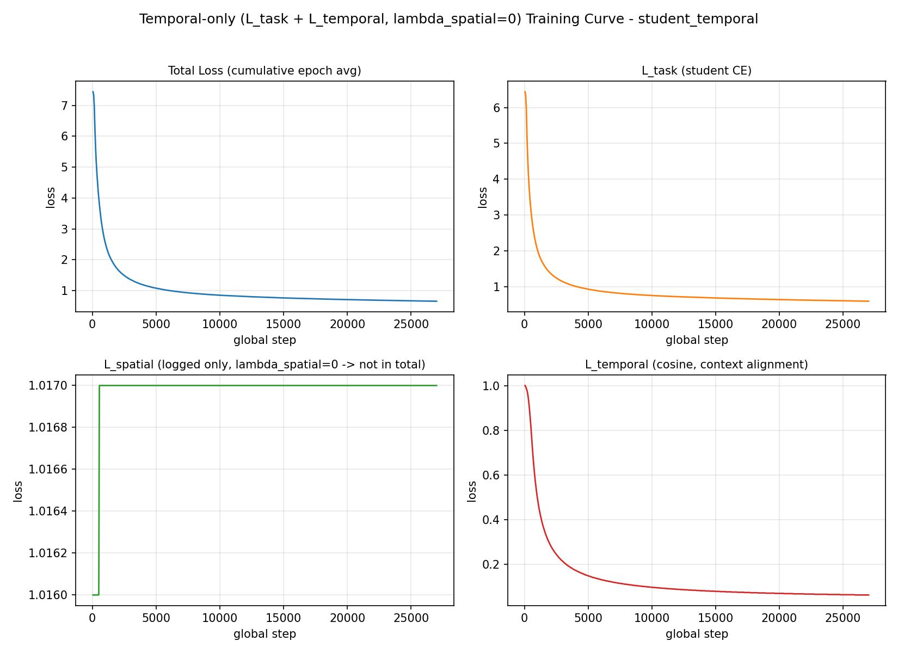
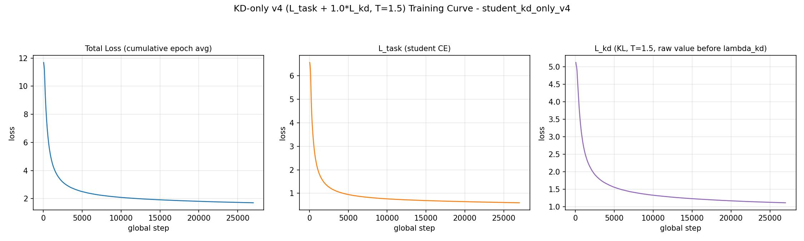

# VLM 증류 파이프라인 진행 보고서 (2026-08-12)

> **⚠ 2026-08-12 시점의 스냅샷이다. 최신 판단은 여기를 따르지 말 것.**
> 이후 검증에서 이 문서의 서술 몇 개가 뒤집혔다.
>
> | 이 문서 | 이후 |
> |---|---|
> | `object`에서 Full이 **"확실히 우세"** | **순위 주장 불가.** 5개 변형 모두 시드 고정 없이 1회 학습이라 43.87% 대 37~40%도 n=1 관측이다. "방향성 관찰"로만 쓴다 |
> | 전체 정확도에서 Full 우위 | **세 변형은 구별되지 않는다** (0.35pp는 시드 노이즈와 구별 불가) |
> | INT4 표(baseline 1.39% 등)를 정밀도 비교로 읽음 | **교란된 값.** dtype(fp16)과 해상도가 원인이며 정정 재측정이 큐에 있다 |
> | 증류 손실이 활성 크기를 **결정**한다 | **절반만 참.** fixA(학습 없이 붕괴 94.4%→0.0%)와 B(자기 정렬이 효과의 51% 재현)가 반증 |
>
> **최신 판단**: `thesis_outline_20260910.md`(장 구성·서술 규칙·실험 대장),
> `paper_positioning_ksae2026.md`(제목·초록). 이 파일은 **판단이 어떻게 바뀌었는지
> 추적하기 위해** 고치지 않고 남긴다.

Qwen2.5-VL-7B teacher → Qwen2.5-VL-3B student 지식증류 프로젝트, `train_distillation.py`
ablation 인프라 구축부터 5-way 최종 결과, EM-VLM4AD 공정 비교, CODA-LM 착수 검토까지의 기록.

## 한눈에 보기

| 항목 | 상태 |
|---|---|
| 5-way ablation 학습 (Full/spatial/temporal/baseline_v2/kd_only_v4) | **완료** |
| 5-way NuScenes-QA val 평가 (11,309 샘플) | **완료** |
| kd_only EOS 붕괴 진단 및 근본 수정 (v2→v3→v4) | **완료** |
| 5-way 공정성 감사 | **완료**, 캐벗 1건 확인(결과에 영향 없음) |
| EM-VLM4AD 공정 비교 (finetune, single-camera/max_length 통제) | **완료** — 54.08% (Ours 51.69%보다 높음) |
| CODA-LM 평가 | **착수 전** — GPT-4o judge 비용/API 키 결정 대기 |

---

## 1. Ablation 인프라 — `--variant` 플래그

`train_distillation.py`에 `--variant {full,spatial,temporal}` CLI 플래그를 추가해 세 ablation
변형이 `output_dir`/`lambda_spatial`/`lambda_temporal`/`temporal_k` 4개 값만 다르게 CONFIG를
덮어쓰도록 구현. baseline_v2/kd_only_v2처럼 스크립트를 물리적으로 복제하지 않은 이유는, 과거
`lora_target_vision_attn` 건처럼 한쪽만 고치고 다른 쪽을 깜빡하는 ablation-fairness 버그가
재발할 위험을 구조적으로 없애기 위함.

이어서 `student_spatial`(λ_temporal=0, temporal_k=1)과 `student_temporal`(λ_spatial=0)을
`_orchestrate_ablations.sh`로 순차 학습 완료:

| 체크포인트 | 최종 avg_loss | 세부 |
|---|---|---|
| student_full | 0.9173 | task=0.581 spatial=0.276 temporal=0.061 |
| student_spatial | 0.8634 | task=0.579 spatial=0.284 (temporal 미학습, 평탄) |
| student_temporal | 0.6569 | task=0.595 temporal=0.062 (spatial 미학습, 평탄) |

## 2. 학습 설정 및 소요 시간

### 2.1 공통 학습 설정

5개 ablation 변형(Full/spatial/temporal/baseline_v2/kd_only_v4) 전부에 걸쳐 동일한 값 —
§6의 공정성 감사에서 로그 대조로 직접 재확인한 것과 같은 항목들이다.

| 항목 | 값 |
|---|---|
| Teacher | Qwen2.5-VL-7B-Instruct + LoRA (`checkpoints/teacher_lora/epoch_1`) |
| Student base | Qwen2.5-VL-3B-Instruct |
| LoRA rank / alpha / dropout | 16 / 32 / 0.05 |
| `lora_target_vision_attn` | `True` (vision encoder qkv/proj까지 LoRA 적용) |
| learning_rate | 2e-5 |
| warmup_ratio | 0.05 (warmup_steps=1351) |
| num_epochs | 1 |
| effective_batch | 16 |
| total_steps | 27,037 |
| drivelm_ratio | 0.4 (배치 내 DriveLM:NuScenes-QA 목표 비율) |
| hazard_oversample / beta | True / 0.5 |
| log_every / save_every_steps | 50 / 1,000 |
| GPU | 단일 GPU, 전 실행 순차 진행 (동시 학습 없음) |

변형별로 다른 값:

| 변형 | batch_size × grad_accum | λ_spatial | λ_temporal | temporal_k | spatial_layer_idx | 기타 |
|---|---|---|---|---|---|---|
| Full | 2 × 8 | 1.0 | 1.0 | 2 | 23 | `teacher_max_length=1600` |
| spatial | 2 × 8 | 1.0 | 0.0 | 1 | 23 | teacher 멀티프레임 입력 자체 생략 |
| temporal | 2 × 8 | 0.0 | 1.0 | 2 | 23 | — |
| baseline_v2 | 4 × 4 | — (task CE만) | — | — | — | teacher 관여 없음 |
| kd_only_v4 | 2 × 8 | — | — | — | — | `lambda_kd=1.0`, `kd_temperature=1.5` |

baseline_v2만 micro-batch 구성이 다르지만(4×4 vs 2×8) effective_batch=16으로 동일해 실질적
영향은 없음(§6).

### 2.2 실측 소요 시간 (wall-clock)

같은 GPU 1개를 오케스트레이션 스크립트(`_orchestrate_v2.sh`, `_orchestrate_ablations.sh`)로
순차 실행했기 때문에, 아래 시각은 실제 로그/PID 파일 타임스탬프로 역산한 값이다.

| 실행 | 시작 | 종료 | 소요 시간 | 비고 |
|---|---|---|---|---|
| Full | 2026-07-24 01:06 | 2026-07-26 16:16 | **63.2시간** (2일 15h) | 이전에 14시간 hang으로 1회 중단·재시작한 이력 있음(CLAUDE.md의 watchdog 도입 계기) — 이 수치는 마지막 정상 완주 구간만 |
| baseline_v2 | 2026-07-26 16:16 | 2026-07-27 22:17 | **30.0시간** (1일 6h) | teacher forward 없음 + micro-batch 4라 5개 중 가장 빠름 |
| kd_only_v2 | 2026-07-27 22:17 | 2026-07-30 01:40 | **51.4시간** (2일 3h) | 최종 폐기(EOS 붕괴) — GPU 시간은 소모됨 |
| spatial | 2026-07-30 01:40 | 2026-08-01 05:37 | **52.0시간** (2일 4h) | |
| temporal | 2026-08-01 05:37 | 2026-08-03 20:10 | **62.6시간** (2일 15h) | teacher 멀티프레임(K=2) 입력 유지로 Full과 비슷하게 오래 걸림 |
| kd_only_v3 | (중도 kill) | — | 미완주 | 가설 기각 후 폐기, 체크포인트 삭제 |
| kd_only_v4 | 2026-08-05 11:21 | 2026-08-07 15:02 | **51.7시간** (2일 4h) | 최종 사용 체크포인트 |

**Full/temporal이 baseline_v2보다 2배 이상 걸리는 이유**: teacher forward pass(7B, `torch.no_grad()`)가
매 스텝 추가되고, temporal_k=2일 때는 teacher가 현재+과거 프레임 2장을 함께 토큰화·인코딩해야
해서 데이터 로딩·teacher 연산 비용이 함께 늘어난다. spatial(temporal_k=1)은 teacher가 student와
동일한 단일 프레임만 보므로 그만큼 덜 걸린다.

전체 5-way 학습에 소요된 순수 GPU-시간 합계(kd_only_v2/v3의 폐기분 포함): 약 **311시간**
(≈13일)이며, kd_only_v2→v4 재시도분(51.4h)과 v3 부분 학습분을 제외한 "최종 채택 체크포인트만"
기준으로는 약 **259.5시간**(≈10.8일)이다.

### 2.3 평가 소요 시간

| 평가 | 샘플 수 | 소요 시간 | 처리 속도 |
|---|---|---|---|
| 5-way 각 NuScenes-QA val 평가 (5회) | 11,309 | 회당 약 1.2~1.3시간 | ~0.4초/샘플 (student는 CAM_FRONT 1장만 읽음) |
| EM-VLM4AD finetune (multi-cam, 1차) | train 54,607 × 3 epoch | 53분 | 6뷰 중복 read 포함 |
| EM-VLM4AD finetune (single-cam, 최적화 후 최종) | train 54,607 × 3 epoch | 37.3분 | 1회 read + 텐서 복제로 단축 |
| EM-VLM4AD eval (single-cam, max_length=16, 최종) | 11,309 | 1시간 45분 | 최적화 전 추정치(3.4초/샘플, ~10.7h) 대비 약 8배 단축 |

## 3. 학습 손실 곡선

각 실행의 `logs/*.log`를 파싱해 생성한 loss curve(`loss_graph/`). Full/spatial/temporal은
task/spatial/temporal 3~4분할, baseline_v2는 단일 CE, kd_only_v4는 task/kd 분할.

**Full** — `L_task + L_spatial + L_temporal`

**Baseline (no KD)** — `L_task`만

**L_spatial only** — `λ_temporal=0`, L_temporal은 로그만 되고 학습엔 반영 안 됨(평탄한 것이 정상)

**L_temporal only** — `λ_spatial=0`, L_spatial은 로그만 되고 학습엔 반영 안 됨(평탄한 것이 정상)

**KD-only (v4)** — `L_task + 1.0·L_kd` (T=1.5)

## 4. KD-only EOS 붕괴 — 진단과 수정 (v2 → v3 → v4)

**v2** (`lambda_kd=1.0`, `kd_temperature=4.0`): 학습 loss는 정상이었으나 NuScenes-QA val
정확도 **1.78%**로 붕괴(다른 4개 변형은 50%대). EOS 확률을 직접 찍어보니 정답 토큰 자체는
정상 확신도로 맞히지만(`yes` p=0.99 등) EOS(`<|im_end|>`) 확률이 학습 끝까지 rank
수백~수십만 위에 머물러 "멈춤"을 학습하지 못한 상태였음 — `"yes. 10.5.1.2.3.4."`처럼 숫자를
끝없이 이어붙이는 패턴.

**v3** (`lambda_kd`만 0.3으로 축소, T=4.0 유지) — 첫 가설(손실 크기 불균형)에 따른 수정. 손실
비율은 개선됐지만(`task=0.940` vs `0.3×kd=0.815`), baseline_v2가 이미 EOS를 깔끔히 학습한
동일 스텝(`step_5000`, 18.5% 지점)에서 여전히 EOS가 전혀 학습되지 않음 — **가설 기각**.

**근본 원인**: teacher 자신의 forced-position 로짓을 직접 프로빙. T=1(원본 확률)에서는 EOS가
0.24~0.97(대부분 1위)로 정상인데, `UniformKDLoss`가 쓰는 T=4로 나눈 뒤 152K 토큰 vocab
전체에 softmax를 걸면 EOS 확률이 **0.0004~0.0016 수준까지 붕괴**(순위는 유지되지만 2·3위와
사실상 동률). Hinton식 KD의 T=2~4는 ~1,000클래스 기준이라, 152K 토큰 vocab에 그대로 적용하면
target이 사실상 균등분포로 뭉개져 "여기서 멈춰라"는 신호 자체가 사라짐.

| 질문 | teacher EOS p (T=1) | teacher EOS p (T=4) |
|---|---|---|
| pedestrian 식별 | 0.965 (1위) | 0.00064 |
| traffic cones 존재 | 0.243 (2위) | 0.00116 |
| moving cars 존재 | 0.755 (1위) | 0.00036 |

**v4** (`kd_temperature` 4.0→**1.5**, `lambda_kd` 0.3→**1.0**): step_5000/7000/8000/10000/
20000/최종(epoch_1) 각 지점에서 EOS 재확인 — 전부 rank 1(확률 0.4~1.0)로 정상화 확인.
최종 `avg_loss=1.7059`(task=0.596, kd=1.110).

## 5. 5-way 최종 결과 (NuScenes-QA val, 11,309 샘플, exact-match)

| 모델 | 전체 | comparison | count | exist | object | status |
|---|---|---|---|---|---|---|
| **Full (Ours)** | **51.69%** | 64.72% | 7.46% | 80.17% | **43.87%** | 51.03% |
| L_spatial only | 51.40% | 63.09% | **10.58%** | 81.38% | 37.86% | **52.79%** |
| L_temporal only | 51.34% | 64.44% | 7.73% | **81.17%** | 39.89% | 52.24% |
| Baseline (no KD) | 50.30% | 64.49% | 7.96% | 80.26% | 36.67% | 51.15% |
| KD-only (uniform, v4) | 46.74% | 63.88% | 10.40% | 67.68% | 35.48% | 51.09% |

**핵심 관찰**
- Full이 단일 손실 ablation(spatial/temporal 단독)보다도 근소 우위 — 두 손실을 함께 쓰는 게 낫다는 근거.
- `object` 카테고리에서 Full이 확실히 우세(43.87%) — L_spatial의 패치 정렬 효과와 일치.
- Baseline(no KD)도 이미 50.30%로 준수 — feature-KD의 순이득은 실재하지만 크지 않음(~1~1.4pp).
- KD-only가 최하위, 특히 `exist`(67.68% vs 나머지 ~80%대). 실제 생성 결과를 확인한 결과 **판단 자체는
  맞히는데 정답 뒤에 부연설명을 붙여서**("yes, there are many.") exact-match에서 떨어지는 패턴 —
  teacher의 DriveLM 혼합 학습 스타일이 KD를 통해 일부 전이된 잔여효과로 진단.
- `count`는 5개 전부 7~11%대로 공통 약점 — 모델 규모/데이터에서 오는 구조적 한계로 판단.

## 6. 5-way 공정성 감사

데이터(drivelm_ratio, hazard_oversample), LoRA(rank/alpha/dropout, `lora_target_vision_attn=True`),
optimizer(lr, warmup), effective_batch=16·total_steps=27037, 평가 프로토콜(동일 11,309 샘플,
동일 스크립트) — **전부 5개 변형에 걸쳐 동일함을 로그 대조로 직접 확인**.

유일한 caveat: kd_only의 `kd_temperature`/`lambda_kd`만 v2→v3→v4 디버깅 과정에서 val 샘플
소수를 직접 들여다보며 조정됨(다른 4개는 val 관찰 없이 사전 고정). 다만 이 조정은 accuracy
수치가 아닌 "EOS가 rank 1인가"라는 정성적 진단이었고, 그럼에도 kd_only가 5개 중 최하위로
나왔다는 점에서 오히려 "feature-KD가 output-KD보다 낫다"는 결론을 더 보수적으로 뒷받침함.

## 7. EM-VLM4AD 비교 — 공정성 이슈 발견과 통제

**1차 시도** (원저자 기본 설정 그대로 파인튜닝+평가 진행 중) 중간 정확도 52~55%대가 나오자
공정성 재검토 실시 → **두 가지 구조적 비대칭 발견**:
1. EM-VLM4AD는 카메라 6뷰를 전부 입력받음(우리 student는 CAM_FRONT 1개만).
2. 생성 길이 캡이 `max_length=512`(우리는 `max_new_tokens=16`).

→ **진행 중이던 평가를 중단**하고 두 조건을 통제:
- `--single_camera`: CAM_FRONT 1장을 6-slot에 복제(아키텍처 shape는 유지, 정보량만 통제)
- `--max_length 16`: 우리 eval과 동일하게 조정
- 부수적으로 이미지를 6번 중복 read/transform하던 비효율도 발견해 1회 read + tensor 복제로 수정 → **eval 속도 약 8배 향상**(3.4s/sample → ~0.4s/sample, §2.3)

**통제된 최종 결과** (NuScenes-QA train 동일 서브셋 54,607개로 3epoch 파인튜닝 후 val 11,309 평가):

| | 전체 | comparison | count | exist | object | status |
|---|---|---|---|---|---|---|
| EM-VLM4AD (T5-Base, finetuned, single-cam) | **54.08%** | 67.87% | **18.35%** | 80.50% | 42.65% | 50.48% |
| (참고) student_full | 51.69% | 64.72% | 7.46% | 80.17% | 43.87% | 51.03% |

EM-VLM4AD가 전체 정확도와 `count`에서 우리 Full보다 높게 나옴. 사용자 요청에 따라 **5-way 표에
6번째 행으로 합치지 않고 CLAUDE.md에 별도 항목으로 기록** — 서로 다른 모델 계열(T5 LM +
CNN/ViT 프론트엔드, teacher 없는 아키텍처)이라 5-way 내부 ablation 결론에는 영향 없음.

**"왜 T5 대신 이 방법을 쓰는가" 방어 논리** (심사 대비로 정리):
1. 이 연구의 기여는 태스크 1등 모델이 아니라 **distillation 방법론**(7B teacher → 3B student
   압축) — EM-VLM4AD는 압축 대상 teacher 자체가 없어 같은 질문에 답할 수 없음.
2. EM-VLM4AD는 224×224/6뷰 고정 CNN 구조라 QA 포맷 밖 확장이 어려움. Qwen 기반은 범용 VLM.
3. NuScenes-QA로 파인튜닝하면서 EM-VLM4AD가 오히려 짧게만 답하도록 눌림 — 안전성 설명가능성
   관점에서 불리.
4. teacher가 더 커져도(32B, 72B...) 이 파이프라인은 재적용 가능. EM-VLM4AD류엔 대응 개념 없음.

## 8. CODA-LM — 조사 완료, 착수는 보류 중

- 데이터: Train 4,884 / Val 4,384 / Test 500 / Mini 50 (CODA2022 기반), 어노테이션은
  HuggingFace `KaiChen1998/coda-lm`.
- QA 포맷이 NuScenes-QA와 완전히 다름 — **전부 자유서술형**(general_perception/
  region_perception/driving_suggestion), exact-match 불가능.
- **공식 채점이 GPT-4o judge(OpenAI API) 기반** — 로컬/무료 대안 미제공. 이 인스턴스엔
  OpenAI 키 없음.
- 표준 API 가격($2.50/$10 per 1M 토큰) 기준 추정 비용(5개 체크포인트 전체, 이미지당 평가
  단위 ~4개 가정 — region_perception 개수는 불확실):

  | 스플릿 | 이미지 수 | 예상 비용(표준) | Batch API(50%↓) |
  |---|---|---|---|
  | Mini | 50 | ~$4 | ~$2 |
  | Test | 500 | ~$40 | ~$20 |
  | Val | 4,384 | ~$350 | ~$175 |

- **결정 대기 중**: (a) API 키 제공 후 공식 파이프라인 그대로 구현 / (b) 로컬·무료 대체 채점
  스크립트 자체 설계(공식 리더보드와 비교 불가) / (c) 보류.

## 9. Git 커밋 이력 (이번 구간)

| 커밋 | 내용 |
|---|---|
| `a8aa103` | `--variant` 플래그, kd_only v4 수정, 5-way eval_results |
| `6a7f804` | loss curve (Full, baseline_v2) |
| `1fda2d3` | loss curve (spatial, temporal, kd_only_v4) |
| `9c2d06c` | EM-VLM4AD `--single_camera`/`--max_length` 옵션 + 성능 최적화 + eval_results |

CLAUDE.md는 `.gitignore` 대상이라 이 보고서에 정리된 서술형 기록은 저장소 히스토리와 별개로
로컬에만 존재함(인스턴스 파괴 시 유실 위험 — 특히 `external/EM-VLM4AD` 내부 수정은 nested git
repo라 이중으로 커밋 불가).

## 10. 남은 작업

1. CODA-LM 진행 방향 결정 (§8)
2. (선택) v1 baseline/kd_only appendix 평가 — vision-attn LoRA 단독 효과 분리
3. (선택) EM-VLM4AD zero-shot 결과도 참고용으로 기록할지 여부
