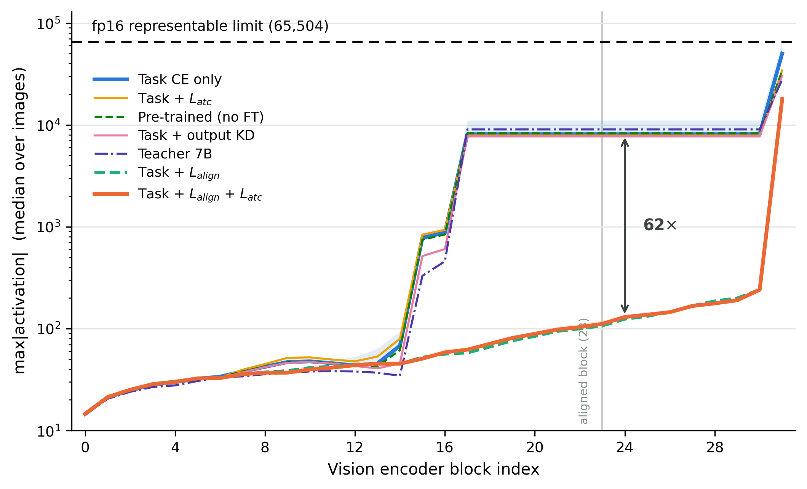
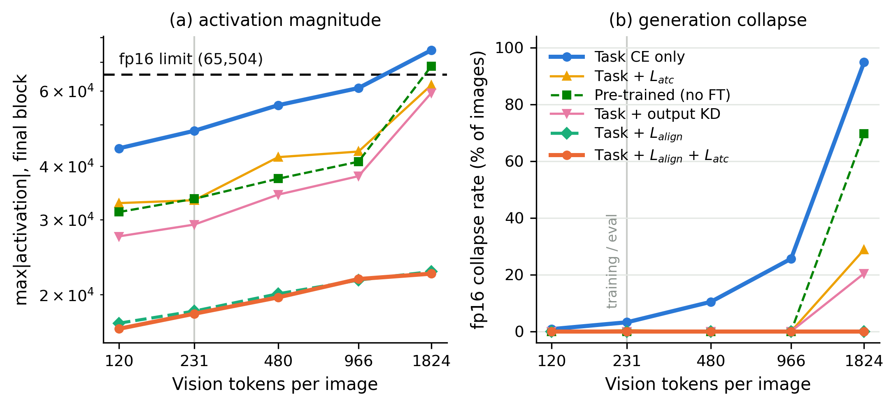
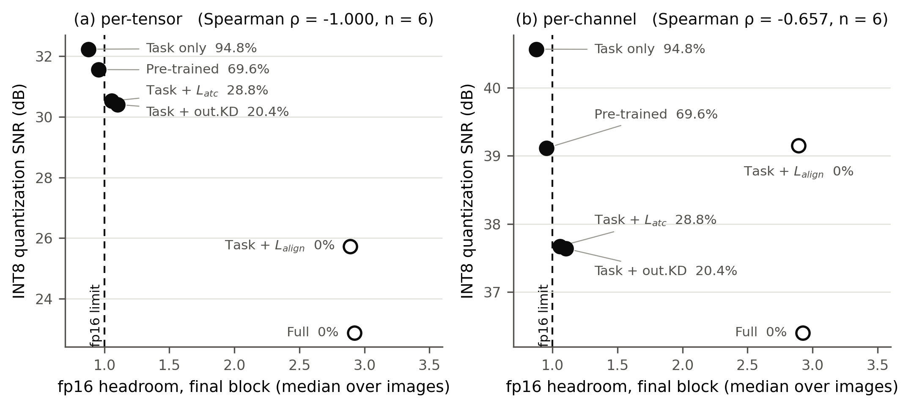
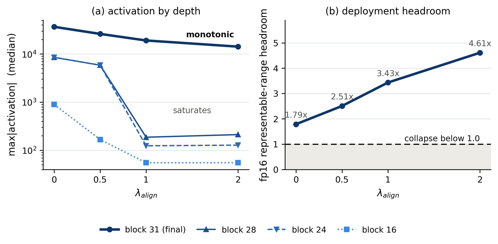
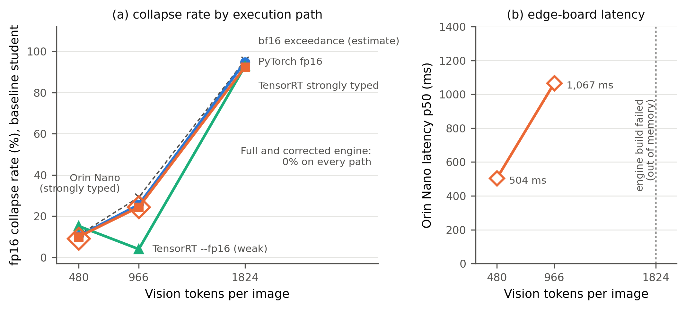
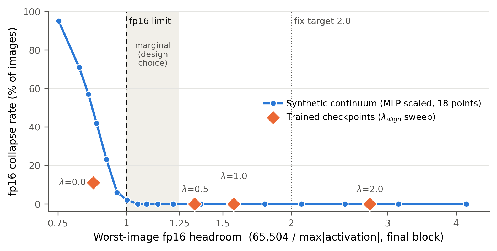

<!-- 자동 생성: scripts/build_thesis.py (2026-10-02). 직접 고치지 말 것 — 장별 초안을 고치고 다시 생성한다. -->

# 자율주행 비전-언어 모델의 저정밀 배포를 위한 표현 범위 여유 측정과 진단

*Measuring and Diagnosing Representable-Range Headroom for Low-Precision Deployment of Autonomous-Driving Vision-Language Models*

석사학위논문 초안 · 합본 생성 2026-10-02 · 학교 양식 적용 전

---

# 목차

- 국문 초록
- 1장 서론
  - 1.1 배경 — 차량 탑재 VLM과 두 단계의 압축
  - 1.2 문제 — 표준 지표가 보지 못하는 실패
  - 1.3 논지와 기여
  - 1.4 범위 — 주장하지 않는 것
  - 1.5 논문의 구성
- 2장 관련 연구
  - 2.1 VLM 지식 증류와 주행 VLM 경량화
  - 2.2 저정밀 배포와 활성 이상치
  - 2.3 자율주행 VLM 효율화 서베이
  - 2.4 평가 프로토콜
  - 2.5 정리 — 비어 있는 축
- 3장 실험 기반 — 통제된 다중 변형 증류 파이프라인
  - 3.1 교사와 학생
  - 3.2 데이터
  - 3.3 손실
  - 3.4 다섯 변형과 공정성 통제
  - 3.5 평가 프로토콜
  - 3.6 결과 — 정확도로는 변형을 구별할 수 없다
  - 3.7 이 장이 뒤 장에 넘기는 것
- 4장 수치 표현의 상실 — fp16 표현 범위 초과
  - 4.1 표현 범위 여유 — 정의와 측정 규칙
  - 4.2 활성 크기 프로파일
  - 4.3 이산적 실패와 해상도 의존성
  - 4.4 표준 지표는 역방향을 가리킨다
  - 4.5 오버플로 지점 — 마지막 블록 MLP가 생성한다
  - 4.6 증폭기 — down_proj의 849번 행
  - 4.7 개입 위치가 성패를 가른다
  - 4.8 여유를 움직이는 수단은 여럿이다
  - 4.9 정리
- 5장 따름정리 — 이산적 실패는 집계 지표를 무력화한다
  - 5.1 INT4 정확도 1.39% — 원인은 양자화가 아니었다
  - 5.2 검사받는 부분과 터지는 부분 — 공개 양자화 저장소 조사
  - 5.3 위험 구성이 곧 위험은 아니다 — 그러나 위험한 실례가 있다
  - 5.4 설정도, 설계도, 가중치도 여유를 예측하지 못한다
  - 5.5 재는 일도 쉽지 않다
  - 5.6 정리
- 6장 저정밀 배포 검증 파이프라인과 실기기 확인
  - 6.1 대상 — 비전 인코더만 내보낸다
  - 6.2 배포 형식으로 내보내기 — 막힌 곳 넷
  - 6.3 측정 프로토콜 — 정밀도 조건을 나눈다
  - 6.4 결과 — TensorRT는 이 오버플로를 막지 않는다
  - 6.5 처방의 런타임 검증
  - 6.6 형식의 비용 — bf16은 공짜가 아니지만, 그 비용은 형식 탓이 아니다
  - 6.7 네 선택지를 나란히 놓으면
  - 6.8 런타임이 대신 막아 줄 여지는 줄고 있다
  - 6.9 엣지 보드 — 강타입 엔진에서 같은 붕괴, 같은 교정
  - 6.10 정리
- 7장 도구 — headroom_guard: 배포 전 진단·교정 패스
  - 7.1 구성
  - 7.2 설계 판단
  - 7.3 판정 기준을 데이터로 정한다
  - 7.4 검증
  - 7.5 배포 조건 정확도 — 종단 검증
  - 7.6 정리
- 8장 종합 논의와 한계
  - 8.1 논지는 닫혔는가
  - 8.2 사례 연구의 범위
  - 8.3 한계
  - 8.4 한계로 두지 않은 것
- 9장 결론
  - 9.1 요약
  - 9.2 기여
  - 9.3 범위와 남은 문제
  - 9.4 실무 권고
  - 9.5 향후 연구
- 참고문헌
- Abstract

## 그림 목차

- 그림 4-1. 비전 인코더 블록별 최대 활성의 크기
- 그림 4-2. 입력 해상도에 따른 (a) 마지막 블록 활성 크기와 (b) fp16 생성 붕괴율
- 그림 4-3. 표준 압축 지표의 역전 — 마지막 블록의 fp16 여유와 같은 텐서의 INT8 양자화 SNR
- 그림 4-4. 정렬 손실 가중치 λ_align에 따른 (a) 블록별 활성 크기와 (b) 마지막 블록 fp16 여유
- 그림 6-1. 실행 경로별 fp16 붕괴율과 엣지 보드 지연
- 그림 7-1. 판정 기준의 보정 — 마지막 블록의 최악 이미지 여유와 fp16 붕괴율

## 표 목차

- 표 3-1. 다섯 학생 변형의 손실·가중치·교사 입력
- 표 3-2. 다섯 변형의 공정성 통제 항목
- 표 3-3. NuScenes-QA 검증 정확도 — 변형별·질문 유형별
- 표 4-1. 측정 형식에 따른 여유와 판정
- 표 4-2. 비전 인코더 블록별 최대 활성 크기
- 표 4-3. 입력 해상도별 fp16 붕괴율
- 표 4-4. 원본 해상도에서의 모델별 여유와 해석
- 표 4-5. 여유·붕괴율과 표준 압축 지표
- 표 4-6. 양자화 검사를 받는 부분과 fp16으로 실행되는 부분
- 표 4-7. 마지막 블록 최댓값의 성분 분해
- 표 4-8. 마지막 블록 MLP 가설의 두 형태와 판정
- 표 4-9. 사후 개입 위치에 따른 활성과 붕괴율
- 표 4-10. 정렬 손실 가중치 λ에 따른 활성과 여유
- 표 4-11. 정렬 대상에 따른 마지막 블록 활성
- 표 5-1. INT4 정확도 — 교란 요인 제거 전후
- 표 5-2. 공개 양자화 저장소의 설정 패턴
- 표 5-3. 위험 구성 공개 저장소의 실측 여유
- 표 5-4. 기반 모델과 양자화 파생본의 여유 — 상속
- 표 5-5. 다른 두 계열에서의 여유 상속
- 표 5-6. Qwen 세대별 여유
- 표 6-1. ONNX 내보내기에서 막힌 곳과 해결
- 표 6-2. 내보낸 ONNX 그래프와 대조 결과
- 표 6-3. TensorRT 정밀도 조건
- 표 6-4. TensorRT 정밀도 조건별 붕괴율·메모리·지연
- 표 6-5. 교정 그래프의 fp16·bf16 지연
- 표 6-6. 배포 선택지 넷의 비교
- 표 6-7. Orin Nano에서의 관행 빌드 시도와 실패 지점
- 표 6-8. 강타입 엔진의 A100 대조 — fp16 그래프
- 표 6-9. Orin Nano 실측 결과
- 표 7-1. headroom_guard의 명령
- 표 7-2. 최악 여유에 따른 붕괴율 — 전이 지점
- 표 7-3. 초과 비율과 실제 붕괴율
- 표 7-4. 실행 경로별 붕괴율과 초과 비율 — 관행은 fp32 그래프
- 표 7-5. 표본 수에 따른 무초과 시 참 초과율의 95% 상한
- 표 7-6. 도구의 세 판정
- 표 7-7. 모델 계열별 도구 적용 결과
- 표 7-8. 학습된 λ 체크포인트의 여유와 실제 붕괴
- 표 7-9. 배포 조건 정확도 — 종단 검증
- 표 7-10. fp16과 bf16의 짝지은 정확도 비교
- 표 8-1. 기여 진술의 부분별 근거와 강도

---

# 국문 초록

**자율주행 비전-언어 모델의 저정밀 배포를 위한 표현 범위 여유 측정과 진단**

자율주행용 비전-언어 모델(VLM)을 차량에 탑재하려면 지식 증류로 모델을 줄이고 반정밀도(fp16)로 연산을
줄여야 한다. 두 단계는 각자의 지표 — 증류는 과제 정확도, 양자화는 이상치 비율과 양자화 신호대잡음비(SNR)
— 로 평가된다. 본 논문은 이 평가 체계가 놓치는 실패로 **fp16 표현 범위 초과**를 제시하고, 그것을 배포 전에
재고 고치는 절차를 제안한다.

Qwen2.5-VL-7B 교사를 3B 학생으로 증류하면서 데이터·LoRA 구성·학습 스텝을 고정하고 손실 항만 달리한 다섯
학생을 만들었다. 특징 증류 학생들과 증류 없는 기준선은 정확도로 서로 구별되지 않았으나(50.30~51.69%),
비전 인코더 마지막 블록의 **표현 범위 여유**
(format_max ÷ max|activation|)는 원본 해상도에서 0.88배부터 2.92배까지 갈렸다(이미지별 최대의 중앙값). 여유가
1배 아래인 학생은 fp16에서 이미지의 94.8%에 대해 출력을 통째로 잃었고, 과제 정확도가 49.95%(bf16)에서
1.36%(fp16)로 떨어졌다. 같은 두 학생의 INT8 양자화 SNR은 붕괴하는 쪽이 32.23 dB, 붕괴하지 않는 쪽이
22.88 dB로, **표준 압축 지표는 위험을 역방향으로 가리켰다.** 이는 양자화 도구가 검사하는 부분과 양자화에서
제외되어 fp16으로 실행되는 부분이 서로 다르기 때문이며, 조사한 공개 양자화 저장소 197개 중 13.7%가 이미
그런 설정이었다(배포 시 fp16 변환을 세지 않은 하한).

오버플로 지점은 마지막 블록 MLP의 출력 투영 안, 사전학습 가중치에 고정된 한 채널로 특정되었다. 곱이
만들어지기 전에 입력을 줄이면 학습 없이 붕괴가 사라졌고, 출력을 줄이면 사라지지 않았다. 여유는 특징 정렬
손실의 가중치에 따라 단조롭게 변했고, 정렬 대상을 학생 자신으로 바꿔도 효과의 절반이 남았으며, 저장소
설정·인코더 설계·가중치·모델 계열 어느 것으로도 예측되지 않았다. 비전 인코더를 양자화에서 뺀 공개 파생본은
기반 모델의 여유를 그대로 물려받았다.

이 진단을 도구 `headroom_guard`로 구현했다. 도구는 활성 크기를 넘치지 않는 형식(bf16)에서 재고, 형식 상한을
넘는 이미지의 비율로 붕괴율을 추정하며(PyTorch fp16 기준 6개 모델 평균 오차 2.1%p), 대상이 지원하는 형식에 맞춰 형식 전환이나
가중치 교정을 권고한다. 배포 조건에서 도구가 교정한 가중치는 정확도를 1.36%에서 50.73%로 되돌렸다. 비전
인코더를 ONNX로 내보내 TensorRT fp16 엔진으로 실행해도 같은 붕괴가 재현되었다. 엣지 보드(Jetson Orin Nano
8GB)의 강타입 엔진도 A100과 같은 비율로 붕괴했고(802,816 해상도, 24.4%), 교정 엔진은 붕괴하지 않았다.

압축된 주행 VLM의 저정밀 배포에서 부족한 것은 여유를 움직이는 수단이 아니라 **그것을 재는 일**이다.

**주요어**: 표현 범위 여유, 저정밀 추론, 지식 증류, 비전-언어 모델, 자율주행, 배포 검증


---

# 1장 서론

## 1.1 배경 — 차량 탑재 VLM과 두 단계의 압축

자율주행 인지에 시각-언어 모델(vision-language model, VLM)을 쓰면 장면 이해를 자연어로
설명할 수 있다. 판단의 근거를 사람이 읽을 수 있는 형태로 남긴다는 점은 사고 원인 규명과
운전자·규제 기관의 신뢰 확보에서 기존 인지 모듈이 주지 못하던 이점이다. 그러나 실용
성능을 내는 VLM은 수십억 개의 파라미터를 가지며, 차량에 탑재되는 엣지 가속기의 메모리와
연산 예산은 데이터센터 GPU와 비교할 수 없이 작다.

그래서 탑재까지는 통상 두 단계를 거친다. **지식 증류[1]**로 모델 자체를 줄이고, **양자화와
반정밀도(fp16) 연산**으로 계산을 줄인다. 두 단계는 서로 다른 문헌에서 발전해 왔고 평가
방식도 다르다. 증류는 과제 정확도로, 양자화는 이상치 비율(max/rms)이나 양자화
신호대잡음비(SNR) 같은 수치 지표로 평가한다. 각 단계가 자기 지표에서 합격하면 배포 준비가
된 것으로 본다.

## 1.2 문제 — 표준 지표가 보지 못하는 실패

fp16의 표현 한계는 65,504다. 어떤 층의 활성값이 이를 넘으면 그 값은 무한대가 되고, 이후
연산에서 NaN으로 번져 **그 이미지에 대한 출력이 통째로 무너진다.** 정확도가 조금 떨어지는
것이 아니라 생성 자체가 실패한다. 그리고 이 실패는 **활성값의 절대 크기**에만 달려 있다.

그런데 압축 평가에 쓰이는 지표는 대부분 **스케일 불변량**이다. 텐서 전체에 상수를 곱해도
이상치 비율은 변하지 않고, 정수 양자화의 SNR도 변하지 않는다(스케일이 양자화 파라미터로
흡수되기 때문이다). 절대 크기로 결정되는 fp16 초과와 스케일 불변 지표는 **수학적으로 직교**
하며, 한쪽으로 다른 쪽을 판단할 수 없다. 직교성만으로는 두 축이 무관하다는 것까지만 예측된다.
본 논문은 실제로는 그보다 나쁜 일, 즉 **표준 지표가 위험을 거꾸로 가리키는 일**이 일어남을
보인다.

구체적으로, Qwen2.5-VL-7B[2] 교사를 3B 학생으로 증류하면서 손실 항만 달리한 다섯 학생을
만들었다(3장). 그중 특징 정렬 손실을 쓰지 않은 학생은 비전 인코더 마지막 블록의 fp16 여유가
**0.88배**(p50 · 원본 해상도 · 250장, bf16에서 측정)로 이미 한계를 넘어 원본 해상도에서
**94.8%**의 이미지가 붕괴하고, 정렬 손실을 쓴 학생은 **2.92배**로 붕괴가 없다(0.0%). 그런데
같은 두 학생의 INT8 양자화 SNR은 붕괴하는 쪽이 **32.23 dB**, 붕괴하지 않는 쪽이 **22.88 dB**
(원본 해상도)로, 표준 지표는 붕괴하는 모델을 오히려 더 안전하다고 순위 매긴다(4장).
과제 성능으로 보면 붕괴하는 학생은 원본 해상도에서 bf16으로 돌릴 때 **49.95%**이던
정확도가 fp16에서 **1.36%**로 떨어진다(NuScenes-QA[3] 1,029문항, 7장).

## 1.3 논지와 기여

본 논문의 기여는 하나다.

> **압축된 주행 VLM을 저정밀로 배포할 때 표현 범위 초과로 인한 기능 상실이 일어나며,
> 표준 압축 지표는 이 위험을 역방향으로 가리킨다. 이 실패는 정확도의 점진적 저하가
> 아니라 이산적이고, 그것을 예고하는 값은 순전파 한 번으로 계산되며 그 값을 움직이는
> 수단도 여럿이다. 부족한 것은 수단이 아니라 측정이다.**

이 진술은 네 부분으로 읽으며, **순서가 곧 근거의 강도**다.

1. **표준 지표가 역방향을 가리킨다.** 이것이 기여의 실체다. 논증이 아니라 같은 모델·같은
   이미지에서 잰 두 수치의 대조이므로 가장 강하다(4장).
2. **실패는 이산적이다.** 붕괴는 이미지 단위로 일어나며 한 이미지 안에서 정상과 붕괴가
   섞이지 않는다. 붕괴를 제외하면 fp16과 bf16의 정확도 차이가 사라진다(생성 단위 확인은
   7장). 이산적이기 때문에 교란 변수 하나가 집계 지표 전체를 뒤집는다(5장).
3. **예고하는 값은 순전파 한 번으로 계산된다.** 층 출력에 대한 표현 범위 여유
   `format_max ÷ max|activation|`이다. 나눗셈 하나이므로 이것 자체를 지표 제안의 기여로
   내세우지 않는다. **"그렇다면 무엇을 대신 재야 하는가"에 대한 실무적 답**이다.
4. **여유를 움직이는 수단은 여럿이다.** 특징 정렬 손실의 가중치, 정렬 대상(교사가 아닌 학생
   자신으로 두어도 효과의 절반가량이 재현된다), 학습 없는 사후 가중치 재조정, 그리고 형식
   전환(bf16)이 모두 여유를 바꾼다(4·6장). 수단이 이렇게 흔한데도 붕괴가 배포까지 가는
   이유는 **재지 않기 때문**이며, 이것이 "부족한 것은 측정"이라는 결론의 근거다.

그리고 이 논지를 실무로 잇기 위해 두 가지를 만든다. **배포 검증 절차**(6장) — 비전 인코더를
고정 형상 ONNX로 내보내 TensorRT에서 정밀도 조건별로 붕괴를 재는 절차 — 와 **배포 전 진단
도구** `headroom_guard`(7장)다. 도구는 여유를 재고, 위험하면 교정 배율을 계산하며, 그 판정의
근거를 사용자가 확인할 수 있게 출력한다.

## 1.4 범위 — 주장하지 않는 것

기여의 경계를 서론에서 밝혀 둔다. 뒤 장의 모든 서술이 이 경계를 지킨다.

- **일반성을 주장하지 않는다.** 본 논문은 **fp16 표현 범위 초과라는 하나의 실패 양식**을
  끝까지 판 사례 연구다. "모든 저정밀 실패가 이산적이다"라고 쓰지 않는다. 위험 사례로
  실측된 것은 Qwen2.5-VL 세대이며, 다른 제작사의 비전 인코더들은 넉넉한 여유를 보였다
  (5장). 따라서 현상 자체가 한 세대의 특성일 수 있음을 인정한다. 다만 그 세대는 공개
  양자화 저장소 조사에서 둘째로 큰 집단이고, 비전 인코더를 양자화에서 제외한 파생본은
  기반 모델의 여유를 그대로 물려받는다(5장).
- **변형 간 정확도 순위를 주장하지 않는다.** 다섯 학생은 각각 한 번씩, 시드 고정 없이
  학습했다. 정확도 차이 대부분은 시드 잡음과 구별되지 않는다(3.6절).
- **증류 손실이 여유를 "결정한다"고 주장하지 않는다.** 정렬 손실은 여유를 움직이는 여러
  수단 중 하나다. 사후 재조정만으로도 붕괴가 사라지고, 정렬 대상을 바꿔도 효과의 절반이
  남기 때문이다.
- **"아무도 재지 않는다"고 쓰지 않는다.** 근거는 공개 저장소 197개의 config 조사와 arXiv
  전문 검색이며, config는 애초에 활성 통계를 적는 곳이 아니다. 정확한 진술은 **"조사한
  범위에서 표현 범위 여유를 보고한 사례를 찾지 못했다"**이다.
- **여유는 사후에 발견했다.** 미리 재고 시작한 연구가 아니다. 다만 그 값은 배포 **전에**
  계산할 수 있었고, 쟀다면 붕괴를 학습 단계에서 알 수 있었다. 이 순서를 그대로 적는다.

학습 하이퍼파라미터 쪽의 실패 — 큰 어휘에서 증류 온도가 종료 토큰 신호를 지우는 현상 —
도 본 연구 과정에서 규명했으나, 그것은 **저정밀 배포**라는 이 논문의 축을 직접 예시하지
않으므로 범위 밖으로 분리했다. 3.3절에 출력 증류 변형의 설정 근거로만 짧게 적는다.

## 1.5 논문의 구성

2장은 선행 연구를 네 계열로 정리하고 각 계열과 본 연구의 차이를 밝힌다. 3장은 논지를
검증하기 위한 **실험 기반** — 손실 항만 다른 다섯 학생 — 을 만들고, 그 학생들이 **정확도로는
구별되지 않음**을 먼저 인정한다. 4장은 정확도가 보지 못하는 차이, 즉 fp16 표현 범위 초과와
그 앞에서 표준 지표가 뒤집히는 현상을 측정하고, 오버플로 지점을 특정하며, 여유를 움직이는
수단들을 보인다. 5장은 그 실패가 이산적이어서 집계 지표 — 양자화 정확도 표, 공개 저장소에
선언된 설정 — 가 위험을 가리지 못함을 보이고, 공개 양자화 모델에서 같은 조건이 얼마나 흔한지
조사한다. 6장은 배포 검증 절차와 런타임·실기기(엣지 보드, 강타입 엔진)에서의 확인을, 7장은 진단·교정 도구와 그 종단
검증(배포 조건 정확도, 생성 단위의 이산성 확인)을 다룬다. 8장은 결과를 종합하고 한계를
정리하며, 9장에서 결론을 맺는다.

---

# 2장 관련 연구

본 연구는 네 계열의 문헌과 맞닿는다. 각 절 끝에 본 연구와의 차이를 적는다.

## 2.1 VLM 지식 증류와 주행 VLM 경량화

**특징 정렬 증류.** 중간층 특징을 학습 가능한 사상(projection)과 함께 정합시키는 설계는
FitNets[4] 이래 확립된 방법이다. 본 연구의 정렬 손실 `L_align`도 이 계열에 속하며, 그 구조를
새로운 기여로 주장하지 않는다.

**주행 VLM 증류.** Drive-KD[5]는 두 교사–학생 조합(InternVL3-8B[6] → 1B,
Qwen2.5-VL-7B → 3B) 가운데 하나로 본 연구와 같은 조합을 쓰며, 층별 어텐션 신호(주로 텍스트에서
비전으로의 어텐션)를 증류한다. 배포 정밀도는 다루지 않는다. EM-VLM4AD[7]는 DriveLM[8]으로 학습한 경량 주행 VQA 모델로, 코드와 가중치가 공개되어
있어 본 연구에서 참조 비교에 사용했다(3.6절). MiniDrive[9]는 공개 저장소에 코드와 가중치가
없어 재현할 수 없었으므로 인용 비교에만 쓴다.

**멀티프레임 교사에서 단일프레임 학생으로.** SCPNet[10]은
멀티프레임 교사의 시간 지식을 단일프레임 학생에 증류해, 배포 시 추론 비용을 늘리지 않으면서
시간 정보를 전이하는 구조를 자율주행에서 이미 제시했다. 본 연구의 시간 맥락 손실 `L_atc`는
그 구조를 LiDAR 기반 시맨틱 장면 완성에서 **카메라 기반 생성형 VQA**로 옮긴 것이며,
참신성을 주장하지 않는다.

> **본 연구와의 차이.** 이 계열은 증류의 결과를 **정확도**로 평가한다. 본 연구는 같은 증류
> 설계가 학생 비전 인코더의 **활성 크기**를 부수적으로 바꾸며, 그 크기가 저정밀 배포의
> 성패를 가른다는 점을 다룬다.

## 2.2 저정밀 배포와 활성 이상치

**미세조정 방식과 압축 친화성.** 미세조정 방식이 사후 압축의 성패에 영향을 준다는 점은
CrAFT[11]가 sharpness 최소화 목적함수로 이미 보였다. 학습·미세조정 단계에서
활성 이상치를 다루는 방법들도 제안되어 왔다 — 가중치 행렬 사이의 구조적 증폭을 제어해 극단적
활성을 완화하는 Colinearity Decay[12], 회전으로 이상치를 제거한 뒤 미세조정하는
RoLoRA[13]와 RoSTE[14], 문제 활성의 동적 범위를 제한하는
QuantTune[15].
이들은 모두 **양자화 친화성을 목적으로 설계한 기법**이며, 대상은 영상 분류용 ViT 또는 언어
모델이다.

**거대 활성.** 트랜스포머의 특정 채널에 매우 큰 활성이 나타나는 현상은 Massive Activations[16]와 후속 연구들이 보고해 왔고, 암묵적 편향으로 기능한다는 해석이 제시되었다.
모델 계열에 따라 최대 활성이 네 자릿수까지 차이 난다는 측정도 있다(Measuring Maximum
Activations[17]). 그러나 이들 연구는 활성 크기를 아키텍처와 사전학습의 산물로
다루며, **같은 아키텍처를 서로 다른 목적함수로 미세조정했을 때 크기가 달라지는지는 측정하지
않았다.** 비전 인코더 쪽에서는 RegCache[18]가 대규모 사전학습 비전 인코더의
이상치를 학습 없이 완화하는 활성 양자화 방법을 제안했지만, 서로 다르게 미세조정한 체크포인트를
비교하지는 않는다. 소형 VLM을 비전 인코더·프로젝터·언어 모델로 나눠 양자화하고 Jetson Orin
NX·AGX에서 평가한 연구[19]는 구성 요소별 양자화 오차와 지연을 분리해 보였다.
본 연구가 보는 것은 그와 달리 **양자화에서 제외되어 반정밀도로 남는 비전 인코더**다.

**반정밀도 추론의 오버플로.** fp16 추론에서의 수치 오버플로 자체는 알려진 문제다. PASA[20]는 어텐션 입력의 큰 진폭을 원인으로 지목하고 알고리즘적 완화를 제안했다.
vLLM 이슈 #40290[21]은 Gemma 4 비전 인코더를 fp16으로 돌리면 모든 이미지의 출력이 무너지는 현상을
보고했는데, 본 연구와 **같은 기전**이다. 넘치는 곳은 SigLIP 표준화 `(h − std_bias) × std_scale`의
뺄셈 중간값이며, 원인은 **저장된 bf16 가중치** `std_bias`(|max| 53,760, fp16 대비 1.218배)이고,
그것을 줄여 줄 `std_scale`이 뺄셈 **뒤에** 온다. 이 가중치는 두 텐서만 내려받아 직접 확인했으나,
활성 `h`는 재지 못했으므로 붕괴 자체는 본 연구의 측정이 아니다. 이 사례는 **개입 위치가 성패를
가른다**는 본 연구의 관찰(4장)과 처방 구조까지 같다. 다만 두 사례 모두 **한 모델의 사전학습
가중치가 가진 성질**을 다룬다.

**증류와 양자화 강건성.** 자동차 영역에서는 증류한 소형 모델이 교사보다 INT8 양자화에
강건하다는 관측이 있다(Edge AI for VRU Safety[22]). 다만 손실 종류를 통제
비교하지 않았고 메커니즘을 제시하지 않았으며, 과제는 객체 검출이다.

> **본 연구와의 차이.** 이 계열의 지표는 대부분 **이상치 비율(동적 범위)**을 본다. 본 연구는
> **절대 크기(표현 범위 여유)**를 동적 범위와 분리해 재고, 두 축이 같은 모델에서 반대 방향을
> 가리킬 수 있음을 보인다. 또 차이가 한 모델의 사전학습 가중치가 아니라 **같은 기반 모델을 다른
> 손실로 학습한 결과**에서 생긴다는 점 — 두 체크포인트 중 하나만 붕괴한다는 점 — 에서
> 구별된다. 오버플로 현상 자체의 선례는 인정한다.

## 2.3 자율주행 VLM 효율화 서베이

최근 서베이들은 주행용 VLM·VLA의 효율화를 주요 과제로 다룬다. 「A Survey on Vision-Language-Action
Models for Autonomous Driving」[23]은 모델이 수십억 파라미터로 커질수록 증류나 MoE
희소화가 필요해질 것이라 본다. 「Vision-Language-Action Models for Autonomous Driving: Past, Present,
and Future」[24]는 모델 구조와 시스템 효율 절에서 지연과 연산 부담을 과제로 든다.
「A Survey on Efficient Vision-Language-Action Models」[25]는 구조적 희소화와 행동
표현의 충실도 사이에 절충이 있어 과도한 가지치기와 저비트 양자화가 행동 충실도를 해칠 수 있다고
지적한다. 「Rethinking Language's Role in Efficient VLA for Autonomous Vehicles」[26]는
효율–안전 프론티어가 정량화되어 있지 않고, 효율 지표와 주행 성능 지표가 같은 논문에 함께
등장하는 일이 드물다고 지적한다.

> **본 연구와의 관계.** 본 논문은 이 공백 중 좁은 한 자리 — **저정밀 연산이 기능 상실을
> 일으키는지를 배포 전에 판단하는 값** — 을 채운다. 효율–안전 프론티어 전체를 다루지 않는다.

## 2.4 평가 프로토콜

**DriveLM**(nuScenes[27] 기반)은 장면별 키프레임에 인지·예측·계획·행동 네 과제의 질의응답을
붙인 데이터셋으로, 본 연구의 학습 데이터이자 활성 측정 이미지의 출처다. 공개된 검증 분할
(`v1_1_val_nus_q_only.json`, 149개 장면·799개 키프레임)은 **정답이 비어 있고**, 정답 채점
경로였던 공식 리더보드는 CVPR 2024 챌린지와 함께 닫혔다. 그래서 정확도 평가에는 쓸 수 없다.

**NuScenes-QA**는 nuScenes 장면에 대한 짧은 답의 질의응답으로, 검증 분할에 정답이 있다.
본 연구는 그 가운데 DriveLM 검증 키프레임과 표본 토큰이 일치하는 **11,309문항**을 주 정확도
평가에 쓴다(3.5절). DriveLM 검증 장면은 학습에 쓴 696개 장면과 겹치지 않으므로 장면 단위로
분리된 평가다.

**CODA-LM[28]**은 자율주행 코너 케이스 VQA로, 본 연구에서는 활성 크기의 도메인 일반성을 확인하는
보조 축으로 쓴다. CODA[29] 자체는 이미지의 약 9%를 nuScenes에서 가져왔으므로 완전히 독립된
도메인은 아니다. 본 연구가 확인한 것은 사용한 143장이 **우리 학습 이미지와 겹치지 않는다**는
것(이미지 해시 대조)이며, 두 데이터셋의 독립성이 아니다.

## 2.5 정리 — 비어 있는 축

본 연구가 조사한 범위(위 문헌들, arXiv 전문 검색, 공개 양자화 저장소 197개의 config)에서
다음 둘을 함께 다룬 연구를 찾지 못했다.

1. 절대 크기(표현 범위 여유)와 동적 범위(이상치 비율·양자화 SNR)를 **같은 모델에서 분리해
   측정하고** 두 축의 순위가 뒤집힘을 보인 것
2. 그 절대 크기가 **학습 설계에 따라 달라지고**, 생성형 주행 VLM에서 **출력 전면 붕괴**로
   이어짐을 이미지 단위로 정량화한 것

이 부재는 조사 범위 안의 진술이다. 검색어 몇 개의 부재가 문헌 전체의 부재를 뜻하지는 않는다.

---

# 3장 실험 기반 — 통제된 다중 변형 증류 파이프라인

**이 장은 기여 장이 아니다.** 1장의 논지를 검증하려면 **손실 항만 다르고 나머지는 모두 같은
학생들**이 필요하다. 이 장은 그것을 만들고, 통제가 실제로 지켜졌음을 학습 기록으로 확인하며,
그 학생들이 정확도로는 서로 구별되지 않는다는 점을 먼저 인정한다. 뒤의 네 장은 "그런데
정확도가 보지 못하는 차이가 있다"에서 출발한다.

## 3.1 교사와 학생

**교사**는 Qwen2.5-VL-7B-Instruct를 LoRA[30]로 미세조정한 모델이다(rank 16, alpha 32, dropout
0.05, 학습 가능 파라미터 47,589,376개). **학생**은 Qwen2.5-VL-3B-Instruct이며, 다섯 변형 모두
같은 LoRA 구성(rank 16, alpha 32, dropout 0.05)을 쓴다. 대상 모듈은 언어 디코더의
`q/k/v/o_proj`와 `gate/up/down_proj`에 더해 **비전 인코더의 어텐션(`qkv`, `proj`)**까지다.
Qwen2.5-VL 비전 인코더의 MLP도 `gate/up/down_proj`라는 같은 이름을 쓰므로, 비전 MLP는
이름이 겹쳐 함께 적응된다. 그 결과 학생의 학습 가능 파라미터는 다섯 변형 모두
**41,124,224개**(전체 3,795,747,200개의 1.08%)로 같다.

두 모델 모두 전체 미세조정이 아니라 LoRA 어댑터만 학습하며, 체크포인트는 어댑터와 학습
상태만 저장한다. 교사와 학생의 비전 인코더는 구조가 같다(깊이 32, 은닉 크기 1,280).

## 3.2 데이터

학습 데이터는 두 출처를 합친다.

- **DriveLM**(nuScenes 학습 분할): 696개 장면, 4,072개 키프레임, 네 과제의 질의응답
  **377,983개**. 각 (키프레임, 과제, 질문) 조합이 한 표본이다.
- **NuScenes-QA**(학습 분할): 전체 376,604문항 중 DriveLM 키프레임과 표본 토큰이 일치해
  이미지를 붙일 수 있는 **54,607문항**. NuScenes-QA는 자체 이미지 경로가 없으므로 DriveLM
  키프레임을 통해서만 이미지를 얻는다.

두 출처는 크기가 크게 다르므로, 가중 무작위 표본기로 **배치 안 비율을 DriveLM 40% ·
NuScenes-QA 60%**로 고정한다. 입력 이미지는 전방 카메라(CAM_FRONT) 한 장이다. 질문과 답을
한 시퀀스로 토큰화하고, 답 앞부분의 레이블은 가려 답 토큰에만 과제 손실을 건다.

DriveLM 안에서는 장면 위험도 점수(교사가 1~5로 매긴 값)에 따라 표본 확률을 조정한다
(드문 점수를 대략 `(n/count)^0.5`로 더 뽑되 40:60 비율은 유지). 이것은 **데이터 분포만
바꾸는 설정**이며 어떤 손실에도 들어가지 않는다. 다섯 변형 모두에 같은 값으로 켜져 있어,
변형들은 같은 데이터 분포를 본다.

## 3.3 손실

학생의 손실은 다음 형태다.

```
L_total = L_task + λ_align · L_align + λ_atc · L_atc        (증류 변형)
L_total = L_task + λ_kd · L_kd                              (출력 증류 변형)
L_total = L_task                                            (기준선)
```

- **`L_task`** — 학생 자신의 답 토큰 교차 엔트로피. 모든 변형에 들어간다.
- **`L_align`(특징 정렬)** — 교사와 학생 비전 인코더의 **24번째 블록**(인덱스 23, 32개 중)
  출력을 패치 단위로 맞춘다. 학생 패치를 학습 가능한 선형 사상(1,280→1,280)에 통과시킨 뒤
  교사 패치와의 코사인 거리 `1 − cos`를 평균한다. 교사가 여러 프레임을 볼 때는 **현재 프레임의
  패치만** 잘라 비교한다. 사상 없이 정렬하면 손실이 거의 줄지 않았고(두 모델의 특징 공간은
  구조가 같아도 정합되어 있지 않다), 사상을 넣은 뒤에야 수렴했다.
- **`L_atc`(비대칭 시간 맥락)** — 교사는 현재 프레임과 직전 키프레임, 모두 **2장**을 보고
  학생은 현재 프레임 1장만 본다. 답 생성 직전 위치에서 두 모델의 마지막 디코더 은닉 상태를
  비교하되, 학생 쪽을 학습 가능한 선형 사상(2,048→3,584)으로 교사 차원에 맞춘 뒤 코사인 거리를
  쓴다. 학생의 추론 비용은 늘지 않는다. DriveLM 키프레임은 평균 약 3.1초 간격이며, 프레임
  순서는 파일명의 시각 정보로 정렬한다.
- **`L_kd`(출력 증류)** — 답 토큰 위치에서 교사와 학생의 다음 토큰 분포 사이 KL 발산을
  온도 T로 계산하고 T²를 곱한다. 두 모델의 어휘 크기가 달라(151,936 대 152,064) 작은 쪽에
  맞춰 자른다. 온도는 **T = 1.5**다. 관행적 값 T = 4에서는 약 15만 개 어휘 전체에 확률이
  퍼져 교사의 종료 토큰 신호가 지워지고, 학생이 답 뒤에 멈추지 못하는 붕괴가 일어났다.
  이 현상은 본 논문의 범위 밖이므로(1.4절) 여기서는 설정의 근거로만 적는다.

두 사상(`L_align`·`L_atc`의 선형 층)은 학습에만 쓰이고 추론 시에는 제거된다. 따라서 추론
시점의 학생은 다섯 변형 모두 **같은 구조**다.

## 3.4 다섯 변형과 공정성 통제

**표 3-1.** 다섯 학생 변형의 손실·가중치·교사 입력

| 변형 | 체크포인트 | 손실 | λ | 교사 입력 |
|---|---|---|---|---|
| Full | `student_full` | `L_task + L_align + L_atc` | 1.0 · 1.0 | 2프레임 |
| 정렬만 | `student_spatial` | `L_task + L_align` | 1.0 · 0 | 1프레임 |
| 시간만 | `student_temporal` | `L_task + L_atc` | 0 · 1.0 | 2프레임 |
| 기준선 | `student_baseline_v2` | `L_task` | — | 교사 없음 |
| 출력 증류 | `student_kd_only_v4` | `L_task + L_kd` | λ_kd 1.0, T 1.5 | 1프레임 |

앞의 세 변형은 같은 학습 스크립트의 인자(`--variant`)로만 갈린다. 네 개의 값(두 λ, 교사
프레임 수, 출력 경로)을 빼면 코드 경로가 같으므로, 한쪽만 고치고 다른 쪽을 잊는 종류의 불공정이
생기지 않는다.

**고정한 것.** 학생 기반 모델, LoRA 구성과 대상 모듈, 학습률 2×10⁻⁵, 워밍업 비율 0.05,
유효 배치 16, 에폭 1, 데이터와 표본기 설정, 평가 프로토콜.

**통제를 학습 기록으로 확인했다.** 설정 파일이 아니라 **실제로 돈 학습의 로그와 체크포인트**를
대조했다.

**표 3-2.** 다섯 변형의 공정성 통제 항목

| 항목 | Full | 정렬만 | 시간만 | 기준선 | 출력 증류 |
|---|---|---|---|---|---|
| 학습 가능 파라미터 | 41,124,224 | 41,124,224 | 41,124,224 | 41,124,224 | 41,124,224 |
| DriveLM 표본 | 377,983 | 377,983 | 377,983 | 377,983 | 377,983 |
| NuScenes-QA 표본 | 54,607 | 54,607 | 54,607 | 54,607 | 54,607 |
| 최적화 스텝 | 27,037 | 27,037 | 27,037 | 27,037 | 27,037 |
| 워밍업 스텝 | 1,351 | 1,351 | 1,351 | 1,351 | 1,351 |
| 마이크로 배치 × 누적 | 2 × 8 | 2 × 8 | 2 × 8 | **4 × 4** | 2 × 8 |
| 시드 | 고정 안 함 | 〃 | 〃 | 〃 | 〃 |

(표본 합 432,590 ÷ 유효 배치 16 = 27,036.9 → 27,037스텝, 즉 한 에폭)

**다른 것은 둘이다.**

1. **기준선의 마이크로 배치가 4 × 4다.** 교사를 올리지 않아 메모리가 남으므로 마이크로 배치를
   키웠다. 유효 배치(16)와 스텝 수는 같고, 모델에 배치 정규화가 없으므로 한 번의 갱신이 보는
   기울기는 부동소수점 누적 순서를 빼면 같다.
2. **손실 항과 그에 딸린 것** — 교사의 유무와 입력 프레임 수, λ 값. 이것은 통제 실패가 아니라
   이 비교가 재려는 변인 자체다.

> **기준선의 이력.** 기준선과 출력 증류에는 비전 어텐션 LoRA가 없던 이전 판(v1)이 있다.
> v1에서 현재 판(v2)으로 넘어갈 때 **비전 어텐션 LoRA와 위험도 기반 표본 조정 두 가지가 함께
> 바뀌었으므로**, v1 대 v2 비교를 LoRA 용량 하나의 효과로 해석하지 않는다. 다섯 변형 비교는
> 모두 v2 설정이다.

## 3.5 평가 프로토콜

정확도는 NuScenes-QA 검증 분할 83,337문항 가운데 DriveLM 검증 키프레임(149개 장면, 799개
키프레임)과 표본 토큰이 일치하는 **11,309문항**에서 정확 일치로 잰다. 답은 정규화(소문자화
등) 후 비교한다. 문항은 다섯 유형 — 존재(exist) 3,308 · 개수(count) 2,212 · 대상(object)
2,359 · 비교(comparison) 1,780 · 상태(status) 1,650 — 으로 나뉜다.

평가 조건은 다섯 변형 모두 같다. 처리기는 항상 기반 모델에서 만들어 **평가 해상도
(`max_pixels` 200,704, `min_pixels` 50,176)**를 고정하고, LoRA 경로의 연산 dtype은 bf16이다.
탐욕 디코딩으로 최대 16토큰을 생성한다. 4장 이후의 **원본 해상도(`max_pixels` 1,440,000)**
측정과 구별해야 한다 — 표현 범위 초과는 해상도가 높을수록 심해지므로, 해상도 조건을 빼고
수치를 옮기면 틀린 비교가 된다.

## 3.6 결과 — 정확도로는 변형을 구별할 수 없다

**표 3-3.** NuScenes-QA 검증 정확도 — 변형별·질문 유형별

| 변형 | 전체 | 비교 | 개수 | 존재 | 대상 | 상태 |
|---|---|---|---|---|---|---|
| Full | 51.69% (5,846) | 64.72% | 7.46% | 80.17% | 43.87% | 51.03% |
| 정렬만 | 51.40% (5,813) | 63.09% | 10.58% | 81.38% | 37.86% | 52.79% |
| 시간만 | 51.34% (5,806) | 64.44% | 7.73% | 81.17% | 39.89% | 52.24% |
| 기준선 | 50.30% (5,688) | 64.49% | 7.96% | 80.26% | 36.67% | 51.15% |
| 출력 증류 | 46.74% (5,286) | 63.88% | 10.40% | 67.68% | 35.48% | 51.09% |

(NuScenes-QA 검증 11,309문항, 평가 해상도, bf16, 각 변형 1회 학습. 괄호는 정답 수)

**표 3-3에서 주장하는 것과 주장하지 않는 것.**

- **Full · 정렬만 · 시간만은 전체 정확도에서 구별되지 않는다.** 세 값의 폭은 0.35%p이고,
  각 변형을 시드 고정 없이 한 번씩 학습했으므로 이 차이는 시드 잡음과 구별할 수 없다.
  "Full이 단일 손실 변형보다 낫다"고 쓰지 않는다.
- **증류하지 않은 기준선도 크게 뒤지지 않는다.** 특징 증류 세 변형과의 차이는 1.4%p 이내다.
  특징 증류의 정확도 이득은 있더라도 작다.
- **대상(object) 유형의 차이는 방향성 관찰로만 적는다.** Full이 43.87%로 나머지(35.48~39.89%)
  보다 폭이 크고, 그 방향은 패치 단위 정렬이라는 `L_align`의 목적과 맞는다. 그러나 이것도
  한 번의 학습에서 나온 값이라 구간을 붙일 수 없으며, 순위 주장으로 쓰지 않는다.
- **출력 증류는 존재(exist) 유형에서 뚜렷이 낮다**(67.68% 대 나머지 80.17~81.38%). 온도를
  고친 뒤에도 남는 차이다.
- **개수(count)는 다섯 변형 모두 7~11%로 낮다.** 이 규모와 데이터에서 정확한 개수 세기는
  손실 설계로 바뀌지 않는 한계로 보인다.

참고로, 같은 11,309문항에서 EM-VLM4AD(T5-Base 계열)를 같은 NuScenes-QA 학습 분할로
미세조정하고 입력 조건(전방 카메라 한 장, 최대 16토큰)을 맞춰 평가하면 54.08%다. 이 값은
본 연구 파이프라인의 통제된 변형이 아니라 **모델 계열이 다른 참조점**이므로 표 3-3에 넣지
않는다. 본 연구의 기여는 정확도 경쟁이 아니며, 다섯 변형의 내부 비교는 이 값과 무관하다.

## 3.7 이 장이 뒤 장에 넘기는 것

다섯 학생은 같은 데이터, 같은 LoRA 구성, 같은 스텝으로 학습되었고 정확도로는 사실상 구별되지
않는다. **그런데 이 가운데 하나는 fp16으로 배포하는 순간 원본 해상도에서 대부분의 이미지에
대해 출력을 잃는다.** 정확도 표는 그것을 보여 주지 않고, 다음 장에서 보이듯 양자화 지표는
그것을 거꾸로 보여 준다. 4장은 이 차이를 비전 인코더의 활성 크기에서 측정하는 데서 시작한다.

---

# 4장 수치 표현의 상실 — fp16 표현 범위 초과

3장의 다섯 학생은 정확도로 구별되지 않았다. 이 장은 같은 학생들이 **비전 인코더의 활성
크기**에서는 수십 배 갈리며, 그 차이가 fp16 배포에서 이미지 단위의 기능 상실로 이어지고,
표준 압축 지표는 그것을 거꾸로 가리킨다는 것을 보인다. 이어 오버플로 지점을 특정하고,
여유를 움직이는 수단이 여럿임을 보인다.

## 4.1 표현 범위 여유 — 정의와 측정 규칙

층 ℓ의 출력에 대해 여유를 다음으로 정의한다.

> **여유(ℓ) = format_max ÷ max|activation(ℓ)|**

fp16에서 format_max = 65,504다. 여유가 1에 가까우면 그 층은 표현 한계에 걸쳐 있고, 1 미만이면
이미 넘었다. 이미지마다 최대 절댓값을 구한 뒤 이미지들에 대한 **중앙값(p50)**과 **최악값**을
통계량으로 쓴다. 계산 비용은 순전파 한 번이다.

**측정 dtype을 나눈다 — 크기는 bf16에서, 붕괴는 fp16에서.** 재려는 값이 이미 fp16을 넘기
때문에 fp16에서 크기를 재면 안 된다. 기준선 학생을 원본 해상도에서 fp16으로 재면 250장 중
13장만 유한하고, 살아남은 13장의 중앙값은 63,552로 여유 1.03배 — "안전"해 보인다.

**표 4-1.** 측정 형식에 따른 여유와 판정

| 측정 형식 | 유한 표본 | 활성 중앙값 | 여유 | 판정 |
|---|---|---|---|---|
| **bf16 (참값)** | **250/250** | **74,752** | **0.88배** | 위험 |
| fp16 | 13/250 | 63,552 | 1.03배 | "안전"(틀림) |

(`student_baseline_v2`, 원본 해상도, 마지막 블록)

넘친 표본이 측정에서 탈락하고 넘치지 않은 표본만 남아 중앙값을 끌어내리는 **생존 편향**이다.
bf16은 지수 범위가 약 3.39×10³⁸이라 이 크기에서 넘치지 않으므로 참값을 준다. 그래서 본 논문의
모든 활성 크기는 bf16에서 재고, 붕괴 여부만 목표 형식(fp16)에서 관측한다. 틀리는 방향이
하필 **위험한 쪽**이라는 점에서, "재야 한다"는 처방에는 **"어느 형식에서 재야 하는가"**가
함께 따라와야 한다.

**해상도를 병기한다.** Qwen2.5-VL[2]은 입력 해상도에 따라 패치 수가 바뀌고, 활성 크기와 붕괴는
해상도에 강하게 의존한다(4.3절). 본 논문은 두 조건을 쓴다 — **평가 해상도**(`max_pixels`
200,704, 3장의 정확도 조건)와 **원본 해상도**(`max_pixels` 1,440,000, nuScenes[27] 원본 1600×900이
줄지 않는 조건). 조건이 다른 두 수치를 한 문장에 놓지 않는다.

## 4.2 활성 크기 프로파일

DriveLM[8] 검증 키프레임 799장(평가 해상도)에서 비전 인코더 블록별 최대 활성의 중앙값을 쟀다.

**표 4-2.** 비전 인코더 블록별 최대 활성 크기

| 모델 | blk16 | blk24 | blk28 | **blk31 (마지막)** |
|---|---|---|---|---|
| 사전학습 3B (미세조정 없음) | 840 | 8,256 | 8,256 | 33,792 |
| 기준선 | 876 | 8,096 | 8,096 | **50,176** |
| 출력 증류 | 604 | 7,712 | 7,712 | 30,336 |
| 시간만 | 932 | 7,872 | 7,872 | 34,304 |
| 정렬만 | 56 | 124 | 187 | 18,432 |
| Full | 59 | 130 | 177 | 17,920 |
| 교사 7B | 458 | 9,024 | 9,024 | 27,904 |

(799장, 평가 해상도, bf16, 이미지별 최대의 중앙값; 그림 4-1)



**그림 4-1.** 비전 인코더 블록별 최대 활성의 크기. 이미지마다 블록 출력의 max|activation|을 구해 799장(DriveLM 검증 키프레임 전방 카메라, 평가 해상도 `max_pixels` 200,704)에 대한 **중앙값**을 그렸다. 크기는 **bf16**에서 쟀다. 강조한 두 모델(과제 손실만, Full)에는 p50~p95 구간을 띠로 표시했다. 세로선은 정렬 손실이 걸리는 24번째 블록, 가로 점선은 fp16 한계(65,504)다. 24번째 블록에서 정렬 손실을 쓴 두 변형의 활성은 나머지보다 약 62배 작다(8,096 대 130).

세 가지가 보인다.

- **중간층에서는 정렬 손실을 쓴 두 변형만 수십 배 낮다**(blk24에서 8,096 대 130, 약 62배).
- **마지막 블록에서는 차이가 줄지만 사라지지 않는다**(50,176 대 17,920, 약 2.8배). fp16 한계를
  결정하는 것은 이 층이다.
- **교사는 오히려 높다**(blk24 9,024). 정렬 손실은 코사인 거리라 **방향만** 제약하므로, 학생의
  활성이 작아지는 것은 교사를 닮아서가 아니라 **부수 효과**다.

기준선의 마지막 블록이 사전학습 모델보다 크다(33,792 → 50,176). 이것을 "과제 손실 미세조정이
활성을 키운다"로 읽으면 안 된다. 언어 디코더에만 LoRA[30]를 건 이전 판 기준선(v1)은 오히려 사전학습
대비 활성이 10% 낮았고(250장, 평가 해상도: 33,312 → 30,024), 증가는 **비전 어텐션 LoRA 추가와
표본 조정 변경이 함께 들어간 v2에서** 나타났다(→ 47,296). 두 요인은 분리되지 않았다(3.4절, 4.8절).

## 4.3 이산적 실패와 해상도 의존성

fp16에서 마지막 블록의 활성이 65,504를 넘으면 그 값은 무한대가 되고 이어지는 연산에서 NaN이
된다. 언어 모델은 NaN 특징을 받아 토큰 0(`!`)만 반복한다. 이 실패는 **이미지 단위로 전부 아니면
전무**이며, 같은 장면의 연속 키프레임에서 뭉친다.

**표 4-3.** 입력 해상도별 fp16 붕괴율

| 입력 픽셀 상한 | 패치 수 | 기준선 | 출력 증류 | 시간만 | 사전학습 | 정렬만 | Full |
|---|---|---|---|---|---|---|---|
| **1,440,000 (원본)** | 7,296 | **94.8%** | 20.4% | 28.8% | 69.6% | **0.0%** | **0.0%** |
| 802,816 | 3,864 | 25.6% | 0 | 0 | 0 | 0 | 0 |
| 401,408 | 1,920 | 10.4% | 0 | 0 | 0 | 0 | 0 |
| 200,704 (평가) | 924 | 3.2% | 0 | 0.4% | 0 | 0 | 0 |
| 100,352 | 480 | 0.8% | 0 | 0 | 0 | 0 | 0 |

(fp16 붕괴율, 250장, 이미지 단위로 출력이 NaN이면 붕괴; 그림 4-2)



**그림 4-2.** 입력 해상도에 따른 (a) 마지막 블록 활성 크기와 (b) fp16 생성 붕괴율. 250장, (a)는 이미지별 최대의 **중앙값·bf16**, (b)는 fp16에서 출력이 NaN이 된 이미지의 비율이다. 가로축은 1600×900 이미지가 실제로 만드는 비전 토큰 수(120 · 231 · 480 · 966 · 1,824 — 각각 `max_pixels` 100,352 · 200,704 · 401,408 · 802,816 · 1,440,000)이며, 세로선은 학습·평가 해상도다. 정렬 손실을 쓴 두 변형만 모든 해상도에서 붕괴하지 않는다.

붕괴는 802,816 → 1,440,000 구간에서 급격히 늘어 **안전 해상도에 절벽**이 있다. 동적 해상도를
지원하는 최신 VLM에서 이 축이 특히 중요하다는 뜻이다. 원본 해상도에서 **정렬 손실을 쓴 두
변형만 붕괴하지 않는다.** 따라서 이 조건에서는 "여유가 크다"가 아니라 "정렬 손실이 붕괴 회피의
**필요조건**으로 관찰된다"까지 쓸 수 있다(단, 4.7절의 사후 교정은 학습 없이도 붕괴를 없앤다).

**"미세조정이 안전한 모델을 망친다"고 쓰지 않는다.** 사전학습 모델도 원본 해상도에서 69.6%가
붕괴한다. 정확한 서술은 여유 비율 기준이다(원본 해상도, 250장, p50).

**표 4-4.** 원본 해상도에서의 모델별 여유와 해석

| 모델 | 여유 | 해석 |
|---|---|---|
| 사전학습 3B | 0.95배 | 사전학습 상태에서 이미 여유가 없다 |
| 기준선 | 0.88배 | 남은 여유마저 없앤다 |
| 시간만 · 출력 증류 | 1.06배 · 1.10배 | 한계선 위로 조금 올린다 |
| **정렬만 · Full** | **2.89배 · 2.92배** | 약 3배의 여유를 만든다 |

## 4.4 표준 지표는 역방향을 가리킨다

원본 해상도 250장에서 마지막 블록의 여유와 fp16 붕괴율, 그리고 **같은 텐서**의 INT8 양자화
지표를 함께 잰다.

**표 4-5.** 여유·붕괴율과 표준 압축 지표

| 변형 | 여유 | 붕괴율 | max/rms | INT8 SNR (텐서 단위) |
|---|---|---|---|---|
| 사전학습 | 0.95배 | 69.6% | 173.2 | 31.56 dB |
| 기준선 | **0.88배** | **94.8%** | 147.2 | **32.23 dB** |
| 출력 증류 | 1.10배 | 20.4% | 208.3 | 30.41 dB |
| 시간만 | 1.06배 | 28.8% | 205.4 | 30.52 dB |
| 정렬만 | 2.89배 | **0.0%** | 173.7 | 25.72 dB |
| Full | **2.92배** | **0.0%** | 238.2 | **22.88 dB** |

(원본 해상도, 250장, 마지막 블록, 여유는 p50·bf16 측정; 그림 4-3)



**그림 4-3.** 표준 압축 지표의 역전 — 마지막 블록의 fp16 여유와 같은 텐서의 INT8 양자화 SNR. 원본 해상도 (`max_pixels` 1,440,000). 가로축은 이미지별 최대의 **중앙값**으로 계산한 여유(크기는 **bf16**, 250장), 세로축은 INT8 양자화 SNR의 중앙값(200장)이다. 채운 점은 fp16에서 붕괴가 있는 모델, 속 빈 점은 붕괴 0%이며 라벨의 %가 원본 해상도 붕괴율이다. (a) **텐서 단위** SNR은 여유와 완전히 역순이다(6모델 Spearman ρ = −1.000) — 붕괴율 94.8%인 모델이 32.23 dB로 가장 안전해 보이고 0%인 Full이 22.88 dB로 가장 위험해 보인다. (b) **채널 단위** SNR은 정렬만(39.15 dB)에서 단조성이 깨지지만(ρ = −0.657) 두 끝점의 역전은 남는다. 여유를 **최악값**으로 재면 여유가 거의 같은 시간만·출력 증류 쌍의 순서가 뒤집혀 5변형 ρ = −0.900이 되며, 한계 아래 네 모델과 약 2.9배의 두 모델 사이의 역전은 어느 통계량에서도 유지된다(4.4절). 여섯 모델은 색이 아니라 직접 붙인 이름으로 구별한다.

**텐서 단위 INT8 SNR은 다섯 변형에서 역전한다.** 여유(p50)가 작을수록 SNR이 높다
(0.88배 → 32.23 dB, 2.92배 → 22.88 dB, 사이 세 점도 단조 — 사전학습을 포함한 6모델 Spearman[31]
ρ = −1.000). 붕괴율 94.8%인 기준선이 붕괴 0%인 Full보다 9.35 dB 높게 평가된다. **구별하지 못하는
것이 아니라 순서가 반대다.**

**단, 완전한 역전은 여유를 중앙값으로 잴 때다.** 여유를 최악값으로 재면 여유가 거의 같은 인접 쌍
(시간만 1.06배·30.52 dB와 출력 증류 1.10배·30.41 dB, 최악값은 둘 다 약 0.80)의 순서가 뒤집혀 5변형
ρ = −0.900이 된다. 한계 아래의 네 모델과 약 2.9배의 두 모델 사이의 역전은 어느 통계량·어느 표본에서도
유지된다. 표 4-5에서는 여유를 **붕괴율**과 짝지으므로 분포의 중심(p50)을 쓰고, 배포 판정은 "한 장이라도
넘는가"이므로 최악을 쓴다(7.3절). 어느 쪽인지 항상 병기한다.

**단, 완전한 단조성은 양자화 입도에 걸려 있다.** 채널 단위로 재면 다섯 학생이 여유 오름차순(기준선 ·
시간만 · 출력 증류 · 정렬만 · Full)으로 40.56 / 37.67 / 37.64 / **39.15** / 36.41 dB여서 정렬만에서 깨진다.
두 끝점의 역전은 남는다(94.8% 붕괴 40.56 dB 대 0% 붕괴 36.41 dB). 실무 INT8 배포는 채널
단위가 흔하므로 입도를 밝히지 않으면 유리한 쪽을 고른 것으로 읽힌다.

**이상치 비율(max/rms)은 역전조차 하지 않는다.** 두 끝점만 보면 같은 방향으로 보이지만
(147.2 대 238.2), 다섯 변형 전체로는 147.2 → 205.4 → 208.3 → **173.7** → 238.2로 순서가 없다.
**하나는 반대로 말하고 하나는 아무 말도 하지 않는다.**

**역전 자체는 정의에서 나온다.** INT8 양자화는 `scale = amax/127`로 나눈 뒤 반올림하므로,
텐서를 10⁶배 키워도 SNR은 소수점 넷째 자리까지 같다(24.0065 dB 고정). 같은 구간에서 fp16 여유는
2.28×10³배에서 2.28×10⁻³배로 여섯 자릿수 움직인다. 스케일 불변 지표가 절대 크기에만 의존하는
실패를 예측하지 못하는 것은 증명 세 줄로 끝난다.

**그러므로 이 장의 주장은 "지표가 틀렸다"가 아니다.** 그렇게 쓰면 "fp16으로 배포할 것인데 왜
INT8 지표를 보는가"라는 반문에 무너지고, 남는 것은 자명한 명제뿐이다. 실제 주장은 **검사받는
부분과 터지는 부분이 서로소**라는 것이다. 공개 양자화 VLM에서 흔한 설정은 비전 인코더를 양자화
대상에서 **빼고**(`modules_to_not_convert`), 저장 dtype을 fp16으로 둔다. 양자화 도구는 자기가
누른 층만 보고하므로 비전 인코더는 보고서에 "안전"으로 적히는 것이 아니라 **항목 자체가 없다.**
그런데 제외되었다는 바로 그 이유로 비전 인코더는 fp16으로 실행된다.

**표 4-6.** 양자화 검사를 받는 부분과 fp16으로 실행되는 부분

| | 양자화 검사를 받는가 | fp16으로 실행되는가 |
|---|---|---|
| 언어 디코더 | **예** | 아니오 (INT4) |
| **비전 인코더** | **아니오** | **예** |

직교성만으로는 두 축이 무관하다(ρ ≈ 0)는 것까지만 예측된다. 역전이 위험한 것은 사람들이 실제로
그 숫자를 보고 안심하기 때문이며, 그 숫자가 가리키는 대상은 정작 fp16으로 남는 부분이 아니다.
이 설정이 공개 저장소에서 얼마나 흔한지는 5.2절에서 센다.

## 4.5 오버플로 지점 — 마지막 블록 MLP가 생성한다

마지막 블록의 큰 활성이 앞 블록에서 **운반된** 것인지, 마지막 블록에서 **생성된** 것인지를
가렸다. 비전 블록은 `h₁ = h + attn(norm1(h))`, `out = h₁ + mlp(norm2(h₁))` 구조다.

**성분 분해.** 마지막 블록 최댓값 좌표에서 각 성분의 부호 있는 값(30장, 평가 해상도):

**표 4-7.** 마지막 블록 최댓값의 성분 분해

| 변형 | 잔차 | attn | **mlp** | 합 |
|---|---|---|---|---|
| 기준선 | −88 | 7 | **−46,848** | −46,848 |
| 출력 증류 | −98 | −9 | **−28,544** | −28,672 |
| 시간만 | −94 | −10 | **−33,536** | −33,536 |
| 정렬만 | −148 | −20 | **−17,024** | −17,280 |
| Full | −139 | −29 | **−17,152** | −17,408 |

잔차 기여는 전체의 0.2~0.9%에 불과하다. 큰 활성은 **마지막 블록 MLP가 생성**하며, 정렬 손실을
쓴 두 변형은 그 생성량 자체가 절반 이하다.

**잔차 개입.** 직전 블록 출력에 스칼라를 곱해 잔차 운반분만 조절하면, 기준선에서 잔차를 1/34로
줄였는데 마지막 블록 최대가 오히려 147%로 커졌다. "앞에서 운반된 크기가 쌓인다"는 가설이 예측하는
방향과 **반대**다. 원인은 정규화다 — `norm1`의 입력은 순수 잔차라 스케일이 완전히 흡수되지만
(코사인 1.00000), `norm2`의 입력은 잔차와 어텐션 출력의 혼합이라 잔차만 스케일하면 두 항의 비율이
바뀌어 **방향이 바뀐다**(코사인 0.638, 20장). 방향이 바뀌면 MLP 생성량이 크게 달라진다.

**결론은 두 형태로 나눠 적는다.**

**표 4-8.** 마지막 블록 MLP 가설의 두 형태와 판정

| 형태 | 상태 |
|---|---|
| **크기 매개 전파** — "중간층 활성이 크므로 마지막 블록도 크다" | **기각.** 잔차 기여 0.2~0.9%, 잔차를 줄이면 오히려 증가, 중간층 격차(약 62배)가 마지막 블록에서 약 2.8배로 줄어든다 |
| **방향 매개 전파** — "중간층 표현의 방향이 바뀌어 MLP 생성량이 준다" | **기각되지 않았다.** `norm2` 실험이 오히려 지지한다 |

확실한 것은 **생성 위치**가 마지막 블록 MLP라는 점이다. "중간층 변화가 마지막 블록에 영향을 주지
않는다"고 쓰지 않는다. 정렬 손실이 코사인 거리로 **방향을** 바꾸므로, 가장 그럴듯한 그림은
"중간층 표현의 방향 변화 → 마지막 블록 MLP 생성량 감소"다.

## 4.6 증폭기 — `down_proj`의 849번 행

마지막 블록 MLP는 `down_proj(act(gate_proj(x)) ⊙ up_proj(x))`다. LoRA를 병합한 뒤 이 층의 가중치
행 노름을 재면, **849번 행이 중앙값의 9.33배**로 2위(1.06배)와 동떨어져 있다. 그리고 이 값은
**여섯 모델(사전학습과 다섯 학생)에서 완전히 같다** — LoRA가 비전 MLP에 걸려 있지만 그 델타는
무시할 수준이다. 따라서 변형 간 차이는 증폭기가 아니라 **증폭기로 들어가는 입력**에서 온다.

- **849번 행은 32개 블록 전부에서 최상위**다. 0~30번 블록에서는 1.58~2.79배로 평탄하다가
  **마지막 블록에서만 9.33배로 불연속적으로 증폭**된다. "깊이에 따라 증폭된다"가 아니라 "모든
  블록이 쓰는 전용 채널을 마지막 블록만 특별히 크게 쓴다"가 정확하다.
- **활성 이상치도 같은 채널이다.** 원본 해상도 50장에서 마지막 블록 출력의 최대 활성 채널은
  **50장 전부 849번**이고, 그 값의 중앙값은 **73,448**로 fp16 한계를 넘는다.
- **이 행은 이 체크포인트 고유가 아니다.** Qwen2.5-VL-7B(교사)도 849번(9.55배), 이전 세대
  Qwen2-VL-2B[32]는 759번(14.80배)에서 같은 형태의 단일 행 이상치를 보인다. 3B와 7B는 비전 설정이
  같지만 노름 벡터를 대조하면 가중치가 다르다(최대 차이 0.949) — 독립적으로 학습된 두 모델이
  같은 번호에 이상치를 만들었다.

**왜 849번인가**는 사전학습 과정에 접근해야 답할 수 있어 본 연구 범위 밖이다. 다만 논증은 그
답을 필요로 하지 않는다. 증폭기가 존재하고, 여섯 모델에서 같으며, 달라지는 것은 거기 들어가는
입력이라는 세 사실로 닫힌다. 메커니즘을 네 단계로 정리하면 이렇다 — ① 사전학습 가중치의 849번
행이 증폭기다 → ② 미세조정은 증폭기를 바꾸지 않는다 → ③ 변형 간 차이는 증폭기로 가는 입력의
크기다 → ④ 정렬 손실은 중간층 표현을 바꿔 그 입력을 줄인다.

## 4.7 개입 위치가 성패를 가른다

오버플로 지점이 `down_proj` 계산 **안**이라면, 줄이는 위치에 따라 결과가 갈려야 한다. 기준선에
두 사후 개입을 걸었다.

**표 4-9.** 사후 개입 위치에 따른 활성과 붕괴율

| 개입 | 곱 `act(gate)⊙up` | `down_proj` 출력 | 붕괴율 (원본 해상도) |
|---|---|---|---|
| 없음 | 4,588 | 63,200 | 94.4% |
| MLP **출력**을 1/3 (fixB) | 4,588 | 63,360 | 94.8% |
| **gate·up를 각각 1/√3** (fixA, 곱이 1/3) | **1,530** | **24,800** | **0.0%** |

(250장, fp16)

출력 스케일링은 실패한다. 오버플로가 `down_proj` 안에서 **이미** 일어나므로 무한대를 나누는
셈이다. 곱이 만들어지기 **전에** 줄이면 붕괴가 사라진다. **이 비대칭이 오버플로 지점에 대한
가설을 검증한다** — 위치가 틀렸다면 두 개입이 같은 결과를 냈어야 한다.

fixA는 가중치 편집으로 구현할 수 있다. 비전 MLP에는 bias가 있으므로, 훅(출력 `Wx+b`를 스케일)과
등가인 편집은 weight와 bias를 **함께** 나누는 것이다. 이 스케일에서는 weight만 나눠도 결과가
같았다(무개입 95.2% → 세 방식 모두 0.0%, 250장) — bias 기여가 작아서이며, 일반적으로는 함께
나눠야 등가다. 6장의 TensorRT 검증과 7장의 도구는 이 가중치 편집판을 쓴다.

**정확도 변화는 측정 한계 이하다.** 배포 조건(원본 해상도·fp16)의 교정본을 오버플로가 없는 bf16
무교정본과 같은 1,029문항으로 짝지으면 +0.78%p, McNemar[33] p=0.34다(7장). 비유의는 동등성의 증거가
아니므로 "공짜"라고 쓰지 않는다 — 두 조건의 답이 갈리는 문항이 실제로 있다.

## 4.8 여유를 움직이는 수단은 여럿이다

**정렬 손실 가중치 — 용량-반응.** 정렬 손실 가중치 λ를 0 / 0.5 / 1.0 / 2.0으로 두고, 시드와 학습률
궤적을 고정한 채 각 5,000스텝 학습했다.

**표 4-10.** 정렬 손실 가중치 λ에 따른 활성과 여유

| λ | blk24 | **blk31** | λ=0 대비 | fp16 여유 |
|---|---|---|---|---|
| 0 | 8,512 | 36,608 | — | 1.79배 |
| 0.5 | 5,856 | 26,112 | −28.7% | 2.51배 |
| 1.0 | 124 | 19,072 | −47.9% | 3.43배 |
| 2.0 | 128 | **14,208** | −61.2% | **4.61배** |

(799장, 평가 해상도, bf16, p50; 그림 4-4)



**그림 4-4.** 정렬 손실 가중치 λ_align에 따른 (a) 블록별 활성 크기와 (b) 마지막 블록 fp16 여유. 각 λ에서 시드와 학습률 궤적을 고정하고 5,000스텝 학습했다. 799장, 평가 해상도, 이미지별 최대의 **중앙값·bf16**. 마지막 블록은 λ에 따라 단조 감소하고(여유 1.79 → 4.61배), 중간층은 λ=1.0에서 포화한다. 이 스텝 수와 해상도에서는 네 점 모두 붕괴가 없다(4.8절 — 인과를 두 링크로 나눈 이유).

마지막 블록은 단조 감소하며 구간별 감소율이 거의 일정하고, λ=2.0까지 포화 조짐이 없다. 중간층은
λ=1.0에서 급락한 뒤 포화한다. 붕괴율은 네 점 모두 0%다 — 5,000스텝 모델은 활성이 아직 작고
평가 해상도라 넘치지 않는다. 그래서 인과를 두 링크로 나눠 세운다. **① λ → 활성 크기**는 이
스윕이 연속 변수로 보이고, **② 활성 크기 → 붕괴**는 4.3절의 해상도 스윕이 보인다. 붕괴율을
①의 결과 변수로 삼았다면 네 점 모두 0%라 아무것도 보이지 않았을 것이다.

**학습 길이.** 같은 조건(150장, 평가 해상도)에서 기준선과 정렬만의 중간 체크포인트를 비교하면
감소율은 5,000스텝 68.2%에서 완만히 줄어 20,000스텝 부근에서 약 62%로 포화한다. 역전은 없다.

**정렬 대상 — 교사가 필요한가.** 정렬 대상을 7B 교사가 아니라 **3B 학생 자신의 동결 사본**으로
바꾸고 나머지를 같게 학습했다(λ=1.0, 5,000스텝). 같은 250장으로 짝지어 비교하면:

**표 4-11.** 정렬 대상에 따른 마지막 블록 활성

| 변형 | 정렬 대상 | blk31 p50 | λ=0 대비 |
|---|---|---|---|
| λ=0 | — | 36,352 | — |
| **자기 정렬** | **3B 자기 자신** | **27,648** | **−23.9%** |
| 교사 정렬 λ=0.5 | 7B 교사 | 25,600 | −29.6% |
| 교사 정렬 λ=1.0 | 7B 교사 | 19,008 | −47.7% |
| 교사 정렬 λ=2.0 | 7B 교사 | 14,464 | −60.2% |

(250장 짝, 평가 해상도, bf16. 표 4-10의 실행과 표본이 달라 값이 조금 다르다 — 짝지은 비교는 같은 실행
안에서만 유효하므로 합치지 않는다)

같은 λ=1.0에서 자기 정렬이 교사 정렬 효과의 **50%**를 재현한다. 효과의 절반은 교사 표현의
특수성이 아니라 **정렬 제약 일반**에서 온다. 사전 등록한 두 분기("정렬 제약 자체가 원인" 대
"교사 표현이 필요") 어느 쪽도 실현되지 않았고, 두 요인이 대략 절반씩 기여한다.

**반대 방향의 수단.** 언어 디코더에만 LoRA를 건 v1에서 비전 어텐션까지 LoRA를 넓히고 표본 조정을
바꾼 v2로 가면 활성이 1.58배 커지고 여유가 2.18배에서 1.38배로 줄며, 붕괴가 0/250에서 8/250이
된다(250장, 평가 해상도). 두 요인이 함께 바뀌어 어느 쪽 효과인지 분리되지 않으므로, **방향이
반대인 수단이 존재한다**는 것까지만 확인된 사실이다. 실무적으로는 LoRA를 비전 인코더까지 넓히는
흔한 선택이 여유를 줄일 수 있다는 뜻이다.

**사후 교정과 형식 전환.** 학습 없이 가중치를 재조정하는 fixA(4.7절), 그리고 같은 가중치를 bf16으로
실행하는 형식 전환(6장)도 붕괴를 없앤다. 5장에서 보듯 같은 제작사가 다음 세대 모델에서 여유를
크게 늘린 사례도 있다.

**부족한 것은 수단이 아니라 측정이다.** 정렬 손실, 정렬 제약 일반, 사후 가중치 편집, 형식 전환이
모두 여유를 늘리고, LoRA 범위 확장은 줄인다. 수단이 이렇게 흔한데도 붕괴가 배포까지 간다면, 그
이유는 재지 않기 때문이다.

## 4.9 정리

다섯 학생은 정확도로 구별되지 않지만, 비전 인코더 마지막 블록의 여유는 0.88배에서 2.92배까지
갈리고(원본 해상도), 그 차이는 이미지 94.8%의 기능 상실과 0%로 나타난다. 표준 INT8 지표는 이
순서를 뒤집어 보여 주는데, 그것은 지표가 틀려서가 아니라 검사받는 부분과 터지는 부분이 다르기
때문이다. 오버플로는 마지막 블록 MLP의 `down_proj` 안, 사전학습 가중치에 박힌 849번 행에서 일어나며,
줄이는 위치가 맞으면 학습 없이도 사라진다. 여유를 움직이는 수단은 여럿이다.

---

# 5장 따름정리 — 이산적 실패는 집계 지표를 무력화한다

이 장은 별개의 기여가 아니라 4장의 직접적 귀결이다. 실패가 이미지 단위로 전부 아니면 전무이기
때문에, **교란 변수 하나가 정확도 표 전체를 뒤집을 수 있고**, 저장소에 적힌 설정만으로는 위험을
알 수 없다. 두 사례를 차례로 본다.

## 5.1 INT4 정확도 1.39% — 원인은 양자화가 아니었다

다섯 학생을 AWQ[34]로 INT4 양자화해 평가하자 기준선이 **1.39%**, 시간만이 30.49%로 무너졌다. 표면적으로는
"INT4가 특정 학생을 망친다"로 읽힌다. 그러나 이 실행에는 교란 변수가 둘 있었다 — (i) AWQ 저장본을
fp16으로 로드해 비전 인코더가 fp16으로 돌았고, (ii) 처리기를 체크포인트에서 만들어 입력 해상도가
원본 해상도로 올라가 있었다. 같은 AWQ 체크포인트를 bf16으로 로드하고 처리기를 기반 모델에서
만들어(평가 해상도) 전체 11,309문항을 다시 쟀다.

**표 5-1.** INT4 정확도 — 교란 요인 제거 전후

| 변형 | INT4 교란 | **INT4 정정** | bf16 원본 | 정정−원본 |
|---|---|---|---|---|
| 기준선 | **1.39%** | **48.30%** | 50.30% | −2.00%p |
| Full | 51.60% | 51.86% | 51.69% | +0.17%p |
| 정렬만 | 50.82% | 50.64% | 51.40% | −0.76%p |
| 시간만 | **30.49%** | **50.31%** | 51.34% | −1.03%p |
| 출력 증류 | **32.99%** | **47.96%** | 46.74% | +1.22%p |

(NuScenes-QA[3] 11,309문항)

두 변수만 고정했는데 1.39% → 48.30%, 30.49% → 50.31%로 회복됐다. **붕괴는 양자화 때문이 아니었다.**

**무엇 때문이었는지를 직접 가리키는 대조**도 있다. 양자화 없이 비전 인코더만 fp16·원본 해상도로
돌린 기준선의 정확도는 1.36%(1,029문항)로, INT4 교란 실행의 1.39%(11,309문항)와 겹친다. AWQ는 언어
모델의 선형 층만 INT4로 만들고 비전 인코더는 로드 dtype 그대로 돌기 때문에, 두 실행 모두 붕괴는
fp16 비전 인코더에서 일어났다. 짧은 덤프에서 교란 실행의 출력이 토큰 0 반복인 것도 같은 서명이다.
단서 셋을 함께 적는다. 두 값은 표본이 달라 "같다"가 아니라 "겹친다"이고, 교란 실행의 붕괴율은 직접
재지 않았으며(예측 덤프가 없고 AWQ 체크포인트는 삭제됐다), 30문항 덤프의 비율은 붕괴율로 인용하지
않는다(앞 30문항은 장면 몇 개만 덮는데 붕괴는 장면 단위로 뭉친다).

**정정 뒤의 차이를 순위로 쓰지 않는다.** "정정−원본" 열에는 일관된 방향이 없다(−2.00 ~ +1.22%p).
정렬 손실이 없는 출력 증류가 가장 많이 올랐다. 이 값을 재기 전에 네 개만 보고 "정렬 손실이 INT4에서
덜 잃는다"고 썼다면 틀렸을 것이다. 쓸 수 있는 진술은 **"교란을 제거하면 다섯 변형이 모두 48~52%대로
모이며 파국적 값은 사라진다"**까지다.

**이 사례가 보여 주는 것.** 이산적 실패는 정확도라는 집계 지표 안에서 **다른 원인으로 오인되기 쉽다.**
1.39%라는 숫자는 "양자화에 약한 모델"처럼 보였고, 실제로는 양자화와 무관한 fp16 표현 범위 초과였다.

## 5.2 검사받는 부분과 터지는 부분 — 공개 양자화 저장소 조사

4.4절의 "서로소" 설정이 공개 저장소에서 얼마나 흔한지 셌다. 검색으로 얻은 공개 양자화 VLM 저장소
후보 281개 중 **config를 읽을 수 있었던 197개**를 조사했다.

**표 5-2.** 공개 양자화 저장소의 설정 패턴

| 패턴 | 비율 |
|---|---|
| `torch_dtype == float16` | 55/197 (28%) |
| 비전 인코더를 양자화에서 제외 | 67/197 (34%) |
| **둘 다 — 비전 인코더가 fp16으로 실행되도록 적혀 있음** | **27/197 (13.7%)** |
| 처리기 `max_pixels` > 4M | 56/197 (28%) |

위험 구성 27개에는 **모델 제작사 공식 저장소 3개**(`Qwen/Qwen2-VL-{2B,7B,72B}-Instruct-AWQ`)가
포함되며, 그중 7B는 `max_pixels`까지 12,845,056으로 본 연구가 겪은 것과 같은 구성이다.

**13.7%는 노출의 하한이다.** 이 27개는 fp16이라고 **적혀 있는** 저장소다. 논문이 다루는 것은
"배포하려고 fp16으로 **바꾸면**"이고, fp16 변환은 엣지 배포의 표준 경로다(`trtexec --fp16`, ONNX
fp16 변환, fp16 로드). 배포자가 선언된 dtype을 덮어쓴다. 본 연구의 출발점도 이 27개 밖에 있다 —
`Qwen/Qwen2.5-VL-3B-Instruct`는 `bfloat16`으로 선언돼 있지만 fp16으로 바꾸자 원본 해상도에서
69.6%가 붕괴했다. 그래서 두 문장으로 나눠 쓴다. **이미 fp16으로 실행되도록 적혀 있는 것이 13.7%다.
그러나 이는 하한이며, 나머지도 fp16으로 변환하는 순간 같은 조건이 된다.**

**분모를 정확히 적는다.** 13.7%의 분모는 후보 281개가 아니라 config를 읽을 수 있었던 197개다.
나머지 84개는 접근이 되지 않아 빠졌으므로 **자기선택 표본**이며, 편향이 없다고 말하지 않는다.
그리고 이 조사가 찾지 못한 것 — 여유를 보고한 저장소 — 은 조사 범위 안의 진술이다. config는
애초에 활성 통계를 적는 곳이 아니다.

## 5.3 위험 구성이 곧 위험은 아니다 — 그러나 위험한 실례가 있다

위험 구성 27개 가운데 **9개를 직접 쟀다**(100장, 이미지를 줄이지 않는 원본 해상도, 마지막 블록, bf16 측정).
세 고정 해상도 인코더는 해상도 설정이 적용되지 않는다.

**표 5-3.** 위험 구성 공개 저장소의 실측 여유

| 저장소 | 여유 p50 | 판정 |
|---|---|---|
| **`AngelSlim/Qwen2.5-VL-3B-Instruct-INT4-AWQ`** | **0.96배** | **한계 초과** |
| `AngelSlim/Qwen2.5-VL-7B-Instruct-AWQ` | 1.73배 | 경계 |
| `Qwen/Qwen2-VL-2B-Instruct-AWQ` (공식) | 3.88배 | 안전 |
| `Qwen/Qwen2-VL-7B-Instruct-AWQ` (공식) | 4.49배 | 안전 |
| `QuantTrio/Qwen3-VL-32B-Instruct-AWQ` | 6.09배 | 안전 |
| `QuantTrio/Qwen3-VL-30B-A3B-Instruct-AWQ` | 42.21배 | 안전 |
| `Isotr0py/Phi-3.5-vision-instruct-AWQ` | 282.34배 | 안전 (고정 해상도) |
| `ybelkada/llava-1.5-7b-hf-awq` | 321.10배 | 안전 (고정 해상도) |
| `ELVISIO/SenseNova-SI-InternVL3-8B-AWQ` | 422.61배 | 안전 (고정 해상도) |

(`p-christ/Qwen2-VL-7B-Instruct-AWQ`는 적재 경로에서 비전 타워를 찾지 못해 재지 못했다. 교차 확인용으로
잰 `SmolVLM-Instruct`(50.86배)는 27개 목록 밖이라 표 5-3에 넣지 않는다.)

결과는 양쪽으로 갈린다. 계열과 세대에 따라 여유가 두 자릿수 배 이상 차이 나고, 같은 구성에서도
양쪽이 나오므로 **구성만으로는 알 수 없고 재봐야 한다.** 그리고 **위험 쪽 실례가 있다** — 본 연구
학생과 같은 아키텍처의 공개 INT4-AWQ 배포본이 0.96배로 한계를 넘는다.

**제작사 공식 배포본도 한계 아래다.** 27개 필터는 `torch_dtype == float16`을 요구하는데, Qwen 공식
Qwen2.5-VL AWQ 저장소는 `bfloat16`으로 선언돼 있어 전부 빠져 있었다. 배포 시 fp16으로 바꾼다는
전제에서는 선언이 무관하므로 직접 쟀다(원본 해상도, 100장).

**표 5-4.** 기반 모델과 양자화 파생본의 여유 — 상속

| 저장소 | 활성 p50 | 여유 p50 | 최악 |
|---|---|---|---|
| `Qwen/Qwen2.5-VL-3B-Instruct` (기반) | 68,608 | 0.95 | 0.76 |
| **`Qwen/Qwen2.5-VL-3B-Instruct-AWQ`** (공식) | **68,608** | **0.95** | **0.76** |
| `AngelSlim/Qwen2.5-VL-3B-Instruct-INT4-AWQ` | 68,096 | 0.96 | 0.76 |
| `Qwen/Qwen2.5-VL-7B-Instruct-AWQ` (공식) | 37,632 | 1.74 | 1.26 |
| `AngelSlim/Qwen2.5-VL-7B-Instruct-AWQ` | 37,888 | 1.73 | 1.30 |

**여유는 기반 모델에서 상속된다.** 기반과 공식 AWQ가 자릿수까지 같다. AWQ가 비전 인코더를 양자화에서
제외하므로 비전 가중치가 기반 그대로이기 때문이다. 서로 다른 두 양자화 주체가 같은 값을 내는 것도
같은 이유다(1.74 대 1.73). 이 상속을 다른 두 계열에서도 확인했다(100장, 같은 세션).

**표 5-5.** 다른 두 계열에서의 여유 상속

| 계열 | 기반 → AWQ 여유 p50 | 최악 | 비전 가중치 |
|---|---|---|---|
| LLaVA-1.5-7B[35] | 321.10 → 321.10 | 291.13 → 291.13 | 391/391 비트 동일 |
| Phi-3.5-vision[36] | 282.34 → 282.34 | 257.89 → 257.89 | bf16→fp16 재저장, 최대 차 2.98×10⁻⁸ |

Phi 쪽은 가중치가 비트 단위로 같지 **않은데도** 여유가 같다 — 재저장 반올림이 활성 최대에 닿지
않는다. 두 계열 모두 여유가 수백 배인 고정 해상도 인코더이므로, 확인한 것은 **상속**이지 위험이
아니다. 세 번째로 계획한 InternVL3[6] 쌍은 기반 저장소에 접근할 수 없어 재지 못했다.

상속은 세는 방식을 바꾼다. "저장소 27개 중 몇 개가 위험한가"가 아니라 **"기반 모델이 위험하면
비전 인코더를 양자화에서 뺀 그 파생본 전부가 위험하다"**이다. 실무 권고도 명확해진다 — 파생본마다
잴 필요 없이 **기반 모델의 비전 인코더를 한 번 재면** 된다. 다만 상속은 **같은 기반의 파생본**
사이에서만 성립한다. 비전 키 개수가 같은 두 Qwen3-VL[37] 저장소(dense 32B와 MoE 30B-A3B)는 여유가
6.09 대 42.21로 일곱 배 달랐다.

**잴 수 없는 것이 조용히 틀린 값을 낸다.** `AngelSlim/Qwen2.5-VL-3B-Instruct-INT4-AWQ`는 표준 적재
경로(`from_pretrained`)로는 잴 수 없었다. 저장소의 키 규약(`model.visual.*`)이 사용 버전의 규약
(`visual.*`)과 달라 **경고만 찍고 비전 인코더를 랜덤 초기화**했고, 활성이 NaN으로 나왔다. 비전 샤드만
내려받아 엄격 모드로 적재하는 경로를 만들고, 정규화 파라미터가 초기값(1.0)이 아닌지 확인하는 검사를
넣은 뒤에야 도달했다. 검사가 없었다면 난수를 논문에 실었을 것이다.

## 5.4 설정도, 설계도, 가중치도 여유를 예측하지 못한다

**세대 비교.** 적재 코드가 새 모델(`qwen3_vl`)을 몰라 Qwen3-VL을 재려면 `transformers`를 올려야
했다. 한 논문에 두 버전의 수치가 섞이지 않도록 먼저 **다리 측정**을 했다 — 같은 모델, 같은 100장을
두 버전에서 재니 여유 p50은 **0.0000%** 차이였고 최악값만 약 2% 달랐다. p50은 버전을 넘어 비교할 수
있다. 그 위에서 잰 세대별 여유는 다음과 같다(원본 해상도, 100장, p50).

**표 5-6.** Qwen 세대별 여유

| 세대 | 모델 | 여유 |
|---|---|---|
| Qwen2-VL | 2B · 7B (공식 AWQ) | 3.88 · 4.49 |
| **Qwen2.5-VL** | **3B · 7B** | **0.95 · 1.74** |
| Qwen3-VL | 32B (dense) · 30B-A3B (MoE) | 6.09 · 42.21 |

**Qwen2.5-VL 세대만 한계 근처다.** 이전 세대도 안전했고 다음 세대는 더 안전하다. 같은 제작사가
세대를 넘기며 여유를 실제로 늘렸다는 점은 4.8절의 "수단은 여럿"에 증거를 하나 더한다.

**다른 제작사의 가변 해상도 인코더.** Qwen 밖에서 같은 설계(해상도에 따라 패치 수가 변하는 단일
시퀀스 인코더)를 쓰는 모델을 찾아 쟀다. Mistral의 Pixtral-12B[38]는 35.91배, Zhipu의 GLM-4.1V-9B[39]는
38.26배, Moonshot의 Kimi-VL-A3B[40]는 40.33배다. 서로 무관한 세 제작사의 값이 10% 안에 모이고,
Qwen2.5-VL은 이들보다 약 40배 낮다. GLM-4.1V는 처리기 출력 형상이 Qwen2-VL과 같지만 여유는 38.26 대
3.88로 열 배 다르다. **같은 설계, 다른 학습.** 가변 해상도 설계는 전제일 뿐 원인이 아니다.

**블록 뒤까지 쟀다.** 위 값은 비전 블록의 마지막 출력에서 잰 것이다. 블록 뒤 연산이 크기를 키우는
계열이 있다면(vLLM #40290[21]의 Gemma 4) 위 "안전"은 과대평가다. 그래서 여섯 계열의 블록 뒤 연산을 따로
재니 **전부 크기를 줄였다**(배율 0.0009~0.0945). 비전 인코더의 마지막 단계가 패치 표현을 언어 모델의
임베딩 크기로 내리는 일이라 구조적으로 감쇠하며, 블록 뒤에 LayerNorm 하나만 있어 차원을 줄이지
않는 Kimi-VL만 배율이 한 자릿수 크다는 점이 이 설명을 뒷받침한다. 판정은 여섯 모두 바뀌지 않았다.

**가중치의 증폭기 비율로도 예측할 수 없다.** 여섯 계열에서 MLP 출력층의 최대 행 노름 비를 쟀더니,
Qwen2-VL-2B가 14.80배로 가장 크지만 여유는 3.88배로 안전하고, Qwen2.5-VL은 9.33배에 0.95배로
붕괴한다. 순위가 뒤집히며 Spearman ρ(비율, 여유) = −0.429(n=6)다. 활성은 증폭기와 입력의 곱이고,
입력 쪽은 가중치만 봐서는 보이지 않는다.

**결론.** 저장소 설정(선언된 dtype), 인코더 설계, 가중치의 증폭기 비율, 모델 계열 — 네 가지 사전
정보 모두 여유를 예측하지 못했다. 남는 방법은 **재는 것**이다. 다만 이것은 이 네 후보를 반증했다는
뜻이지, 사전 선별이 원리적으로 불가능하다는 뜻은 아니다. 활성 통계를 쓰는 저비용 대리 지표 같은
다른 후보는 탐색하지 않았다.

**논문에 불리한 면을 그대로 적는다.** 현상이 **Qwen2.5-VL 한 세대의 이상치**일 수 있으므로 일반성은
좁다. 그 세대가 왜 활성이 컸고 다음 세대에서 왜 줄었는지는 공개 정보로 알 수 없다. 다만 Qwen2.5-VL은
조사한 197개 중 54개로 둘째로 큰 집단이고, 비전 인코더를 양자화에서 뺀 그 파생본은 모두 기반의
0.95~1.74배를 물려받는다.

## 5.5 재는 일도 쉽지 않다

위험 구성 27개 중 처음 표준 경로로 잴 수 있었던 것은 4개뿐이었다. config 구조(평면 대 중첩),
가중치 키 규약, 아키텍처 인식, 모델별 원격 코드의 의존성이 저장소마다 달라 단일 `transformers`
버전에서 로드되지 않았다. 비전 가중치를 직접 적재하는 경로와 다리 측정을 만들어 9개까지 늘렸다.
남은 18개 중 12개는 30B 이상의 대형 모델이고(디스크), 나머지 다수는 이미 잰 기반의 재양자화본이나 그 미세조정본이다.

**버전 파편화는 양방향이다.** Kimi-VL의 원격 코드는 새 `transformers`에서 제거된 심볼을 써서 구
버전에서만 돌고, Qwen3-VL은 새 버전에서만 돈다. **어느 한 버전으로도 전부 열 수 없다.**

이 경험을 두 논거로 **나눠서** 적는다. "생태계의 파편화가 재는 일을 어렵게 만든다"는 처음 27개 중
4개라는 비율이 뒷받침하며, 어느 단일 버전을 고르든 성립한다. 반면 남은 저장소를 모두 뚫지 않은
것은 **본 연구의 선택**이며, 앞 논거로 정당화하지 않는다. 다리 측정으로 버전을 올려도 p50이 같다는
것을 확인했으므로 "측정 일관성" 때문이라고 말할 수 없고, 뚫었다면 "양쪽 실례가 있다"는 서술이 더
단단해졌을 것이다.

## 5.6 정리

이산적 실패는 집계 지표 안에서 다른 원인으로 오인된다. INT4 정확도 1.39%는 양자화가 아니라 fp16
비전 인코더의 표현 범위 초과였다. 공개 저장소의 설정은 위험을 드러내지 않는다 — 13.7%가 이미 fp16
실행으로 적혀 있지만 이는 하한이고, 적힌 설정만으로는 안전과 위험이 갈리지 않는다. 설정·설계·
가중치·계열 어느 것도 여유를 예측하지 못했고, 기반 모델의 여유는 파생본에 그대로 상속된다.
따라서 처방은 하나다. **배포 전에, 목표 해상도에서, bf16으로 크기를 재어 여유를 확인한다.**
6장은 이 처방이 실제 배포 런타임에서도 필요한지를, 7장은 그것을 도구로 만드는 일을 다룬다.

---

# 6장 저정밀 배포 검증 파이프라인과 실기기 확인

4장까지의 붕괴는 모두 A100의 PyTorch fp16 경로에서 관측했다. 이 장은 두 질문에 답한다. 첫째, **실제
배포 런타임은 이 오버플로를 알아서 막아 주는가?** TensorRT 같은 추론 엔진은 fp16 빌드에서도 레이어별로
fp32를 남길 수 있으므로, 막아 준다면 "재야 한다"는 처방이 약해진다. 둘째, **붕괴는 PyTorch만의
현상인가?** 그렇다면 배포와 무관한 실험실 현상이다.

답하려면 비전 인코더를 배포 형식으로 내보내 런타임에서 돌릴 수 있어야 한다. 그 절차가 공개된 것이 없어
직접 만들었고, 그것이 이 장의 두 번째 산출물이다. 부수적으로 이 장은 경량화를 다루는 논문에 필요한
**지연시간과 메모리** 수치를 채운다.

## 6.1 대상 — 비전 인코더만 내보낸다

검증 대상은 비전 인코더 마지막 블록의 활성 크기이므로 언어 모델은 필요 없다. 비전 인코더는 깊이 32,
은닉 크기 1,280, 약 6억 3천만 파라미터로 fp16 가중치가 1.17 GiB라 8GB 엣지 보드에도 올라간다.
본문의 "비전 인코더"는 코드와 파일 이름에서 관례대로 *vision tower*로 불린다(`tower_*.onnx`) — 같은 것이다.

## 6.2 배포 형식으로 내보내기 — 막힌 곳 넷

Qwen2.5-VL[2] 비전 인코더는 입력 해상도에 따라 형상이 변하는 동적 로직을 갖고 있어 그대로는 ONNX로
나가지 않는다. 실제로 막힌 지점이 넷이었고 모두 해결했다(`scripts/export_vision_tower_onnx.py`).

**표 6-1.** ONNX 내보내기에서 막힌 곳과 해결

| 막힌 곳 | 해결 | 확인 |
|---|---|---|
| `grid_thw`에 의존하는 동적 로직(회전 위치 임베딩, 윈도우 인덱스, `cu_seqlens`)이 ONNX로 나가지 않는다 | 배포 해상도를 고정하고 그 해상도의 값을 **상수로 굽는 래퍼** | 원본 대비 오차 0 |
| 어텐션 마스크의 채움값(`finfo.min`)이 fp16에서 −∞가 되어 **무관한 NaN**을 만든다 | 채움값을 −10⁴으로 (exp(−10⁴)은 fp32에서도 0) | 상수화 대조 통과 |
| 트레이서가 큰 상수(마스크)를 **블록마다 복제**해 파일이 약 3배로 부푼다 | 저장 직전에 내용이 같은 상수를 하나로 합친다 — 8.32 GiB → 2.69 GiB | 토큰별 코사인 0.999920으로 동일 |
| 가중치를 외부 파일(`.onnx.data`)로 둔 그래프를 TensorRT가 파싱하지 못한다 | 바이트가 아니라 **파일 경로로** 파싱 | 9,177 레이어 정상 파싱 |

둘째 항목은 이 연구의 주제와 같은 부류의 함정이다. 마스크의 −∞는 모델의 활성과 무관하게 fp16에서 NaN을
만들므로, 이를 고치지 않으면 **붕괴하지 않을 모델도 붕괴하는 것처럼** 보인다.

**검증은 절대오차가 아니라 토큰별 코사인으로 한다.** 블록 32개를 지나며 누적되는 fp32 연산 순서 차이만으로
최대 절대오차가 수 단위까지 벌어지고, 이는 **같은 PyTorch 코드를 CPU와 CUDA에서 돌려도** 똑같이 나타난다
(실측 0.8394). 그래서 토큰별 코사인 유사도로 판정하고, CPU와 CUDA 사이의 차이를 기준선으로 함께 보고한다.

**표 6-2.** 내보낸 ONNX 그래프와 대조 결과

| 파일 | `max_pixels` | 패치 | 상수화 대조 | ONNX 코사인 |
|---|---|---|---|---|
| `tower_baseline_v2_native` | 1,440,000 | 7,296 | 0 | 0.999920 |
| `tower_full_native` | 1,440,000 | 7,296 | 0 | 0.999999 |
| `tower_baseline_v2` | 200,704 | 924 | 0 | 0.999978 |
| `tower_full` | 200,704 | 924 | 0 | 1.000000 |

## 6.3 측정 프로토콜 — 정밀도 조건을 나눈다

TensorRT의 `--fp16`은 fp16을 **허용**하는 것이지 강제하는 것이 아니다. 빌더는 정확도를 위해 레이어별로
fp32를 남길 수 있다. 이것을 구분하지 않으면 "재현되지 않음"의 원인을 알 수 없으므로 세 조건을 둔다.

**표 6-3.** TensorRT 정밀도 조건

| 조건 | 빌드 | 답하는 질문 |
|---|---|---|
| **관행** | `--fp16` | 실제 배포 관행에서 무슨 일이 일어나는가 |
| **엄격** | `--fp16` + 정밀도 제약 강제, TF32 끔 | 순수 fp16 경로에서 주장의 수치 조건이 성립하는가 |
| 대조군 | fp32 | 붕괴가 정밀도 때문인가 |

A100에 TensorRT 10.13(형식 비용 재측정은 10.16도)을 별도 가상환경에 설치해 기존 측정 환경(`transformers`
4.49)을 건드리지 않았다. 원본 해상도 입력 50장을 넣고 출력에 NaN·Inf가 생긴 이미지의 비율을 붕괴율로 센다. 관행 fp16 기준선의
붕괴율은 나중에 PyTorch 측정과 같은 250장으로 다시 쟀고, 본문은 그 값을 쓴다.

**결과를 보기 전에 해석을 등록했다**(개요 §6.4). "엄격에서만 재현되고 관행에서는 안전하다"를 가장 가능성
높은 결과로 적었다 — TensorRT가 해당 레이어를 fp32로 남겨 우연히 회피할 것이라는 예상이었다.

## 6.4 결과 — TensorRT는 이 오버플로를 막지 않는다

**표 6-4.** TensorRT 정밀도 조건별 붕괴율·메모리·지연

| 조건 | 붕괴율 | 가중치 메모리 | 지연 p50 |
|---|---|---|---|
| fp32 대조군 | **0.0%** | 2,760 MiB | 441.0 ms |
| **fp16 관행** | **92.8%**¹ | **1,385 MiB** | 139.7 ms |
| fp16 엄격 | 빌드 실패(아래) | — | — |

(`student_baseline_v2`, 원본 해상도, TensorRT 10.13, A100. 붕괴율 92.8%만 250장, 나머지는 50장)

> ¹ 250장 중 232장(2026-10-01 측정, `trt_native250_baseline_v2_dense.json`). 처음에는 50장으로 재서 94.0%(47장)였다.
> 같은 엔진 설정·같은 그래프이며 표본만 다르다. 가중치 메모리와 지연, 다른 행은 50장 측정이다.

**관행 설정에서 그대로 붕괴한다.** 사전 등록한 예상은 빗나갔다. 가중치 메모리가 정확히 절반(2,760 →
1,385 MiB)이므로 네트워크가 실제로 fp16으로 변환되었고, 빌드 로그에서 트랜스포머 블록 전체를 하나로 융합한
노드의 입출력 경계 텐서도 fp16(`Half`)으로 배치되어 있다. 융합 노드 안쪽 텐서의 정밀도는 로그에 나오지
않으므로, 확인된 근거는 이 둘이며 둘로 충분하다.

**PyTorch만의 현상이 아니다.** 같은 모델·같은 250장에서 PyTorch fp16 붕괴율 94.8%와 TensorRT 92.8%가
2.0%p 차이로 거의 같다. 등록된 분기 가운데 "관행에서도 재현"이 실현되었으므로, 주장은 **실제 배포 도구에서 성립한다.**

**엄격 조건의 빌드 실패는 결론에 영향이 없다.** 원인은 모델이 아니라 측정 스크립트다 — 모든 레이어에 일괄로
fp16을 강제했는데 인덱스를 계산하는 레이어에는 적용할 수 없다. 엄격 조건은 관행에서 안전했을 때 원인을
가르기 위한 것이었으므로, 관행에서 재현된 이상 필요하지 않다.

## 6.5 처방의 런타임 검증

7장의 도구 `headroom_guard fix`가 저장한 교정 가중치 — PyTorch 배포 조건에서 정확도를 1.36%에서 50.73%로
되돌린 **바로 그 파일** — 를 같은 절차로 내보내 fp16 엔진을 빌드하고 같은 50장을 넣으면 **붕괴율 0.0%**다.
손으로 굳힌 상수가 아니라 도구의 산출물 자체가 PyTorch → ONNX → TensorRT를 통과한다. 이로써
**진단 → 교정 → 내보내기 → 엔진 → 배포 조건 검증**이 하나의 경로로 닫힌다.

## 6.6 형식의 비용 — bf16은 공짜가 아니지만, 그 비용은 형식 탓이 아니다

"그냥 bf16으로 빌드하면 되지 않나"는 정당한 반론이다. 같은 그래프를 bf16으로 빌드하면 가중치 메모리는
fp16과 같은 1,385 MiB이면서 **붕괴가 0.0%**로 사라진다. 활성 크기는 그대로인데 형식의 상한만 약 3.4×10³⁸으로
올렸더니 붕괴가 없어졌으므로, **표현 범위 가설의 독립적인 확인**이기도 하다.

**지연은 같은 그래프·같은 세션으로만 비교한다.** 교정 그래프 하나에서 두 형식을 모두 재면 네 경우 모두
붕괴가 0%라 차이가 형식뿐이다.

**표 6-5.** 교정 그래프의 fp16·bf16 지연

| TensorRT | 교정 fp16 | 교정 bf16 | bf16 ÷ fp16 |
|---|---|---|---|
| 10.13 | 149.5 ms | 205.5 ms | **1.375배** |
| 10.16 | 138.7 ms | 186.5 ms | **1.344배** |

(50장, 원본 해상도, A100)

**그 비용은 형식의 산술 비용이 아니다.** A100은 규격상 fp16과 bf16의 텐서코어 처리량이 같다. 비전 인코더의
실제 행렬곱 형상(qkv, gate, down, 어텐션의 두 곱)으로 순수 행렬곱을 재면 두 형식이 **기하평균 1.001배**로
동등하다. 빌드 로그도 같은 곳을 가리킨다 — fp16 빌드는 전술 탐색 줄이 bf16보다 약 2.7배 많고 fp16에서만
벡터화 레이아웃을 시도한다. 즉 격차는 **이 런타임 버전의 bf16 커널 커버리지**에서 온다.

**이것은 본 논문에 불리하다.** 커널이 성숙하면 이 비용이 사라지고, "bf16으로 빌드하라"가 여유를 재지 않고도
통하는 처방이 될 수 있다(8장 한계 3). 두 버전에 걸쳐 격차가 닫히지 않은 것(1.375 → 1.344배, 빌드 간 변동
4~7%보다 작은 감소)은 관측된 범위의 사실일 뿐이다. 다만 fp16이 범위 안에서 bf16보다 8배 정밀하다는 점은
규격이라 커널과 무관하게 남는다.

## 6.7 네 선택지를 나란히 놓으면

**표 6-6.** 배포 선택지 넷의 비교

| 선택 | 붕괴율 | 지연 p50 | 가중치 메모리 | 정확도 (원본 해상도, 1,029문항) |
|---|---|---|---|---|
| fp32 | 0.0% | 441.0 ms | 2,760 MiB | — |
| fp16 무교정 | 92.8%¹ | 139.7 ms | 1,385 MiB | 1.36% (PyTorch) |
| **fp16 + 도구 교정** | **0.0%** | **149.5 ms** | 1,385 MiB | **50.73%** (PyTorch) |
| bf16 무교정 | 0.0% | 197.4 ms | 1,385 MiB | 49.95% (PyTorch) |

(붕괴율·지연·메모리는 TensorRT 10.13·50장, ¹만 250장(6.4절 각주). 정확도는 같은 가중치의 PyTorch 배포 조건 측정, 7.5절)

fp32는 안전하지만 교정 fp16보다 약 2.95배 느리고 메모리가 두 배다. fp16 무교정은 붕괴한다. 교정 fp16과 bf16은
정확도로 구별되지 않으므로(+0.78%p, McNemar[33] p=0.34), 선택 기준은 **지연 대 가중치 편집의 위험**으로 좁혀진다.
교정은 fp16의 속도를 지키지만 완전한 등가가 아니고(7.2절), bf16은 가중치를 건드리지 않지만 이 런타임에서는
느리다. **어느 쪽을 고르든 먼저 여유를 재야 선택지가 생긴다**는 것이 표 6-6의 요지다. 그리고 대상이 bf16을 지원하지
않는 경우(DLA[41] 오프로드)에는 오른쪽 마지막 행이 선택지에서 빠진다.

## 6.8 런타임이 대신 막아 줄 여지는 줄고 있다

TensorRT 11.0[42]은 fp16·bf16·INT8 등 정밀도 허용 빌더 플래그와 정밀도 제약 플래그, 레이어별 정밀도 지정
(`setPrecision`) 같은 약타입 API를 모두 제거했고, 이제 모든 네트워크를 강타입으로 빌드해 정밀도를 그래프의
자료형으로 정한다. "fp16을
허용하고 빌더가 고르는" 방식에서 "그래프가 말하는 대로 하는" 방식으로의 이행이다. 빌더가 위험한 레이어를
fp32로 남겨 줄 여지가 줄어드는 셈이므로, 여유를 사용자가 직접 확인해야 할 이유는 커진다.

## 6.9 엣지 보드 — 강타입 엔진에서 같은 붕괴, 같은 교정

**대상과 절차.** Jetson Orin Nano[43] 8GB(Ampere GPU 1024코어, DLA 없음, L4T R36.4.7, TensorRT 10.3.0, 15W 모드)에서
6.2절의 ONNX 셋(기준선, Full, 교정 기준선)으로 엔진을 만들고, A100과 같은 250장을 같은 순서로 넣었다. 전처리가
A100과 비트 단위로 같은지는 해상도별 기준 해시로 측정 전에 확인했고, 모두 일치했다. 해석은 결과 전에 등록했다
(개요 §6.4b~6.4h). **다만 사전 등록한 종료 원칙("이 시도로도 안 되면 그래프를 더 바꾸지 않는다")을 결과를 본 뒤
두 번 넘었다**(6.4g·6.4h). 그 결정과 모든 실패를 아래에 그대로 적는다.

**관행 `--fp16`으로는 엔진을 만들 수 없었다.** 빌드가 매번 메모리 부족으로 실패했고, 등록한 순서대로 조건을 바꿨다.

**표 6-7.** Orin Nano에서의 관행 빌드 시도와 실패 지점

| 시도 | 그래프 (모두 관행 `--fp16`) | 실패 지점 (빌드 로그) |
|---|---|---|
| 1 | 원본 해상도, 단일 그래프 | 어텐션 행렬 크기의 버퍼(3.48 GB) |
| 2 | 802,816, 단일 (작업 공간 제한·최적화 수준 0 포함) | 가중치 fp32(2.6 GB)와 fp16 사본이 공유 메모리 7.4 GB를 넘음 |
| 3 | 802,816 · 401,408, 블록 16에서 둘로 분할 | 전체 어텐션 행렬 두 개 분량(1.91 GB · 0.47 GB) |
| 4 | 분할 + 어텐션을 창·쿼리 단위로 나눠 계산, 세 해상도 | 원본은 작업 버퍼(0.2~0.44 GB), 802,816·401,408은 **가중치 상수 영역(1.26 GB · 0.63 GB)** |
| 5 | 4 + 가중치·활성을 fp16으로 저장한 그래프, 원본 · 802,816 | 원본은 작업 버퍼, 802,816은 **같은 상수 영역 — 바이트 단위로 같다** |

5번째 시도가 원인을 가리킨다. 가중치를 fp16으로 저장해도 빌더가 1.26 GB의 fp32 사본을 다시 만든다. `--fp16`은
fp16을 **허용**할 뿐이라 빌더가 fp32 구현도 후보로 시험하고, 그 과정에서 fp32 상수가 필요한 것으로 해석한다.
어텐션 메모리를 줄여도(4번째) 남는 벽이 이것이다.

**강타입 빌드.** 그래서 같은 fp16 그래프를 **강타입**(`--stronglyTyped`)으로 빌드했다. 강타입에서는 정밀도를
그래프의 자료형이 정한다 — 가중치·활성 fp16, softmax와 RMSNorm 내부는 그래프에 적힌 fp32. 이것은 PyTorch fp16
추론(`model.to(float16)`)과 같은 의미이고, TensorRT 11은 모든 네트워크를 이렇게 빌드한다(6.8절). 즉 관행
조건이 아니라 **앞으로의 기본 배포 경로**다. A100에서 먼저 대조했다(250장).

**표 6-8.** 강타입 엔진의 A100 대조 — fp16 그래프

| 해상도 | 초과 비율 (bf16) | PyTorch fp16 | **TRT 강타입** | TRT 관행 (fp16 그래프) |
|---|---|---|---|---|
| 1,440,000 (원본) | 95.6% | 94.8% | **92.4%** | 92.4% |
| 802,816 | 29.2% | 25.6% | **24.4%** | 3.6% |
| 401,408 | 10.8% | 10.4% | **10.0%** | 17.2% |

(기준선 학생, 250장, TensorRT 10.13, A100. Full과 교정본은 모든 칸에서 0%)

등록한 예상대로 강타입 엔진은 세 해상도 모두 PyTorch fp16과 2.4%p 안에서 같았고, 관행 엔진만 해상도에 따라
양쪽으로 어긋났다(7.3절). 보드에는 페이지 캐시를 비운 상태에서, 빌드한 엔진을 적재하지 않고 파일로만 쓰는
빌더와 두 분할 엔진을 차례로 올리는 순차 측정으로 들어갔다 — 둘 다 메모리 때문이며 엔진과 측정 조건은 같다.

**결과 — 보드에서 같은 붕괴, 같은 교정.**

**표 6-9.** Orin Nano 실측 결과

| 해상도 | 모델 | Orin Nano | A100 강타입 | 지연 p50 (Orin) |
|---|---|---|---|---|
| 802,816 | 기준선 | **24.4%** (61/250) | 24.4% (61/250) | 1,067 ms |
| 802,816 | Full | **0.0%** | 0.0% | 1,069 ms |
| 802,816 | 교정 기준선 | **0.0%** | 0.0% | 1,069 ms |
| 401,408 | 기준선 | **9.2%** (23/250) | 10.0% (25/250) | 504 ms |
| 401,408 | Full · 교정 기준선 | **0.0% · 0.0%** | 0% · 0% | 503 ms |
| 원본 1,440,000 | 세 모델 | **빌드 불가** — 0.64 GB 자원 할당 실패 | 92.4% · 0% · 0% | — |

(250장, 같은 순서, 15W 모드, TensorRT 10.3, 강타입. 지연은 두 분할 엔진의 합; 그림 6-1)



**그림 6-1.** 실행 경로별 fp16 붕괴율과 엣지 보드 지연. (a) 기준선 학생의 붕괴율을 실제 비전 토큰 수(480 · 966 · 1,824 — `max_pixels` 401,408 · 802,816 · 1,440,000)에 대해 겹쳤다. 250장, 같은 순서. 점선은 **bf16**에서 잰 형식 상한 초과 비율(추정), 파랑은 PyTorch fp16, 주황 선은 A100 TensorRT **강타입** 엔진(fp16 그래프), 청록은 A100 TensorRT 관행 `--fp16` 엔진(fp32 그래프), 속 빈 주황 마름모는 Orin Nano의 강타입 엔진이다. 강타입 엔진은 세 해상도 모두 PyTorch와 2.4%p 안에서 같고, Orin은 802,816에서 붕괴 장 수까지 같다(61장). 관행 엔진만 802,816에서 4.0%, 401,408에서 15.2%로 양쪽으로 어긋난다(7.3절). Full과 교정 엔진은 모든 경로·해상도에서 0%다. (b) Orin Nano의 지연 p50(15W 모드, 두 분할 엔진의 합). 원본 해상도는 강타입으로도 엔진을 빌드하지 못했다(6.9절). 참고로 A100 강타입 지연은 30.6 · 48.2 · 96.2 ms다.

같은 강타입 그래프가 GPU와 TensorRT 버전이 다른 두 기기에서 802,816은 **붕괴 장 수까지 같았고**, 401,408은
2장 달랐다(등록 기준 ±5%p 안). 붕괴가 실행 환경을 넘어
성립하고, Full과 도구의 교정 엔진은 보드에서도 붕괴하지 않는다. 802,816에서 기준선 24.4%와 0%의 차이는
61장 대 0장이라 판별력도 충분하다.

**원본 해상도는 강타입으로도 빌드되지 않았다.** 1부 엔진이 구현 선택을 끝낸 뒤 마지막 자원 할당
(636,552,576 B ≈ 0.64 GB)에서 실패했고, 페이지 캐시를 비운 세 번의 시도 × 세 모델과 그 전 단독 시도까지 **열 번
모두 같은 바이트에서** 실패했다. 성공과 실패가 갈린 802,816(비슷한 크기 0.64 GB의 할당이 경계선)과 달리 결정적이다 —
원본 해상도의 작업 메모리 위에 1부 가중치 자원을 올릴 수 없다.

**이 보드의 배포 파라미터.** 이 비전 인코더를 Orin Nano 8GB에서 강타입 엔진으로 돌릴 수 있는 해상도의 상한은
`max_pixels` 802,816(966 토큰)과 1,440,000(1,824 토큰) 사이이고, 지연은 토큰 수에 거의 비례한다(480 토큰 504 ms,
966 토큰 1,067 ms, 15W 모드). 그 범위 안에서 기준선의 붕괴율은 해상도와 함께 9.2% → 24.4%로 커지고, 여유를
교정한 엔진과 Full은 0%다. 즉 **메모리가 허락하는 가장 높은 해상도가 여유가 가장 작은 해상도**이고, 그 지점에서
재야 한다(5장).

**이 결과가 뜻하지 않는 것.** (i) 보드 값은 **강타입 fp16 그래프** 조건이다. 관행 `--fp16`(약타입) 엔진은 보드에서
어느 해상도로도 빌드되지 않았으므로, "관행 빌드가 보드에서 붕괴한다"는 말할 수 없다. (ii) 해상도는 메모리가 허락한
범위다 — 기준선이 가장 크게 붕괴하는 원본 해상도(A100 92.4%)는 보드에서 재지 못했다. (iii) 보드 한 대, 전력 모드 하나, TensorRT 버전 하나다.
(iv) 빌드가 메모리 경계선에 있어 같은 조건에서도 성공과 실패가 갈렸다(802,816 교정본은 최종 빌더의 첫 시도에서
실패하고 페이지 캐시를 비운 두 번째 시도에서 성공. 기준선은 그 전 trtexec 빌드에서 같은 할당에 실패한 적이 있다).
실패는 엔진 내용과 무관한 할당 실패라 측정값에는 영향이 없다.

## 6.10 정리

비전 인코더를 배포 형식으로 내보내는 절차를 만들었고, 그 과정의 함정 가운데 하나(마스크의 −∞)는 이 연구의
주제와 같은 부류였다. 실제 배포 런타임인 TensorRT는 관행 fp16 빌드에서 이 오버플로를 막지 않았으며(92.8%, 250장),
PyTorch의 94.8%와 같은 현상이다. 도구가 만든 교정 가중치는 런타임에서도 붕괴를 없앴다. 엣지 보드(Jetson Orin
Nano 8GB)에서는 관행 빌드가 메모리 때문에 되지 않았으나, 강타입 엔진은 A100과 붕괴 장 수까지 같았고(802,816,
24.4%) Full과 교정 엔진은 0%였다. bf16은 붕괴를 없애지만
이 런타임에서는 1.34~1.38배 느렸고, 그 비용은 형식이 아니라 커널 커버리지에서 왔다. 어느 선택이든 여유를 재야
고를 수 있다.

---

# 7장 도구 — `headroom_guard`: 배포 전 진단·교정 패스

논문의 주장은 "부족한 것은 수단이 아니라 측정"이다. 그렇게 말하면서 재는 도구를 주지 않으면
주장이 불완전하다. 이 장은 4~6장의 진단을 실행 가능한 하나의 패스로 묶는다.

## 7.1 구성

**입력**은 모델(학습한 체크포인트 또는 공개 저장소), 목표 형식(기본 fp16), 목표 해상도(기본은
모델 자신의 설정), 대표 이미지 N장(기본 100장)이다. **출력**은 배포 가부 판정, 층별 여유 표,
형식별 여유와 권고, 그리고 선택적으로 교정된 가중치와 교정 전후 비교다.

**표 7-1.** headroom_guard의 명령

| 명령 | 하는 일 |
|---|---|
| `diagnose` | 블록별 `max|activation|`을 재고 초과 비율과 여유를 계산해 판정한다 |
| `fix` | 위험 블록에 필요한 MLP 축소 배수를 산출해 가중치를 교정하고(`--verify`면 재측정) 교정 가중치를 저장한다 |
| `selftest` | 모델 없이 판정 세 분기와 배수 풀이를 시험한다 |

```
python scripts/headroom_guard.py diagnose --checkpoint checkpoints/student_baseline_v2/epoch_1
python scripts/headroom_guard.py diagnose --repo Qwen/Qwen2.5-VL-3B-Instruct-AWQ \
    --dtype float16 --max_pixels 1440000
python scripts/headroom_guard.py fix --checkpoint ... --target_headroom 2.0 --verify
```

## 7.2 설계 판단

**① 크기는 bf16에서, 붕괴는 목표 형식에서 잰다.** 여유 `format_max ÷ max|activation|`의 분모는
참값이어야 한다. 목표 형식이 fp16이면 도구는 크기 측정을 bf16으로 강제한다. 이 원칙은 도구를
만들며 한 번 빠뜨렸다가 실측으로 잡았다 — 처음에 두 측정을 모두 fp16에서 하자 10장 중 8장이
발산한 상태로 교정량을 풀어 목표 2.0배에 1.74배밖에 도달하지 못했다. bf16으로 재자 진단값이
1.03배가 아니라 0.90배(이미 한계 초과)였고, 필요한 MLP 축소가 ×0.50에서 ×0.39로 바뀌어 목표를
달성했다(4.1절의 생존 편향과 같은 현상이다).

**② 모델 기본 설정을 기본값으로 쓴다.** `--max_pixels`를 주지 않으면 모델 자신의 처리기 설정을
쓴다. Qwen2.5-VL-3B[2]의 기본 상한은 12,845,056으로 nuScenes[27] 원본(1,440,000)보다 커서 이미지가
줄지 않는다. 즉 **"모델을 받아 그대로 쓰는 경로"의 위험을 기본으로 보여 준다.**

**③ 계열 차이는 이름 패턴으로 흡수하고, 모르는 것은 모른다고 적는다.** 블록 목록과 MLP 구조를
이름으로 찾는다 — 게이트형 `(gate_proj, up_proj) → down_proj`(Qwen2.5-VL, LLaMA 계열)와 단순형
`fc1 → fc2`(Qwen2-VL[32], CLIP 계열). 인식하지 못하는 구조는 건너뛰고 기록하며, **"미인식 = 안전"이
아님을 출력에 명시한다.** 실측으로 두 군데를 고쳤다 — 블록 목록 이름이 `blocks`가 아닌 계열
(Idefics3의 `encoder.layers`)과, 처리기가 5차원 입력(배치, 타일, 채널, 높이, 너비)을 내는 계열.

**④ 블록 뒤 출력도 재고 나쁜 쪽으로 판정한다.** 비전 인코더의 마지막 블록 뒤에 크기를 키우는
연산이 있으면(vLLM #40290[21]의 Gemma 4) 블록만 보는 판정은 안전을 과대평가한다. 반대로 크기를 줄이는
계열(Qwen2.5-VL의 merger)에서 타워 출력만 보면 위험을 놓친다. 그래서 두 지점을 모두 재고 여유가
작은 쪽으로 판정한다. 측정한 여섯 계열은 모두 블록 뒤에서 크기를 줄였다(5.4절).

**⑤ 형식부터 검토하게 한다 — 대상이 지원할 때만.** 도구는 목표 형식만이 아니라 모든 부동소수
형식의 여유를 함께 보고한다. 측정한 모델들의 bf16 여유는 10³³배 이상이므로 표현 범위만 보면
bf16이 문제를 즉시 없앤다. 그래서 GPU 배포라면 가중치를 고치기 전에 **bf16 빌드를 먼저 검토하라고
권고**한다. 다만 자동으로 고르지는 않는다 — TensorRT에서 bf16 엔진은 fp16 대비 1.34~1.38배 느렸고
(6장), fp16은 범위 안에서 bf16보다 8배 정밀하다(8.3절). 그리고 **배포 대상이 bf16을 지원하지
않으면 이 권고는 실행할 수 없는 조언**이다. Jetson의 DLA[41]는 FP16과 INT8만 지원한다(AGX Orin·Orin
NX에 해당하며, 본 연구 대상인 Orin Nano[43]에는 DLA가 없다). 그래서 대상의 지원 형식을 받는다.

```
python scripts/headroom_guard.py diagnose --dtype float16 --available_formats float16,int8
```

지원하지 않는 형식은 표에 "대상 미지원"으로 표시하고, 1순위 권고가 "형식 전환은 선택지가 아니다
— 남는 수단은 가중치 교정, 배포 해상도 하향, 대상 변경뿐"으로 바뀐다. 형식 전환이라는 탈출구가
없는 대상에서 이 도구의 가치가 오히려 가장 크다. 셋 중 무엇을 고를지는 여유를 재야 알 수 있기
때문이다.

**⑥ 스케일 형식은 받되 "내 소관이 아니다"라고 답한다.** INT8·INT4·fp8 추론은 거의 항상 스케일
인자와 함께 쓰므로 "절대 크기가 상한을 넘는가"라는 질문이 성립하지 않는다. 그래서 이 형식들을
여유 비교에 넣지 않고, 대상이 지원한다고 선언되면 "동적 범위 문제이므로 별도 평가가 필요하다"고
출력한다. 도구가 자기 적용 범위를 스스로 밝히는 셈이다.

**⑦ 잔차를 분리해 축소량을 푼다.** 블록 출력은 `잔차 + MLP(...)`이므로 MLP 분기만 f배로 줄여도
잔차는 남는다. 블록 출력의 최대 지점에서 두 분기를 분리해 재고, 모든 이미지에 대해
`|r + f·m| ≤ format_max / target`을 f에 대해 풀어 가장 작은 f를 쓴다. 보수적으로 잡으므로 목표를
약간 넘겨 달성한다(목표 2.0배 → 실측 2.28배). 잔차만으로 목표를 넘는 이미지가 있으면 "MLP 축소만으로는
도달 불가"를 경고한다. 게이트형 MLP에서는 곱 이전 두 선형층을 각각 `f^(1/2)`로 나누며, bias가 있으면
함께 나눈다(4.7절).

**⑧ 교정은 권하지 않고 비용과 함께 보고한다.** 곱이 만들어지기 전에 줄이면 오버플로는 사라지지만
잔차 분기와 MLP 분기의 비율이 바뀐다. 배포 조건에서 짝지어 잰 정확도 변화는 +0.78%p(McNemar[33]
p=0.34)로 측정 한계 이하지만, 두 조건의 답이 갈리는 문항 54쌍이 있다(7.5절). 따라서 도구는
"자동으로 고쳐 준다"고 주장하지 않는다. 채택은 사용자가 정한다.

**⑨ 조용히 틀리는 적재를 막는다.** 측정 과정에서 조용히 틀린 숫자를 낼 수 있는 경로가 셋
있었다 — 공개 저장소의 키 규약 불일치로 인한 랜덤 초기화, 교정 가중치를 LoRA[30] 미병합 모델에 적재,
타워 탐색이 언어 모델 임베딩을 집는 경우. 도구는 공개 저장소를 적재할 때 가중치가 실제로
들어왔는지 검사하고, 교정 가중치는 엄격 모드로 적재한다. 셋 중 둘은 저자의 버그였다. 검사를
넣는 것은 선택이 아니라 필수였다.

## 7.3 판정 기준을 데이터로 정한다

초판 도구는 "여유 p50 < 2.0이면 위험"으로 판정했다. 2.0에는 출처가 없었다. 관측된 (여유, 붕괴)
쌍 사이가 1.15와 2.85 사이에서 통째로 비어 있어, 임계값을 놓은 바로 그 구간에 데이터가 하나도
없었다. 이 절은 판정 기준을 데이터로 다시 정한 과정이다.

**방법.** 기준선 학생의 마지막 블록 MLP를 여러 배수로 줄여 **여유 연속체**(합성 20점, 100장)를
만들고, 각 지점에서 도구가 보는 값과 실제 fp16 붕괴율을 함께 쟀다.

**① 전이는 형식 상한 그 자체에서 일어난다.**

**표 7-2.** 최악 여유에 따른 붕괴율 — 전이 지점

| 최악 여유 | 1.00 미만 | | | | **1.00** | **1.05** | 1.09 이상 |
|---|---|---|---|---|---|---|---|
| 붕괴율 | 71% | 57% | 42% | 23% | 6% · **2%** | **0%** | 0% |

최악 여유 1.00에서 붕괴 2%, 1.05에서 0%다. 따로 보정할 상수가 없다. (그림 7-1)



**그림 7-1.** 판정 기준의 보정 — 마지막 블록의 **최악 이미지 여유**와 fp16 붕괴율. 파란 선은 기준선 학생의 마지막 블록 MLP를 여러 배수로 줄여 만든 합성 연속체(18점), 주황 마름모는 학습으로 여유가 달라진 λ 스윕 체크포인트(4점, 가중치 편집 없음)다. 모두 100장, 이미지를 줄이지 않는 원본 해상도(1600×900), 크기는 bf16·붕괴는 fp16. 붕괴는 최악 여유 1.00~1.05 사이에서 사라지며(합성 최초 무붕괴 1.049), 학습된 체크포인트도 1.0 아래의 하나(λ=0)만 붕괴한다. **옮겨 가는 것은 경계이지 붕괴율이 아니다** — 같은 최악 여유에서 λ=0 점(0.87, 11%)이 합성 곡선(약 42%)보다 낮은 것은 이미지별 크기 분포가 달라서이며, 붕괴율은 초과 비율로 추정한다(7.3절). 음영 구간(1.00~1.25)은 도구의 「경계」 판정 구간으로 **측정이 아니라 설계 판단**이고, 점선 2.0은 판정 기준이 아니라 `fix`의 교정 목표다.

**② 2.0은 1.91배 보수적이다.** 최초 무붕괴 지점의 최악 여유가 1.049이므로 2.00 ÷ 1.049 = 1.91이다.
합성 20점에서 오탐 8건, 미탐 0건. 미탐이 없으니 위험하지는 않지만, 오탐은 불필요한 가중치 편집을
부르므로 실제 비용이다.

**③ 통계량(p50·p95·최악)은 이 데이터로 고를 수 없다.** 위험·안전 사이의 여백을 무차원 비율로 재면
세 통계량이 1.043~1.045로 사실상 같다. 처음에는 절대 차이로 재서 "p50이 가장 잘 가른다"고 결론냈는데,
절대 차이는 값이 큰 통계량을 자동으로 유리하게 만든다. 도구가 최악 통계량을 쓰는 이유는 여백이
커서가 아니라 **임계값이 물리적 의미(형식 상한 1.0)를 가져 모델 간에 옮겨 가기 때문**이다. 학습으로
만들어진 사례가 그 필요성을 보인다 — λ=0 체크포인트는 원본 해상도에서 p50 여유 1.14로 한계 위처럼
보이지만 최악이 0.87이라 11%가 붕괴한다.

**④ 임계값을 없앤다 — 초과 비율이 붕괴율을 직접 추정한다.** bf16에서 이미지별 최대 활성이 형식
상한을 넘는 비율은 그 자체로 붕괴율의 추정치다(원본 해상도, 250장).

**표 7-3.** 초과 비율과 실제 붕괴율

| 모델 | 초과 비율 | 실제 붕괴율 | 오차 |
|---|---|---|---|
| 사전학습 3B | 72.0% | 69.6% | +2.4%p |
| 기준선 | 95.6% | 94.8% | +0.8%p |
| 출력 증류 | 23.2% | 20.4% | +2.8%p |
| 시간만 | 35.2% | 28.8% | +6.4%p |
| 정렬만 | 0.0% | 0.0% | 0.0%p |
| Full | 0.0% | 0.0% | 0.0%p |

평균 절대 오차 2.1%p, 최대 6.4%p다. 그래서 도구의 1차 판정을 초과 비율로 바꿨다. 임계값도 통계량
선택도 필요 없고, 사용자가 받는 값이 곧 "몇 %의 이미지가 무너지는가"다.

**런타임에서는 빌드 방식에 따라 갈린다.** 표 7-3의 실제 붕괴율은 PyTorch fp16 추론에서 쟀다. 같은 기준선 학생을
TensorRT 엔진(6장)으로 실행하면, 정밀도를 그래프가 정하는 **강타입** 엔진은 추정과 맞고 빌더가 고르는 **관행
`--fp16`(약타입)** 엔진은 해상도에 따라 양쪽으로 어긋난다(250장).

**표 7-4.** 실행 경로별 붕괴율과 초과 비율 — 관행은 fp32 그래프

| 해상도 (`max_pixels`) | 초과 비율 (bf16) | PyTorch fp16 | TRT 강타입 | TRT 관행 `--fp16` |
|---|---|---|---|---|
| 1,440,000 (원본) | 95.6% | 94.8% | 92.4% | 92.8% |
| 802,816 | 29.2% | 25.6% | 24.4% | **4.0%** |
| 401,408 | 10.8% | 10.4% | 10.0% | **15.2%** |

(관행 열은 fp32 가중치 그래프, 강타입 열은 같은 구조의 fp16 그래프. A100, TensorRT 10.13)

강타입 엔진은 세 해상도에서 초과 비율보다 0.8~4.8%p 낮아, PyTorch 검증(최대 6.4%p)과 같은 크기·같은 방향(과대
추정)으로 맞는다. Orin Nano 보드의 강타입 엔진도 802,816에서 24.4%로 같았다(6.9절). 관행 엔진은 802,816에서
초과 이미지의 대부분을 넘기고(과대추정), 401,408에서는 bf16에서 상한을 넘지 않는 이미지까지 무너진다
(**과소추정**). 그래프를 나누거나 어텐션 계산 순서를 바꿔도 같은 해상도의 값이 0.8%p 안에서 재현되므로(802,816
4.0~4.4%, 401,408 15.2~16.0%) 우연한 빌드 하나의 결과는 아니다. 강타입에서 사라지므로 **빌더의 정밀도 선택**에서
오는 것으로 보지만, 어느 레이어가 어떤 정밀도로 바뀌는지는 규명하지 않았다. 초과가 0인 모델(Full)은 두 방식
모든 엔진에서 0%였다. 그래서 초과 비율은 **PyTorch fp16과 강타입 엔진의 붕괴율 추정치**이자 **"0이면 안전"의
판정**으로 쓰고, 약타입 빌드로 배포할 때의 붕괴율은 그 엔진에서 직접 잰다(6장의 절차). TensorRT 11부터는 모든
빌드가 강타입이므로(6.8절) 추정이 맞는 쪽이 기본값이 된다.

**여유와 초과 비율의 역할을 나눈다.** *"붕괴할 것인가"는 초과 비율로 답하고, "왜·얼마나 고쳐야
하는가"는 여유로 답한다.* 초과 비율은 표본 전체의 분포 요약이라 기전과 처방을 말하지 못한다.
교정 배수를 풀려면 목표 여유가 필요하고, 형식을 바꿨을 때의 결과도 여유로만 답한다. 여유는
연속량이라 학습이 그것을 움직이는 모습을 볼 수 있지만(4.8절의 용량-반응), 초과 비율은 0과 1에서
포화한다. 둘은 `여유 < 1 ⟺ 초과율 > 0`이라는 불변식으로 묶여 있으며, 어긋나면 두 값을 다른
통계량·형식·표본에서 잰 것이므로 측정을 의심해야 한다.

**⑤ 표본 수는 이항 상한으로 답한다.** N장에서 초과가 0건일 때 참 초과율의 95% 상한은
`1 − 0.05^(1/N) ≈ 3/N`이다.

**표 7-5.** 표본 수에 따른 무초과 시 참 초과율의 95% 상한

| N | 10 | 20 | 30 | 50 | **100** | 250 |
|---|---|---|---|---|---|---|
| 95% 상한 | 25.9% | 13.9% | 9.5% | 5.8% | **3.0%** | 1.2% |

10장으로 "안전"이라 말하면 참 초과율 26%까지 허용하는 셈이다. 그래서 기본 표본을 100장으로
두었고, 초과가 0건이면 이 상한을 함께 출력한다.

**⑥ 오버플로 측정은 결정론적이다.** 정밀 스윕에 배수 두 개를 본 스윕과 겹치게 넣었더니 여유와
붕괴율이 소수점까지 같았다. 같은 조건을 다시 돌려 0.26%p 달랐던 생성 정확도 측정과 대비된다.
오버플로는 같은 가중치·같은 입력에서 같은 사건이고, 생성 정확도는 더 긴 파이프라인의 커널
비결정성을 탄다.

**판정은 세 갈래로 나온다.**

**표 7-6.** 도구의 세 판정

| 판정 | 조건 |
|---|---|
| 위험 | 초과 비율 > 0 |
| 경계 | 초과 0건, 그러나 최악 여유 < 1.25 |
| 안전 | 초과 0건, 최악 여유 ≥ 1.25 (참 초과율의 95% 상한을 함께 표시) |

**1.25는 측정값이 아니라 설계 판단이다.** 관측된 경계는 1.00~1.05(형식 상한)뿐이고, 1.25는 거기에
모델 안 이미지별 편차 15~20%를 얹어 표본 밖 이미지를 대비한 값이다. 초판의 2.0보다 논거가 낫지만
종류는 같다 — 매직 넘버를 더 작은 매직 넘버로 바꾼 것이다. 그래서 이 문장을 여기와 도구의 도움말,
경계 판정 출력 세 곳에 적는다. `fix`의 목표 여유 기본값 2.0도 판정에는 쓰이지 않는 **교정 목표치**이며
같은 성격의 설계 판단이다.

「경계」 분기는 여유가 1.00~1.25인 모델이 있어야 도는데, 손에 있던 모델이 모두 그 밖이라 한 번도
실행된 적이 없는 상태로 문서에 출력 예가 적혀 있었다. 판정부를 함수로 떼어 `selftest`가 세 분기를
모델 없이 돌리게 했다.

## 7.4 검증

**계열.** 도구를 우리 체크포인트와 공개 모델에 그대로 적용했다(각 모델의 기본 설정).

**표 7-7.** 모델 계열별 도구 적용 결과

| 모델 | 계열 | 블록 구조 | 마지막 블록 여유 | 판정 |
|---|---|---|---|---|
| 기준선 학생 | Qwen2.5-VL | `blocks`, gate·up→down | **0.90배** | **위험 → 교정** |
| Qwen2-VL-2B-Instruct-AWQ | Qwen2-VL | `blocks`, fc1→fc2 | 3.83배 | 안전 |
| Qwen2-VL-7B-Instruct-AWQ | Qwen2-VL | `blocks`, fc1→fc2 | 4.52배 | 안전 |
| SmolVLM-Instruct[44] | Idefics3 | `encoder.layers`, fc1→fc2 | 51.34배 | 안전 |

(10~30장. 5.3절의 3.88·4.49·50.86배와 소수점이 다른 것은 표본 수와 SmolVLM의 해상도 조건 차이다)

세 안전 모델은 가중치를 건드리지 않았고 위험 모델 하나에서만 교정이 발동했다. 오탐도 미탐도 없었다.
**다만 범위를 정확히 적는다 — 검출은 3개 계열, 교정은 1개 계열이다.** 단순형 `fc1 → fc2` 교정
경로는 구현돼 있지만 그 계열 모델이 모두 안전해 한 번도 실행된 적이 없다. "교정이 3계열에서
동작한다"고 쓰지 않는다. 그리고 3개 계열에서 돌았다는 것은 탐색과 패턴 매칭이 계열 차이를 흡수했다는
뜻이지 모든 VLM에서 동작한다는 뜻이 아니다.

**개발셋 밖 양성.** 초판 검증에서 위험 모델은 우리가 만든 기준선 하나뿐이었다(안전 3개와 위험 1개면
무조건 "안전"만 내는 도구도 3/4를 맞는다). 우리가 학습하지 않은 사전학습 3B에 적용하면 교정 전 여유
0.96배 → 교정 후 2.44배, 붕괴율 69% → 0%다(기준선: 0.90 → 2.28배, 80% → 0%, 10장).

**학습으로 만들어진 자연 발생 점.** 7.3절의 전이 곡선은 가중치를 직접 줄여 만든 합성 연속체라, "자기가
만든 교란으로 자기 임계값을 보정했다"는 반론이 성립한다. λ 스윕 체크포인트 넷은 가중치를 편집한 적
없이 학습으로 서로 다른 여유에 놓여 있다. 원본 해상도·fp16·100장에서 쟀다.

**표 7-8.** 학습된 λ 체크포인트의 여유와 실제 붕괴

| λ | 여유 p50 | **최악** | 초과 비율 | **실제 붕괴** |
|---|---|---|---|---|
| **0** | 1.14 | **0.87** | 14.0% | **11.0%** |
| 0.5 | 1.91 | 1.33 | 0.0% | 0.0% |
| 1.0 | 2.32 | 1.57 | 0.0% | 0.0% |
| 2.0 | 4.04 | 2.78 | 0.0% | 0.0% |

최악 여유가 1.0 아래인 하나만 붕괴하고 넘는 셋은 모두 0%다. 합성 교란으로 얻은 경계가 학습된
모델에서 그대로 재현된다(사전 등록한 첫 분기). 초과 비율 추정기도 보정에 쓰지 않은 이 네 모델에서
오차 3.0 / 0.0 / 0.0 / 0.0%p였다. 한편 옛 임계값 2.0은 여기서도 과보수를 보인다 — λ=0.5(1.91배)와
사전학습 7B(1.73배)가 "위험" 판정을 받지만 100장 모두 멀쩡하다.

표 7-8의 여유(원본 해상도)는 4.8절 용량-반응(표 4-10)의 1.79~4.61배(평가 해상도)와 같은 체크포인트인데
값이 다르다. 해상도만 올려도 여유가 깎인다는 것을 λ 축과 무관하게 보여 준다.

**DLA 대상 시연.** 기준선을 원본 해상도 30장에서 `--available_formats float16,int8`로 돌리면
fp16 여유 0.76배(최악, 위험)에 bf16·fp32는 "대상 미지원"으로 표시되고, 1순위 권고가 "형식 전환은
선택지가 아니다"로 바뀐다. 30장이라 도구가 표본 부족을 스스로 경고한다(참 초과율 95% 상한 9.5%).

## 7.5 배포 조건 정확도 — 종단 검증

**왜 이 절이 필요했나.** 교정의 정확도 비용을 처음에는 평가 해상도·bf16에서 쟀다. 그 조건에서는
오버플로가 애초에 없고 배포 형식인 fp16도 쓰지 않는다. **교정이 필요 없는 조건에서 교정의 비용을
재고, 필요한 조건에서는 재지 않은** 것이다. 배포 조건에서 다시 쟀다.

**표본.** NuScenes-QA[3] 검증 11,309문항에서 11개마다 하나씩 뽑은 **1,029문항·708 키프레임**. 앞쪽 N개를
자르면 소수의 장면만 덮으므로 전체에 고르게 퍼뜨렸다. 전체 대비 대표성은 기준선 bf16 기준 50.63%
대 50.30%로 0.33%p 차이다.

**표 7-9.** 배포 조건 정확도 — 종단 검증

| 모델 | 해상도 | 형식 | 교정 | 정확도 | 붕괴형 출력 |
|---|---|---|---|---|---|
| 기준선 | 원본 | fp16 | — | **1.36%** | 1,001 / 1,029 |
| 기준선 | 원본 | fp16 | **도구** | **50.73%** | **0** |
| 기준선 | 원본 | bf16 | — | 49.95% | 0 |
| 기준선 | 평가 | fp16 | — | 48.49% | 45 |
| 기준선 | 평가 | bf16 | — | 50.63% | 0 |
| Full | 원본 | fp16 | — | **52.38%** | **0** |
| Full | 원본 | bf16 | — | 52.87% | 0 |
| Full | 평가 | fp16 | — | 51.31% | 0 |
| Full | 평가 | bf16 | — | 51.02% | 0 |

**① 붕괴는 정확도 0을 뜻한다.** 붕괴형 출력(토큰 0 반복) 1,001문항의 정답은 0개다.

**② 도구가 종단 검증됐다.** 도구가 배포 조건에서 초과 비율 95.0%로 진단(실측 붕괴율 95.0%와 일치)하고
MLP 축소 ×0.3655를 산출해 교정한 가중치가 1.36% → 50.73%를 만든다. 붕괴형 출력은 0개다.

**③ 교정 비용은 측정 한계 이하다.** 교정 하나만 다른 짝을 만들려면 오버플로가 없는 기준선이 필요하고,
bf16이 그 역할을 한다. 무교정 bf16 49.95% 대 교정 fp16 50.73%로 +0.78%p, McNemar p=0.34(불일치 54쌍,
31 대 23)다. "공짜"라고 쓰지 않는다 — 비유의는 동등성의 증거가 아니며, 54쌍은 교정이 답을 실제로
바꾼다는 뜻이다.

**④ 정렬 손실을 쓴 모델은 배포 조건에서 제대로 답한다.** Full은 원본 해상도 fp16에서 52.38%, 붕괴형
출력 0개다.

**⑤ 이산성이 생성 단위에서 확인된다.** 원본 해상도 708 키프레임 중 689개는 그 키프레임의 모든 문항이
붕괴했고 19개는 모든 문항이 정상이었다 — **한 키프레임 안에서 붕괴와 정상이 섞인 경우는 0건**이다.
평가 해상도에서도 붕괴한 32개 키프레임이 모두 통째로 붕괴했다.

**⑥ fp16의 정확도 비용은 전부 오버플로에서 나온다.** 오버플로가 없으면 형식 차이가 사라지는지 짝지은
검정으로 봤다.

**표 7-10.** fp16과 bf16의 짝지은 정확도 비교

| 모델 | 해상도 | 여유 | fp16 | bf16 | 불일치 | McNemar | fp16 붕괴형 |
|---|---|---|---|---|---|---|---|
| 기준선 | 평가 | 1.35배 | 48.49% | 50.63% | 14 대 36 | p=0.0030 | 45 |
| 기준선 (붕괴 문항 제외) | 평가 | — | 50.71% | 50.30% | — | — | — |
| Full | 평가 | 3.63배 | 51.31% | 51.02% | 7 대 4 | p=0.5465 | 0 |
| Full | 원본 | 2.92배 | 52.38% | 52.87% | 4 대 9 | p=0.267 | 0 |

기준선의 평가 해상도 차이(−2.14%p)는 전부 붕괴한 45문항에서 나오고, 그것을 빼면 차이가 없다. Full은
두 해상도 모두 붕괴형 0개에 차이가 비유의이며, 원본 해상도에서 두 형식의 출력 문자열이 1,029개 중
961개(93.4%) 완전히 일치한다. **오버플로 이전의 연속적 열화는 관측되지 않았다.** 처음에는 "여유가
얇을수록 fp16에서 더 떨어진다"로 읽었다가 예측 덤프를 갈라 원인이 잔여 붕괴임을 확인했다 — 집계
수치만 보고 기전을 추정하지 않는다.

**⑦ 표준 평가는 이 손실을 보여 주지 않는다.** 3장의 정확도 표는 bf16으로 쟀으므로 붕괴 손실이 들어
있지 않다. 같은 평가 해상도라도 실제 배포 형식인 fp16으로 돌리면 기준선의 3~4%가 무너진다(48.49%
대 50.63%). 평가와 배포를 가르는 것은 해상도만이 아니라 형식이기도 하며, 표준 평가는 둘 다에서
비켜 서 있다.

**⑧ 해상도 자체의 효과는 주장하지 않는다.** 무붕괴 조건끼리 비교하면 해상도에 따른 차이가 모델마다
방향이 다르고(기준선 −0.68%p, Full +1.07%p) 1,029문항에서 유의 수준이 아니다.

## 7.6 정리

`headroom_guard`는 4~6장의 진단을 명령 하나로 만든다. 크기는 넘치지 않는 형식에서 재고, 판정은
임계값 없는 초과 비율(PyTorch fp16과 강타입 TensorRT에서 검증, 관행 약타입 빌드는 엔진에서 직접 잰다)로 하며, 교정은 권하지 않고 비용과 함께 보고한다. 판정 기준은 합성 연속체로
정하고 학습된 모델로 검증했으며, 배포 조건에서 1.36%를 50.73%로 되돌리는 것까지 종단으로 확인했다.
도구가 할 수 없는 것 — 스케일 형식의 평가, 인식하지 못한 구조, 한 번도 실행되지 않은 교정 경로 —
은 도구가 스스로 출력하고 본문에 적었다.

---

# 8장 종합 논의와 한계

## 8.1 논지는 닫혔는가

1장의 단일 기여 진술을 네 부분으로 나눠 근거 장과 대응시킨다.

**표 8-1.** 기여 진술의 부분별 근거와 강도

| 진술의 부분 | 근거 | 강도와 범위 |
|---|---|---|
| **표준 지표가 역방향을 가리킨다** | 4.4절 — 같은 모델·같은 이미지에서 INT8 SNR 32.23 대 22.88 dB, 붕괴율 94.8% 대 0.0%(원본 해상도). 5.2절 — 검사받는 부분과 터지는 부분이 서로소인 설정이 공개 저장소에 흔하다 | 가장 강하다. 다만 5변형의 완전 역전(ρ = −1.000)은 여유 **p50 기준**이고, 최악값으로 재면 인접한 한 쌍이 뒤집혀 −0.900이다. 군 사이의 역전은 유지된다 |
| **실패는 이산적이다** | 4.3절 — 이미지 단위 붕괴, 해상도 절벽. 7.5절 — 키프레임 안 혼재 0건, 붕괴형 정답 0개, 붕괴를 빼면 형식 차이 소멸. 5.1절 — 이산성 때문에 INT4 정확도 1.39%가 양자화 탓으로 오인됐다 | 매우 강하다 |
| **예고하는 값은 순전파 한 번** | 4.1절 정의, 7장 도구, 7.3절 — 초과 비율이 6모델에서 평균 오차 2.1%p로 PyTorch fp16 붕괴율을 추정. 강타입 TensorRT 엔진(A100·Orin)에서도 맞고, 관행 약타입 엔진은 해상도에 따라 양쪽으로 어긋난다(한계 11) | 정의이므로 논쟁 여지가 적다. 실무 기여는 "어느 형식에서, 어느 통계량으로 재는가"까지 정한 데 있다 |
| **움직이는 수단은 여럿이다** | 4.8절 — λ 용량-반응, 자기 정렬로 효과의 50%, LoRA 범위 확장은 반대 방향. 4.7절 — 학습 없는 사후 교정. 6장 — 형식 전환. 5.4절 — 제작사의 세대 개선 | 강하다. 다만 손실 설계 축은 단일 계열이다(8.3절 한계 1) |

네 부분이 서로 기대어 결론 — **부족한 것은 수단이 아니라 측정이다** — 을 만든다. 수단이 흔하고(4번),
예고 값이 싸며(3번), 표준 지표로는 보이지 않고 오히려 거꾸로 보이므로(1번), 그리고 보이지 않는 사이에
기능이 통째로 사라지므로(2번), 빠진 것은 재는 일이다.

## 8.2 사례 연구의 범위

본 논문은 **fp16 표현 범위 초과**라는 하나의 실패 양식을 끝까지 판 사례 연구다. 일반 법칙을
주장하지 않는다.

계열 간 편차는 이 범위 안에서 **한계가 아니라 근거**로 읽어야 한다. 같은 조건에서 잰 여유가 Qwen2.5-VL
0.95배부터 다른 제작사 인코더 35.91~40.33배, 고정 해상도 인코더 수백 배까지 갈린다(5장). 모든 모델이
1.0배 근처였다면 처방은 "비전 인코더에 fp16을 쓰지 마라" 한 줄로 끝나고 지표가 필요 없었을 것이다.
갈리기 때문에, 그리고 설정·설계·가중치·계열 어느 것으로도 예측되지 않기 때문에 **모델마다 재야
한다**가 성립한다.

## 8.3 한계

판정 기준은 **"이것을 모르는 독자가 본문으로부터 틀린 결론을 내리는가"**다. 포함하면 불리한가를
기준으로 삼으면 은폐가 된다.

**0. 단일 실패 양식.** 본 논문은 fp16 표현 범위 초과 하나를 다룬다. 연구 과정에서 규명한 다른 실패
양식(큰 어휘에서 증류 온도가 종료 신호를 지우는 현상)은 저정밀 배포라는 이 논문의 축을 예시하지
않아 분리했다. 따라서 "이산적 기능 상실이 일반적 실패 양식"이라고 쓰지 않는다.

**1. 손실 설계 축은 단일 계열이다 — 지표 역전은 절반 해소.** 지표 역전은 스케일 불변성의 귀결이므로
계열과 무관해야 한다. 공개 3모델(Qwen2-VL 2B·7B, SmolVLM)에서도 같은 방향이 관찰됐다(여유 3.88 → 4.49 →
50.86으로 커지는 동안 SNR 32.30 → 29.98 → 23.45 dB). 그러나 n=3에서 완전 역전이 우연히 나올 확률은
1/3! = 0.17이므로 이것을 "재현"이라 쓰지 않는다. 통계적 근거는 통제된 6모델 쪽이다(1/6! = 0.0014).
또한 SNR의 **절대 수준은 계열을 넘어 비교할 수 없다** — 아홉 모델을 섞으면 ρ = −0.517이다. 이것은
"SNR 30 dB면 안전" 같은 절대 기준이 성립하지 않음을 오히려 강화한다. 반면 **손실 설계가 여유를
움직인다는 주장은 Qwen2.5-VL에서만 검증했다.** 다른 계열에 정렬 손실을 적용하려면 학습이 필요해
범위 밖이다.

**2. 현상이 한 세대의 이상치일 수 있다.** 가변 해상도 인코더 여덟을 네 제작사에서 쟀는데 Qwen2.5-VL
세대만 한계 근처(0.95~1.74배)였다(5.4절). 설계가 원인이 아니라 그 세대의 학습이 만든 크기이며,
무엇이 그렇게 만들었는지, 다음 세대에서 왜 줄었는지는 공개 정보로 알 수 없다. 따라서 **일반성을
주장하지 않고 범위를 좁혀 적는다.** 다만 Qwen2.5-VL은 조사한 197개 중 둘째로 큰 집단(54개)이고,
비전 인코더를 양자화에서 뺀 그 파생본은 기반의 여유를 그대로 물려받는다. 여유 상속은 Qwen2.5-VL 밖
두 계열(LLaVA-1.5[35], Phi-3.5-vision[36])에서도 확인했다.

**3. 처방의 수명 — 관측 범위에서는 유지됐다.** bf16 엔진은 붕괴를 없애며, 그 지연 비용은 형식의
산술 비용이 아니라 런타임의 bf16 커널 성숙도에서 온다(같은 형상 순수 GEMM에서 두 형식이 동등, 6장).
따라서 커널이 성숙하면 "bf16으로 빌드하라"가 여유를 재지 않고도 통하는 처방이 될 수 있다. 실제로
시험해 보면 TensorRT 두 버전에 걸쳐 격차가 닫히지 않았다(1.375배 → 1.344배, 빌드 간 변동 4~7%보다
작은 감소). 그래서 이 한계를 지우지 않고 "관측된 두 버전에서는 유지됐다"로 적는다. 그리고 두 가지가
이 한계의 범위를 좁힌다.

- **fp16은 범위 안에서 bf16보다 8배 정밀하다.** 두 형식은 같은 16비트를 다르게 나눈 것이다(fp16 가수
  10비트·최대 65,504, bf16 가수 7비트·최대 약 3.39×10³⁸). 이 차이는 규격이므로 커널이 성숙해도 사라지지
  않는다. fp16을 고르는 것은 관성이 아니라 "범위는 문제없을 테니 정밀도를 받자"는 정당한 판단이며,
  본 논문이 지적하는 것은 그 선택이 아니라 **그 전제를 확인하지 않는다**는 점이다.
- **DLA는 bf16을 지원하지 않는다.** AGX Orin·Orin NX처럼 DLA로 오프로드하는 배포에서는 형식 전환이
  선택지가 아니다. 다만 본 연구 대상인 Orin Nano에는 DLA가 없으므로, 이 논거는 상위 모듈로 확장할
  때만 쓴다.

따라서 정확한 서술은 "처방의 가치가 사라진다"가 아니라 **"처방의 목적이 안전에서 성능으로 옮겨
간다"**이다 — bf16이 공짜가 된 세상에서도 여유를 재면 더 빠르고 더 정밀한 fp16을 쓸 수 있는지 답이
나온다. 그래도 한계로 남긴다. 재앙을 막는 처방과 성능을 여는 처방은 설득력의 무게가 다르다.
**지표 역전(기여의 실체)은 이 한계와 무관하다.**

경계도 긋는다. fp8에는 이 처방이 그대로 적용되지 않는다. 숫자만 보면 fp8 E5M2(상한 57,344)에서 여유가
더 줄지만, fp8 추론은 거의 항상 스케일 인자와 함께 쓰므로 절대 크기 문제가 동적 범위 문제로 바뀐다.
이 처방은 **스케일 없이 그대로 쓰는 형식**(fp16, bf16)에 묶여 있다.

**4. 실기기 검증의 범위 — 강타입 엔진, 한 보드, 메모리가 허락한 해상도.** 엣지 보드(Jetson Orin Nano 8GB,
TensorRT 10.3)에서 붕괴와 교정을 확인했다 — 802,816에서 기준선 24.4%(61/250)로 A100과 장 수까지 같았고 Full과
교정 엔진은 0%였다(6.9절). 그러나 (i) 이것은 **강타입** 빌드 조건이다. 관행 `--fp16`(약타입) 엔진은 보드에서 어느
해상도로도 빌드되지 않아, 관행 빌드의 보드 붕괴율은 모른다. (ii) 해상도는 메모리가 허락한 범위다(원본 해상도는
강타입으로도 같은 0.64 GB 할당에서 열 번 모두 빌드되지 않아, 기준선이 가장 크게 붕괴하는 조건은 보드에서 재지
못했다). (iii) 보드 한 대·전력 모드 하나·런타임 버전 하나다. (iv) 보드 측정에 이르기까지
사전 등록한 종료 원칙을 결과를 본 뒤 두 번 넘었다(개요 §6.4g·6.4h). "실차 배포에서 붕괴한다"고 단정하지 않는다.

**5. 도구의 두 상수는 측정이 아니라 설계 판단이다.** 보조 경고의 1.25와 교정 목표 2.0은 실측 경계
(1.00~1.05)에서 유도한 값이지 관측된 경계가 아니다. 그리고 논문이 이름 붙여 세운 여유와 도구의 1차
판정인 초과 비율이 다른 양이라는 점도 설계 판단이다 — 여유는 설계·진단 변수(연속량, 형식 간 비교,
한 장으로 정의), 초과 비율은 배포 판정(표본 필요, 형식에 묶임)으로 역할을 나눴다(7.3절).

**6. λ 용량-반응 곡선의 모양은 5,000스텝에서만 쟀다.** 두 끝점(정렬 없음과 λ=1.0)은 전체 학습의 중간
체크포인트 다섯 곳에서 같은 방향임을 확인했고(감소율 68.2% → 약 62%로 포화, 역전 없음), 효과가
사라지는 것이 아니라 안정화된다. 중간점의 모양을 전체 학습에서 다시 재지는 않았다.

**7. 데이터 출처가 둘이다.** nuScenes가 주축이고 CODA-LM[28]으로 한 축을 더했다. 토큰 수를 고정한 채 장면만
바꾼 후방 카메라에서도(0.86배, 96.8% 붕괴 대 정렬 두 변형 0%), nuScenes 밖 CODA-LM에서도(0.94배, 72.0%
대 0%) 순서가 유지됐다. CODA-LM 143장이 우리 학습 이미지 24,432장과 겹치지 않음은 양성 대조를 둔
이미지 해시 대조로 확인했다. 다만 CODA[29] 자체는 약 9%를 nuScenes에서 가져왔다.

**8. 공개 저장소 조사의 분모와 측정 범위.** 13.7%의 분모는 config를 읽을 수 있었던 197개이며(후보
281개 중), 자기선택 표본이다. 위험 구성 27개 중 직접 잰 것은 9개이고, 나머지는 대형 모델(디스크)이거나
적재하지 않은 파생본이다. 남은 저장소를 모두 열지 않은 것은 본 연구의 선택이다(5.5절).

**9. "재는 것 말고 방법이 없다"의 범위.** 설정·설계·가중치의 증폭기 비율·계열 넷이 여유를 예측하지
못했다는 것은 처방을 정당화한다. 그러나 그것은 **이 넷을 반증했을** 뿐 사전 선별이 원리적으로
불가능함을 보인 것이 아니다. 활성 통계를 쓰는 저비용 대리 지표 같은 다른 후보는 탐색하지 않았다.
따라서 "예측 불가"가 아니라 "이 넷으로는 안 된다"로 쓴다.

**10. 문서의 논거와 코드 구현의 불일치는 자동으로 잡히지 않는다.** 본 연구는 수치 정합을 두 검사기
(수치 감사, 출처 대조)로 지켰지만, 문서가 말하는 판정 기준과 코드가 실제로 쓰는 기준이 다른 경우는
두 검사를 모두 통과한다 — 문서 안에서는 일관되기 때문이다. 실제로 두 번 나왔다(게이트 통계량: 문서
최악·코드 p50, DLA: 문서는 bf16 불가·도구는 모두에게 bf16 권고). 둘 다 고쳤으나, 이 부류를 막는 것은
사람이 지키는 규칙이다.

**11. 붕괴율 추정기는 관행(약타입) TensorRT 빌드에서는 맞지 않는다.** 초과 비율이 붕괴율을 평균 오차 2.1%p로
추정한 것은 PyTorch fp16에서이고, 강타입 TensorRT 엔진(A100 세 해상도, Orin 802,816)에서도 같은 크기로 맞았다.
그러나 관행 `--fp16` 엔진은 양쪽으로 어긋났고, **입력 그래프를 바꿔도 같은 방향으로 어긋난다** — fp32 가중치
그래프에서 802,816 4.0%·401,408 15.2%(표 7-4), fp16 가중치 그래프에서 3.6%·17.2%(표 6-8)다.
추정은 각각 29.2%·10.8%이므로 두 그래프 모두 802,816에서는 과대추정, 401,408에서는 **과소추정** 쪽이다. 어긋남의
크기는 그래프에 따라 다르지만(401,408에서 추정 대비 4.4%p 대 6.4%p) 방향이 둘 다 같으므로 빌드 하나의 우연이
아니다. 강타입에서 사라지므로 빌더의 정밀도 선택에서 오는 것으로 보지만 레이어 수준에서 규명하지 않았다. 과소
추정 쪽이 있으므로 약타입 빌드에서는 이 추정치를 붕괴율의 상한으로 읽으면 안 되고, 그 엔진에서 직접 재야 한다.
TensorRT 11부터는 약타입 빌드가 없어지므로(6.8절) 이 한계는 TensorRT 10 이하의 관행 빌드에 해당한다.

## 8.4 한계로 두지 않은 것

- **849번 행의 기원.** 논증은 "증폭기가 존재하고, 여섯 모델에서 같으며, 달라지는 것은 입력"이라는
  세 사실로 닫힌다. 기원은 더 나아간 질문이지 논증의 결손이 아니므로 4.6절에 한 문장으로 적었다.
- **다중 시드를 돌리지 않은 비용 사유.** 독자에게 필요한 것은 결론("변형 간 정확도 순위를 주장하지
  않는다", 3.6절)이지 비용 계산이 아니다. 결론은 반드시 유지한다.
- **합성 교란에 기반한 판정 기준.** 학습으로 만들어진 λ 체크포인트 넷에서 경계가 그대로 재현돼
  해소됐다(7.4절).

---

# 9장 결론

## 9.1 요약

자율주행용 시각-언어 모델을 차량에 올리려면 지식 증류[1]로 모델을 줄이고 반정밀도로 연산을 줄인다.
두 단계는 각자의 지표 — 증류는 정확도, 양자화는 이상치 비율과 양자화 신호대잡음비 — 로 평가되고,
각 지표를 통과하면 배포 준비가 된 것으로 여겨진다.

본 논문은 이 평가 체계가 놓치는 실패를 하나 보였다. **fp16 표현 범위 초과**다. Qwen2.5-VL-7B[2] 교사를
3B 학생으로 증류하면서 손실 항만 달리한 다섯 학생을 만들었고, 이들은 정확도로 서로 구별되지 않았다
(3장). 그러나 비전 인코더 마지막 블록의 표현 범위 여유는 원본 해상도에서 0.88배부터 2.92배까지
갈렸고, 여유가 1배 아래인 학생은 fp16에서 이미지의 94.8%에 대해 출력을 통째로 잃었다(4장). 과제
정확도로 보면 같은 학생이 bf16에서 49.95%, fp16에서 1.36%였다(원본 해상도, 1,029문항, 7장).

같은 두 학생에 대해 표준 INT8 지표는 순서를 뒤집었다. 붕괴하는 학생의 양자화 SNR이 32.23 dB, 붕괴하지
않는 학생이 22.88 dB였다(원본 해상도). 이것은 지표가 틀려서가 아니라, 양자화 도구가 검사하는 부분과
fp16으로 남아 실제로 넘치는 부분이 서로 다르기 때문이다. 비전 인코더를 양자화에서 빼고 fp16으로
실행하도록 적힌 설정은 조사한 공개 양자화 저장소 197개 중 13.7%였고, 이는 배포 시 fp16으로
변환하는 경우를 세지 않은 하한이다(5장).

오버플로는 마지막 블록 MLP 안, 사전학습 가중치에 박힌 한 채널에서 일어났다. 그 채널로 들어가는 입력을
곱이 만들어지기 전에 줄이면 학습 없이도 붕괴가 사라졌고, 출력을 줄이면 사라지지 않았다(4장). 여유는
특징 정렬 손실의 가중치에 따라 단조롭게 움직였고, 정렬 대상을 교사가 아닌 학생 자신으로 두어도 효과의
절반이 재현되었으며, LoRA[30]를 비전 인코더까지 넓히는 흔한 선택은 여유를 줄였다(4장). 같은 제작사의 다음
세대 모델은 여유를 크게 늘렸다(5장). 저장소 설정, 인코더 설계, 가중치, 모델 계열 가운데 어느 것도
여유를 예측하지 못했다(5장).

이 진단을 `headroom_guard`라는 도구로 묶었다(7장). 도구는 크기를 넘치지 않는 형식에서 재고, 형식
상한을 넘는 이미지의 비율로 붕괴율을 직접 추정하며(6개 모델에서 평균 오차 2.1%p, PyTorch fp16 기준 — 강타입
TensorRT 엔진에서도 맞고, 관행 약타입 빌드에서는 해상도에 따라 양쪽으로 어긋나 엔진에서 직접 잰다), 형식 전환과 가중치
교정을 대상의 지원 형식에 맞춰 권고한다. 배포 조건에서 도구가 교정한 가중치는 정확도 1.36%를 50.73%로
되돌렸다. 비전 인코더를 고정 형상 ONNX로 내보내 TensorRT에서 정밀도 조건별로 재는 절차로, 붕괴가
PyTorch만의 현상이 아니라 실제 배포 런타임의 기본 설정에서도 일어남을 확인했다(6장).

## 9.2 기여

본 논문의 기여는 하나다.

> **압축된 주행 시각-언어 모델을 저정밀로 배포할 때 표현 범위 초과로 기능이 이산적으로 상실되며,
> 표준 압축 지표는 이 위험을 역방향으로 가리킨다. 그 상실을 예고하는 값은 순전파 한 번으로
> 계산되고, 그 값을 움직이는 수단도 여럿이다. 부족한 것은 수단이 아니라 측정이다.**

이를 떠받치는 산출물은 셋이다.

1. **측정 규칙.** 표현 범위 여유를 무엇으로(마지막 블록, 블록 뒤 출력까지), 어느 형식에서(크기는 bf16,
   붕괴는 목표 형식), 어느 통계량으로(판정은 최악과 초과 비율, 붕괴율과의 대응은 중앙값), 몇 장으로
   (0건 관측의 95% 상한이 3% 이하가 되는 100장) 재는지를 정했다. 목표 형식에서 크기를 재면 위험한 모델이
   안전하게 보인다는 것도 실측으로 보였다.
2. **통제된 증거.** 손실 항만 다른 다섯 학생이라는 통제 비교 위에서 지표 역전, 이산성, 오버플로 지점,
   여유를 움직이는 수단을 각각 측정했고, 공개 모델로 범위를 넓혀 여유 상속과 예측 불가능성을 확인했다.
3. **도구와 절차.** 진단·교정 도구 `headroom_guard`와 비전 인코더 배포 검증 절차. 도구는 자기가 답할
   수 없는 질문(스케일 형식, 인식하지 못한 구조)을 스스로 출력한다.

## 9.3 범위와 남은 문제

**범위.** 본 논문은 fp16 표현 범위 초과라는 **하나의 실패 양식**을 다룬 사례 연구다. 일반 법칙을
주장하지 않는다. 한계 근처의 여유는 측정한 모델 가운데 Qwen2.5-VL 세대에서만 관찰되었으므로, 현상이
그 세대의 특성일 가능성을 인정한다.

**남는 것.**

- **손실 설계 축은 단일 계열이다.** 지표 역전은 스케일 불변성의 귀결이라 계열과 무관하지만, 손실
  설계가 여유를 움직인다는 주장은 Qwen2.5-VL에서만 검증했다.
- **실기기 범위.** 붕괴와 교정을 단일 보드(Jetson Orin Nano[43] 8GB)·단일 런타임(TensorRT 10.3)에서 확인했다 —
  **강타입** 엔진, 802,816·401,408 해상도. 원본 해상도와 관행 `--fp16` 엔진은 보드에서 빌드되지 않았다(6.9절). "실차 배포에서 붕괴한다"고 단정하지 않는다.
- **추정기의 범위.** 초과 비율의 붕괴율 추정은 PyTorch fp16과 강타입 TensorRT 엔진(A100·Orin)에서 맞았다. 관행
  약타입 빌드의 엔진은 해상도에 따라 그보다 낮기도(802,816) 높기도(401,408) 했으므로, 그 빌드로 배포할 때는
  엔진에서 직접 잰다. TensorRT 11부터는 모든 빌드가 강타입이다.
- **처방의 수명.** bf16 커널이 성숙해 지연 비용이 사라지면 "bf16으로 빌드하라"가 여유를 재지 않고도
  통하는 처방이 될 수 있다. 관측한 두 런타임 버전에서는 격차가 유지되었고, fp16은 범위 안에서 bf16보다
  8배 정밀하므로 그때도 측정은 "쓸 수 있는가"라는 성능의 질문으로 남는다. 다만 재앙을 막는 처방과
  성능을 여는 처방은 무게가 다르다.

**분리한 것.** 연구 과정에서 규명한 다른 실패 — 큰 어휘에서 증류 온도가 종료 토큰 신호를 지워 학생이
멈추지 못하는 현상 — 은 저정밀 배포라는 이 논문의 축을 직접 예시하지 않아 다루지 않았다. **다루지 않은
것이 아니라 범위 밖으로 분리했으며**, 그 결과는 별도로 보고한다.

## 9.4 실무 권고

저정밀 배포를 준비하는 실무자에게 본 연구가 권하는 것은 짧다.

1. **배포 전에, 배포할 해상도에서 비전 인코더의 여유를 한 번 잰다.** 크기는 넘치지 않는 형식(bf16)에서
   재고, 마지막 블록과 그 뒤 출력을 모두 본다. 표본은 100장 이상.
2. **판정은 형식 상한을 넘는 이미지의 비율로 한다.** 0건이면 표본 수에 따른 상한을 함께 적는다.
3. **양자화 보고서가 비전 인코더를 다루는지 확인한다.** 양자화에서 제외된 부분은 보고서에 "안전"으로
   적히는 것이 아니라 항목이 없다.
4. **넘친다면, 대상이 지원하는 형식부터 본다.** bf16을 쓸 수 있으면 그것이 가장 단순한 해법이고, 쓸 수
   없으면 곱 이전 가중치 교정, 해상도 하향, 대상 변경 가운데 고른다. 무엇을 고를지는 여유가 알려 준다.
5. **공개 양자화 모델은 기반 모델을 재면 된다.** 비전 인코더를 양자화에서 뺀 파생본은 기반의 여유를
   그대로 물려받는다.

## 9.5 향후 연구

- **사전 선별의 가능성.** 본 연구는 설정·설계·가중치·계열 넷이 여유를 예측하지 못함을 보였을 뿐,
  사전 선별이 원리적으로 불가능함을 보이지 않았다. 활성 통계를 쓰는 저비용 대리 지표가 가능한지는 열린
  질문이다.
- **다른 계열에서의 손실 설계 효과.** 정렬 손실이 여유를 넓히는 효과가 다른 비전 인코더에서도 나타나는지는
  학습을 통해서만 답할 수 있다.
- **세대 차이의 원인.** 한 제작사의 연속된 세 세대 가운데 한 세대만 활성이 컸던 이유 — 학습 데이터,
  정규화, 초기화 중 무엇인지 — 는 공개 정보로 가릴 수 없었다.
- **스케일 형식.** fp8처럼 스케일 인자와 함께 쓰는 형식에서는 절대 크기가 아니라 동적 범위가 문제가 된다.
  그 영역에서 표준 지표와 실제 실패의 관계는 이 논문과 다른 질문이다.
- **실차 파이프라인.** 비전 인코더만이 아니라 언어 모델을 포함한 전체 추론 경로, 여러 보드와 런타임에서의
  검증이 남는다.

---

# 참고문헌

1. G. Hinton, O. Vinyals, J. Dean, "Distilling the Knowledge in a Neural Network," in *NIPS 2014 Deep Learning Workshop*, 2015. (arXiv:1503.02531)
2. Qwen Team, "Qwen2.5-VL Technical Report," arXiv:2502.13923, 2025.
3. T. Qian, J. Chen, L. Zhuo, Y. Jiao, Y.-G. Jiang, "NuScenes-QA: A Multi-Modal Visual Question Answering Benchmark for Autonomous Driving Scenario," in *Proc. AAAI Conf. on Artificial Intelligence*, vol. 38, no. 5, pp. 4542–4550, 2024.
4. A. Romero, N. Ballas, S. E. Kahou, A. Chassang, C. Gatta, Y. Bengio, "FitNets: Hints for Thin Deep
5. W. Lian, Z. Tang, H. Li, et al., "Drive-KD: Multi-Teacher Distillation for VLMs in Autonomous
6. J. Zhu, W. Wang, Z. Chen, et al., "InternVL3: Exploring Advanced Training and Test-Time Recipes for Open-Source Multimodal Models," arXiv:2504.10479, 2025.
7. A. Gopalkrishnan, R. Greer, M. Trivedi, "Multi-Frame, Lightweight & Efficient Vision-Language Models
8. C. Sima, K. Renz, K. Chitta, L. Chen, H. Zhang, C. Xie, J. Beisswenger, P. Luo, A. Geiger, H. Li, "DriveLM: Driving with Graph Visual Question Answering," in *Proc. ECCV*, 2024. (Oral)
9. E. Zhang, X. Dai, M. Huang, Y. Lv, Q. Miao, "MiniDrive: More Efficient Vision-Language Models with
10. Z. Xia, Y. Liu, X. Li, X. Zhu, Y. Ma, Y. Li, Y. Hou, Y. Qiao, "SCPNet: Semantic Scene Completion on
11. J. H. Heo, S. Azizi, A. Fayyazi, M. Pedram, "CrAFT: Compression-Aware Fine-Tuning for Efficient
12. J. Tong, G. Liang, P. Sun, J. Wu, "Colinearity Decay: Training Quantization-Friendly ViTs with
13. X. Huang, Z. Liu, S.-Y. Liu, K.-T. Cheng, "RoLoRA: Fine-tuning Rotated Outlier-free LLMs for
14. Q. Wei, C.-Y. Yau, H.-T. Wai, Y. K. Zhao, D. Kang, Y. Park, M. Hong, "RoSTE: An Efficient Quantization-Aware Supervised Fine-Tuning Approach for Large Language Models," in *Proc. ICML*, 2025. (arXiv:2502.09003)
15. J.-M. Chen, Y.-H. Chao, Y.-J. Wang, M.-D. Shieh, C.-C. Hsu, W.-F. Lin, "QuantTune: Optimizing Model Quantization with Adaptive Outlier-Driven Fine Tuning," arXiv:2403.06497, 2024.
16. M. Sun, X. Chen, J. Z. Kolter, Z. Liu, "Massive Activations in Large Language Models," in *Proc. Conference on Language Modeling (COLM)*, 2024. (arXiv:2402.17762)
17. L. Chen, H. Tian, X. Chen, et al., "Measuring Maximum Activations in Open Large Language Models," arXiv:2605.15572, 2026.
18. S. Kim, T. Yeom, J. Kim, W. Park, K. Kim, J. Lee, "Activation Quantization of Vision Encoders Needs Prefixing Registers," in *Proc. ECCV*, 2026. (arXiv:2510.04547)
19. H. Shin, C. Kim, R. Kim, H. Yoo, J. Kim, "Rethinking Small VLM Quantization: From Component-Wise Analysis to Hardware-Aware Edge Deployment," in *ICML 2026 Workshop on Hypothesis Testing*, 2026. (arXiv:2607.08029)
20. L. Cheng et al., "Online Pseudo-average Shifting Attention (PASA) for Robust Low-precision LLM Inference: Algorithms and Numerical Analysis," arXiv:2503.01873, 2025.
21. vLLM Project, "[Bug]: Gemma 4 (31B/26B-A4B) vision outputs only \<pad\> under fp16 — vision_tower standardize overflows," GitHub Issue #40290, 2026-04-19. https://github.com/vllm-project/vllm/issues/40290
22. A. Karjol, D. M. Hanna, "Edge AI for Automotive Vulnerable Road User Safety: Deployable Detection via Knowledge Distillation," arXiv:2604.26857, 2026.
23. S. Jiang, Z. Huang, K. Qian, et al., "A Survey on Vision-Language-Action Models for Autonomous Driving," arXiv:2506.24044, 2025.
24. T. Hu, X. Liu, S. Wang, et al., "Vision-Language-Action Models for Autonomous Driving: Past, Present, and Future," arXiv:2512.16760, 2025.
25. Z. Yu, B. Wang, P. Zeng, et al., "A Survey on Efficient Vision-Language-Action Models," *IEEE Trans. Pattern Anal. Mach. Intell.* (accepted), 2025. (arXiv:2510.24795)
26. T. Guo, L. Su, "Rethinking Language's Role in Efficient VLA for Autonomous Vehicles: Toward Smarter, Trustworthy Driving," in *Proc. EMNLP*, 2026. (arXiv:2608.30144)
27. H. Caesar, V. Bankiti, A. H. Lang, et al., "nuScenes: A Multimodal Dataset for Autonomous Driving," in *Proc. CVPR*, 2020. (arXiv:1903.11027)
28. K. Chen, Y. Li, W. Zhang, et al., "Automated Evaluation of Large Vision-Language Models on Self-driving Corner Cases," in *Proc. WACV*, 2025. (arXiv:2404.10595)
29. K. Li, K. Chen, H. Wang, et al., "CODA: A Real-World Road Corner Case Dataset for Object Detection in Autonomous Driving," in *Proc. ECCV*, 2022. (arXiv:2203.07724)
30. E. J. Hu, Y. Shen, P. Wallis, Z. Allen-Zhu, Y. Li, S. Wang, L. Wang, W. Chen, "LoRA: Low-Rank Adaptation of Large Language Models," in *Proc. ICLR*, 2022. (arXiv:2106.09685)
31. C. Spearman, "The Proof and Measurement of Association between Two Things," *The American Journal of Psychology*, vol. 15, no. 1, pp. 72–101, 1904.
32. P. Wang, S. Bai, S. Tan, et al., "Qwen2-VL: Enhancing Vision-Language Model's Perception of the World at Any Resolution," arXiv:2409.12191, 2024.
33. Q. McNemar, "Note on the Sampling Error of the Difference Between Correlated Proportions or Percentages," *Psychometrika*, vol. 12, no. 2, pp. 153–157, 1947.
34. J. Lin, J. Tang, H. Tang, S. Yang, W.-M. Chen, W.-C. Wang, G. Xiao, X. Dang, C. Gan, S. Han, "AWQ: Activation-aware Weight Quantization for On-Device LLM Compression and Acceleration," in *Proc. MLSys*, 2024. (Best Paper Award)
35. H. Liu, C. Li, Y. Li, Y. J. Lee, "Improved Baselines with Visual Instruction Tuning," in *Proc. CVPR*, 2024. (arXiv:2310.03744)
36. M. Abdin, J. Aneja, H. Awadalla, et al., "Phi-3 Technical Report: A Highly Capable Language Model Locally on Your Phone," arXiv:2404.14219v4, 2024.
37. S. Bai, Y. Cai, R. Chen, et al., "Qwen3-VL Technical Report," arXiv:2511.21631, 2025.
38. P. Agrawal, S. Antoniak, E. B. Hanna, et al., "Pixtral 12B," arXiv:2410.07073, 2024.
39. GLM-V Team, W. Hong, W. Yu, X. Gu, et al., "GLM-4.5V and GLM-4.1V-Thinking: Towards Versatile Multimodal Reasoning with Scalable Reinforcement Learning," arXiv:2507.01006, 2025.
40. Kimi Team, A. Du, B. Yin, B. Xing, et al., "Kimi-VL Technical Report," arXiv:2504.07491, 2025.
41. NVIDIA, "DLA Layer Restrictions," *TensorRT Documentation*. https://docs.nvidia.com/deeplearning/tensorrt/latest/inference-library/dla-layer-restrictions.html (accessed 2026-09-29)
42. NVIDIA, "TensorRT 11.0.0 Release Notes," *TensorRT Documentation*. https://docs.nvidia.com/deeplearning/tensorrt/latest/getting-started/release-notes-11/11.0.0.html (accessed 2026-09-29)
43. L. S. Karumbunathan, "Solving Entry-Level Edge AI Challenges with NVIDIA Jetson Orin Nano," *NVIDIA Technical Blog*, 2022-09-21. https://developer.nvidia.com/blog/solving-entry-level-edge-ai-challenges-with-nvidia-jetson-orin-nano/
44. A. Marafioti, O. Zohar, M. Farré, et al., "SmolVLM: Redefining Small and Efficient Multimodal Models," arXiv:2504.05299, 2025.

---

# Abstract

**Measuring and Diagnosing Representable-Range Headroom for Low-Precision Deployment of
Autonomous-Driving Vision-Language Models**

Deploying vision-language models (VLMs) in vehicles requires both knowledge distillation and half-precision
(fp16) inference, and each step is judged by its own metric: task accuracy for distillation, outlier ratio
and quantization signal-to-noise ratio (SNR) for quantization. This thesis identifies a failure that these
metrics miss — **fp16 representable-range overflow** — and proposes a procedure to measure and correct it
before deployment.

We distilled a Qwen2.5-VL-7B teacher into five 3B students that differ only in their loss terms, with data,
LoRA configuration and training steps held fixed. The feature-distilled students and the non-distilled
baseline are indistinguishable in accuracy (50.30–51.69%), yet the
**representable-range headroom** (format_max ÷ max|activation|) of the vision encoder's last block ranges from
0.88× to 2.92× at native resolution (median over images). The student below 1× loses its output entirely on
94.8% of images in fp16, and its task accuracy falls from 49.95% (bf16) to 1.36% (fp16). For the same two
students, INT8 quantization SNR is 32.23 dB for the one that collapses and 22.88 dB for the one that does not:
**the standard compression metric ranks the risk in reverse.** This happens because the part that quantization
tools inspect differs from the part that is excluded from quantization and runs in fp16 — a configuration
already declared by 13.7% of 197 public quantized repositories we surveyed, a lower bound that ignores fp16
conversion at deployment.

The overflow is localized to a single channel of the last block's MLP output projection, fixed in the
pretrained weights. Scaling the inputs before their product removes the collapse without training; scaling
the output does not. Headroom varies monotonically with the feature-alignment loss weight, half of the effect
remains when the student aligns to itself instead of the teacher, and no repository setting, encoder design,
weight statistic, or model family predicts it. Public derivatives that exclude the vision encoder from
quantization inherit their base model's headroom exactly.

We implement the diagnosis as a tool, `headroom_guard`. It measures magnitudes in a format that does not
overflow (bf16), estimates the collapse rate as the fraction of images exceeding the format limit (mean error
2.1 percentage points over six models in PyTorch fp16), and recommends a format switch or weight correction according to the
formats the target supports. Under deployment conditions, the tool's corrected weights restore accuracy from
1.36% to 50.73%. The same collapse reproduces when the vision encoder is exported to ONNX and run as a TensorRT
fp16 engine. On an edge board (Jetson Orin Nano 8GB), a strongly typed engine collapsed at the same rate as on the
A100 (24.4% at 802,816 pixels), and the corrected engine did not collapse.

What low-precision deployment of compressed driving VLMs lacks is not the means to move headroom, but
**measuring it**.

**Keywords**: representable-range headroom, low-precision inference, knowledge distillation,
vision-language model, autonomous driving, deployment verification
